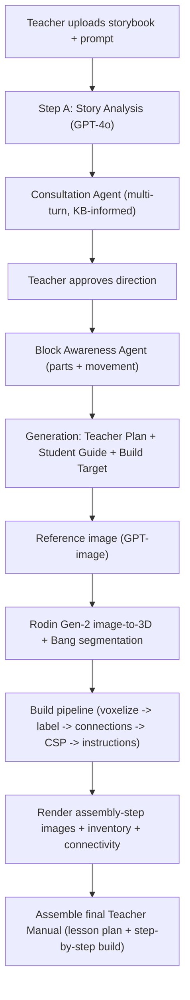

# KidSpark AI - Build Guide (Codex Handoff)

This document is the single entry point for an autonomous coding agent (Codex) tasked with building out the rest of the **KidSpark AI** system. It explains what we are building, why, what already exists, where deeper context lives in this repo, and a concrete milestone roadmap to a finished product.

> Read this first, then follow the links into the source-of-truth docs. Do not duplicate content from those docs - reference them.

---

## 1. Mission and background

**KidSpark AI** turns Kid Spark Education's library of ~72 hands-on STEM lesson families into a searchable knowledge base and an AI agent pipeline that generates **new lesson packages from a teacher-uploaded storybook**. When a teacher uploads a storybook and describes their goals, the system produces materials that look and feel like the hand-crafted originals: a Teacher Lesson Plan, a Student Activity Guide, and (Phase 2) a 3D block Build Plan with step-by-step assembly instructions.

It is **not generic RAG**. Kid Spark lessons have cross-document dependencies (teacher plan references slide images), a fixed structural contract, hard policy constraints (UDL, CASEL, Science of Reading, NGSS, ISTE, CCSS), and build awareness (knowing that "airplane" = wings + body + propeller + rudder + landing gear). The design is a bundle-aware knowledge base plus a staged agent pipeline.

KidSpark AI sits **alongside** the existing BrickSmart Streamlit app (a separate spatial-language LEGO tutor), reusing its UI patterns (streaming, sessions, Pydantic structured outputs) but adding a new FastAPI backend.

- Full spec: [KIDSPARK_TECHNICAL_SPEC.md](KIDSPARK_TECHNICAL_SPEC.md)
- Backend architecture + branch/folder plan: [backend/README.md](backend/README.md)
- Existing BrickSmart app analysis: [CODEBASE_ANALYSIS.md](CODEBASE_ANALYSIS.md)

---

## 2. Product vision - end-to-end flow

The finished system takes a teacher from "I have a storybook and an idea" to "here is my complete, printable lesson with build instructions":

In words:

1. The teacher uploads a storybook and a prompt; **Step A** auto-analyzes it (themes, characters, buildable objects, vocabulary, SEL angles).
2. The **Consultation Agent** iterates with the teacher across a multi-turn chat, grounded in knowledge-base exemplars and policy rules, until they agree on theme, grade/duration, objectives, build artifact, literacy focus, and SEL focus.
3. The teacher **approves** the direction. The **Block Awareness Agent** maps the artifact's parts to Kid Spark pieces and movement (spinning/rolling/pivoting/static).
4. The **Generation** pipeline produces the Teacher Lesson Plan, Student Activity Guide, and a Build Target Profile.
5. On confirmation, the system **kicks off the 3D build pipeline**: generate a reference image, call the **Hyper3D Rodin** API (image-to-3D) + **Bang** (part segmentation), then run the build notebook pipeline (voxelize -> label segments -> classify connections -> CSP block layout -> assembly instructions).
6. The pipeline **renders assembly-step images**, a block inventory/BOM, and a connectivity report.
7. Everything is assembled into a **final Teacher Manual**: the generated lesson plan plus step-by-step instructions on how to build the 3D piece.

---

## 3. Target output - what "done" looks like

The gold standard is the real Kid Spark Teacher Lesson Plan. Study the bundled sample (the "Invent an Airplane" family) to match structure, tone, and reading level:

- Teacher Lesson Plan: [Brick Smart/Kid Spark Materials/4693 - invent-an-airplane-teacher-lesson-plan.pdf](Brick%20Smart/Kid%20Spark%20Materials/4693%20-%20invent-an-airplane-teacher-lesson-plan.pdf)
- Student Activity Guide: [Brick Smart/Kid Spark Materials/4694 - invent-an-airplane-activity-guide.pdf](Brick%20Smart/Kid%20Spark%20Materials/4694%20-%20invent-an-airplane-activity-guide.pdf)
- Slide Companion: [Brick Smart/Kid Spark Materials/4695 - invent-an-airplane-slide-companion.pdf](Brick%20Smart/Kid%20Spark%20Materials/4695%20-%20invent-an-airplane-slide-companion.pdf)
- Standards Alignment & Framework: [Brick Smart/Kid Spark Materials/Early Childhood STEM & Literacy Program - Standards Alignment and Framework.pdf](Brick%20Smart/Kid%20Spark%20Materials/Early%20Childhood%20STEM%20%26%20Literacy%20Program%20-%20Standards%20Alignment%20and%20Framework.pdf)

The Teacher Lesson Plan's canonical section contract (the generator must produce all of these):

- Overview
- Learning Objectives ("I can..." statements)
- Curriculum Connections (Literacy, Language Development, Engineering, Collaboration)
- Activity Details (time, grade, grouping)
- Materials
- Lesson Vocabulary (term + kid-friendly definition)
- Plan for All Learners (UDL/accessibility)
- Anticipatory Set (5 min hook)
- Step 01: Read (story + literacy/phonics)
- Step 02: Learn & Explore (real-world STEM concept)
- Step 03: Invent (hands-on build)
- Closure & Reflection (share-out + discussion questions)
- Real-World Connection
- Example build + standards (NGSS / ISTE / CCSS)

These map to the Pydantic models already defined in [backend/models/schemas.py](backend/models/schemas.py) (`TeacherLessonPlan`, `StudentActivityGuide`, `BuildTargetProfile`, `LessonPackage`).

The **final manual** extends this with AI-generated, step-by-step block-build instructions (rendered images + a parts inventory) for the teacher's chosen artifact - produced by the Phase 2 pipeline.

---

## 4. Repository map - where context lives

### Existing BrickSmart Streamlit UI (reuse patterns, do not break)
- [home.py](home.py) - Streamlit entry point
- [pages/step1.py](pages/step1.py), [pages/step2.py](pages/step2.py), [pages/step3.py](pages/step3.py) - existing 3-step spatial-language tutor
- [pages/kidspark.py](pages/kidspark.py) - **new** KidSpark chat page wired to the backend (consultation + block awareness + progress sidebar)
- [streaming.py](streaming.py) - LangChain `StreamHandler` token streaming pattern
- [utils/](utils) - session, chat history, LLM config helpers
- [structured_query/](structured_query) - existing Pydantic structured-output query helpers

### Phase 1 KidSpark backend (built - FastAPI)
- [backend/README.md](backend/README.md) - backend architecture, folder plan, branch strategy
- [backend/models/schemas.py](backend/models/schemas.py) - all Pydantic data contracts (shared)
- [backend/models/db_models.py](backend/models/db_models.py) - SQLAlchemy ORM (stub for KB tables)
- [backend/agents/story_analysis.py](backend/agents/story_analysis.py) - Step A
- [backend/agents/consultation.py](backend/agents/consultation.py) - multi-turn teacher consultation
- [backend/agents/block_awareness.py](backend/agents/block_awareness.py) - parts/movement mapping
- [backend/agents/orchestrator.py](backend/agents/orchestrator.py) - phase routing + in-memory sessions
- [backend/agents/mock_data.py](backend/agents/mock_data.py) - offline mock KB/evidence/catalog/sample storybook
- [backend/agents/outline_planner.py](backend/agents/outline_planner.py), [backend/agents/build_target.py](backend/agents/build_target.py), [backend/agents/teacher_plan.py](backend/agents/teacher_plan.py), [backend/agents/student_guide.py](backend/agents/student_guide.py), [backend/agents/validator.py](backend/agents/validator.py) - Steps B-F (stubs to finish)
- [backend/api/main.py](backend/api/main.py), [backend/api/sessions.py](backend/api/sessions.py), [backend/api/health.py](backend/api/health.py) - FastAPI app + routes
- [backend/config.py](backend/config.py) - config + key resolution
- [backend/requirements.txt](backend/requirements.txt) - backend deps

### Phase 2 - 3D build pipeline
- `Block_Instructions (pre-connection)/my_notebook_25 (CSP).ipynb` - the build pipeline notebook (Rodin+Bang call, voxelization, segment labeling, connection classification, CSP rotation, inventory, connectivity, assembly instructions)
- [toy_airplane_30k/tripo_convert_1f420a52-b8e1-4d94-a634-567465fa35c8.obj](toy_airplane_30k/tripo_convert_1f420a52-b8e1-4d94-a634-567465fa35c8.obj) - sample segmented OBJ for offline testing
- [PHASE2_BUILD_PLAN_INTEGRATION.md](PHASE2_BUILD_PLAN_INTEGRATION.md) - **the detailed Phase 2 integration plan** (module design, gaps, questions for the notebook team)

### Source-of-truth docs
- [KIDSPARK_TECHNICAL_SPEC.md](KIDSPARK_TECHNICAL_SPEC.md) - authoritative spec (APIs, data models, GCP, agent phases)
- [CODEBASE_ANALYSIS.md](CODEBASE_ANALYSIS.md) - deep analysis of the existing BrickSmart app
- [DEPLOYMENT_GCP.md](DEPLOYMENT_GCP.md) - Cloud Run deployment guide
- KB retrieval design: [Brick Smart/Kid Spark- work/KidSmart_KB_Retrieval_Design_v4.docx](Brick%20Smart/Kid%20Spark-%20work/KidSmart_KB_Retrieval_Design_v4.docx)
- Project briefs: [Brick Smart/](Brick%20Smart) (`Technical Brief for KidSpark AI.docx`, `Brick Smart Project.docx`)

---

## 5. What's been done so far

**Phase 1 runtime backend is implemented and runs locally**, including an offline mock fallback so it works with no API keys:

- FastAPI app with health + session routers ([backend/api/](backend/api)).
- Session phase model: `consultation -> block_awareness -> generation -> refinement -> complete`, routed by [backend/agents/orchestrator.py](backend/agents/orchestrator.py) with an in-memory session store.
- GPT-4o agents for Step A (story analysis), the multi-turn consultation loop (with KB evidence injected from [backend/agents/mock_data.py](backend/agents/mock_data.py)), and block awareness; each has a **mock-mode** path when `OPENAI_API_KEY` is absent.
- Full Pydantic data contracts in [backend/models/schemas.py](backend/models/schemas.py).
- A wired Streamlit page [pages/kidspark.py](pages/kidspark.py) with a live left-sidebar progress panel (pipeline phases, consultation topic checklist, agreed plan, block requirements).
- End-to-end smoke-tested: create session -> upload storybook -> consult -> approve -> block awareness -> finalize blocks.

**Phase 2 has been assessed** and a detailed integration plan written ([PHASE2_BUILD_PLAN_INTEGRATION.md](PHASE2_BUILD_PLAN_INTEGRATION.md)), including the confirmed Hyper3D Rodin + Bang call chain found in the notebook.

**Still stubs / not built:**
- Generation Steps B-F ([outline_planner](backend/agents/outline_planner.py), [build_target](backend/agents/build_target.py), [teacher_plan](backend/agents/teacher_plan.py), [student_guide](backend/agents/student_guide.py), [validator](backend/agents/validator.py)) are docstring-only.
- Ingestion pipeline (Developer A) and real Postgres/pgvector knowledge base - currently mock data only.
- The entire Phase 2 `backend/build3d/` package.
- Final Teacher Manual assembly (lesson text + build-step images -> PDF/HTML).
- Persistence, async job model, and Cloud Run deployment of the backend.

---

## 6. Roadmap to completion (milestones)

Each milestone lists its done-criteria.

- **M1 - Finish Phase 1 generation.** Implement Steps B-F so a session can produce a complete `LessonPackage` (TeacherLessonPlan + StudentActivityGuide + BuildTargetProfile + ValidationResult). Done when `POST /sessions/{id}/generate` returns a valid package that passes the validator, with mock-mode fallback.
- **M2 - Knowledge base.** Either build the ingestion pipeline (parse the Kid Spark PDFs into knowledge nodes + embeddings in Postgres/pgvector) or seed a richer mock KB. Done when consultation/retrieval cite real exemplars and policy rules from the bundled Kid Spark materials.
- **M3 - Phase 2 build pipeline.** Implement `backend/build3d/` per [PHASE2_BUILD_PLAN_INTEGRATION.md](PHASE2_BUILD_PLAN_INTEGRATION.md): `reference_image.py`, `rodin_client.py` (Rodin Gen-2 image-to-3D + Bang + poll + download), `voxelizer.py`, `segment_labeler.py` (GPT-4o vision, replacing the notebook's `llava`), `connection_classifier.py` (GPT-4o), `block_decomposer.py` (incl. CSP rotation), `connectivity.py`, `instructions.py`, `pipeline.py`. Done when `generate_build_plan(obj)` reproduces the airplane's 28-block inventory + connectivity + assembly steps from the bundled OBJ.
- **M4 - Final Teacher Manual assembly.** Merge the generated lesson text and the rendered build-step images into a single printable Teacher Manual (PDF/HTML) matching the Kid Spark format in Section 3. Done when a teacher can download a manual indistinguishable in structure from [4693](Brick%20Smart/Kid%20Spark%20Materials/4693%20-%20invent-an-airplane-teacher-lesson-plan.pdf) plus a build-instructions section.
- **M5 - UX + async jobs.** Make the multi-minute 3D pipeline a background job with phase-level progress in [pages/kidspark.py](pages/kidspark.py); add the refinement loop (up to 3 iterations). Done when the teacher sees live progress and never blocks on a spinner.
- **M6 - Deploy.** Containerize and deploy the backend to Cloud Run, secrets via Secret Manager, per [DEPLOYMENT_GCP.md](DEPLOYMENT_GCP.md). Done when the Streamlit app talks to the deployed backend URL.

---

## 7. Conventions and guardrails

- **LLM provider:** standardize on **OpenAI GPT-4o** (vision-capable) across all agents and the Phase 2 segment labeler/connection classifier. Do not introduce local Ollama dependencies into the backend.
- **Mock-mode pattern:** every agent must keep a no-API-key fallback (see [backend/agents/mock_data.py](backend/agents/mock_data.py) and the agents' `if not OPENAI_API_KEY` branches) so the system runs offline for local dev and tests.
- **Secrets:** read keys from env / GCP Secret Manager via [backend/config.py](backend/config.py). **Never hardcode keys.** Note: the build notebook currently contains a hardcoded Hyper3D API key that **must be rotated and removed** when ported.
- **Async for heavy work:** the 3D build pipeline takes ~3-6 minutes (Rodin + Bang + voxelize + LLMs + rendering). It must run as a background job with status polling - never a synchronous request.
- **Data contracts:** all shared types live in [backend/models/schemas.py](backend/models/schemas.py). Keep schema changes small and reviewable.
- **Run locally:**
  - Backend: `cd backend && python -m uvicorn api.main:app --reload --port 8000`
  - Streamlit: `streamlit run home.py` (KidSpark page at `/kidspark`)
- **Ownership split:** Developer A owns ingestion + KB tables; Developer B owns agents, retrieval, API, and the Phase 2 build pipeline (see [backend/README.md](backend/README.md)).

---

## 8. Open questions / dependencies

Phase 2 (M3) is gated on answers from the notebook team. See Section 6 of [PHASE2_BUILD_PLAN_INTEGRATION.md](PHASE2_BUILD_PLAN_INTEGRATION.md) for the full list; the critical ones:

- LLM1 (segment labeling) exact prompt + output schema, and confirmation to use GPT-4o vision.
- Canonical notebook code path (the CSP/connectivity path) vs. the older dead "Attempt" branches.
- The LLM2 `connection_schema` and connection-type taxonomy.
- The output/serialization contract (blocks + instruction steps + inventory + connectivity as JSON).
- Policy for `INVALID` interfaces in the connectivity report (acceptable vs. must-fix before showing a teacher).
- Rotate the hardcoded Hyper3D API key in the notebook.

---

*This guide is a map, not the territory - always defer to the linked source-of-truth docs and the code itself.*
