# KidSpark AI — Technical Specification

### Build-Aware Knowledge Base, Agent Pipeline, and Backend API

**Version:** 1.0  
**Date:** April 16, 2026  
**Cloud Provider:** Google Cloud Platform (GCP)  
**Status:** Phase 1 — Knowledge Base & Agent Pipeline

---

## Table of Contents

1. [Executive Summary](#1-executive-summary)
2. [What We Are Building and Why](#2-what-we-are-building-and-why)
3. [Integration with Existing BrickSmart](#3-integration-with-existing-bricksmart)
4. [Full Pipeline Vision (Phase 1 + Phase 2)](#4-full-pipeline-vision-phase-1--phase-2)
5. [System Architecture](#5-system-architecture)
6. [GCP Infrastructure](#6-gcp-infrastructure)
7. [Phase 1 — Knowledge Base and Agent Pipeline](#7-phase-1--knowledge-base-and-agent-pipeline)
   - 7.1 [Database Schema](#71-database-schema)
   - 7.2 [Ingestion Pipeline (Developer A)](#72-ingestion-pipeline-developer-a)
   - 7.3 [Retrieval and Agent Pipeline (Developer B)](#73-retrieval-and-agent-pipeline-developer-b)
8. [Phase 2 — 3D Build Plan Integration](#8-phase-2--3d-build-plan-integration)
9. [Developer Workstream Split](#9-developer-workstream-split)
10. [API Reference](#10-api-reference)
11. [Data Model Reference](#11-data-model-reference)
12. [Deployment and Operations](#12-deployment-and-operations)
13. [Timeline](#13-timeline)

---

## 1. Executive Summary

KidSpark AI is a backend system that transforms Kid Spark Education's existing library of ~72 lesson families into a structured, searchable knowledge base, and uses that knowledge base to power an AI agent pipeline that generates new lesson packages from teacher-uploaded storybooks.

The system is built in two phases:

- **Phase 1** (this document's primary focus): Ingest all existing lessons into a build-aware knowledge base hosted on GCP. Build a FastAPI backend with a staged AI agent pipeline that retrieves relevant lesson evidence, follows curriculum standards, and generates complete Teacher Lesson Plans and Student Activity Guides.

- **Phase 2**: Integrate with the 3rd-party 3D modeling pipeline (Rodin, voxelization, connection-block logic) to generate full topology-aware Build Plans with step-by-step visual assembly instructions for Kid Spark physical blocks.

The backend is split into two independent workstreams so two developers can build in parallel:

- **Developer A** owns the knowledge base: ingestion, parsing, extraction, embedding, and storage.
- **Developer B** owns the runtime: retrieval, agent pipeline, teacher chat, and generation APIs.

---

## 2. What We Are Building and Why

### The Problem

Kid Spark Education has a mature library of hands-on STEM lesson families. Each family consists of three tightly linked documents:

| Document | Audience | Content |
|---|---|---|
| **Teacher Lesson Plan** | Teachers | Full instructional flow: objectives, vocabulary, timed steps (Read, Learn & Explore, Invent), prompts, scaffolding, reflection questions, standards alignment |
| **Student Activity Guide** | Students | Compressed visual flow: story intro, vocabulary, concept diagram, build task, example build, real-world connection, reflection |
| **Slide Companion** | Classroom | Visual scaffolds: objective slides, parts diagrams, community agreements, partner sentence stems, step-by-step build sequence, reflection prompts |

These three documents are **not independent** — the Teacher Plan references specific images from the Slide Companion, the Activity Guide mirrors the Teacher Plan's reflection questions, and the build sequence in the slides visually grounds what the teacher describes in words.

There is also a **Standards Alignment & Framework** document that defines hard rules across all lessons: UDL (Universal Design for Learning), CASEL (Social-Emotional Learning), Science of Reading, NGSS, ISTE, and CCSS standards per grade band (Pre-K, Kindergarten, 1st Grade).

**The core need**: When a teacher uploads a *new* storybook and describes their goals, the system must generate a *new* lesson package that follows the same pedagogical patterns, references the same structural framework, and produces materials that look and feel like the hand-crafted originals.

### Why This Is Not a Generic RAG Problem

A naive approach would chunk all lesson PDFs, embed them, and do similarity search. This fails because:

1. **Cross-document dependencies** — The Teacher Plan says "display the Example Airplane from the Slide Companion." If retrieval returns the teacher text without the referenced slide, the generated output loses visual grounding.

2. **Structural fidelity** — A Teacher Lesson Plan has a fixed section contract (Overview, Objectives, Vocabulary, Anticipatory Set, Step 01 Read, Step 02 Learn & Explore, Step 03 Invent, Closure & Reflection). Flat chunks destroy this structure.

3. **Policy constraints** — The Standards document defines hard rules (e.g., "1st Grade Storytime Inventing must include CASEL competencies 1–5"). These must be enforced during generation, not discovered by luck in retrieval.

4. **Build awareness** — Even before full 3D build plans exist, the teacher and student materials refer to *what is being built*. The system must understand that "airplane" means "wings + body + propeller + rudder + landing gear" to generate coherent materials.

### Our Solution: Bundle-Aware Knowledge Base + Staged Agent Pipeline

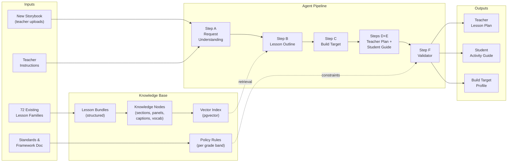

---

## 3. Integration with Existing BrickSmart

The current BrickSmart codebase is a Streamlit app that guides children through LEGO building activities with spatial language learning. KidSpark AI is a **new backend system** that sits alongside BrickSmart, not a replacement.

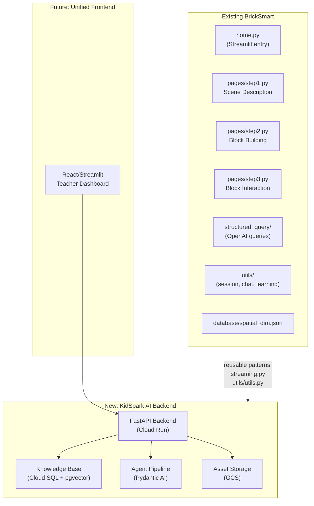

### What Carries Forward

| Component | Status | Rationale |
|---|---|---|
| `streaming.py` (StreamHandler) | **Reuse pattern** | Real-time token streaming to UI; same pattern applies to teacher chat |
| `utils/utils.py` (session management) | **Reuse pattern** | Session ID management, chat history rendering |
| Pydantic structured outputs | **Reuse pattern** | BrickSmart already uses Pydantic models for LLM outputs (`sceneDescriptionOutput`, `spatialSelectionOutput`). KidSpark extends this pattern to all pipeline stages. |
| LangChain + OpenAI integration | **Reuse for embeddings** | LangChain used for RAG/embedding pipeline in the knowledge base |

### What Is New

| Component | Description |
|---|---|
| FastAPI backend | Stateless API layer on Cloud Run (replaces direct Streamlit-to-LLM calls) |
| PostgreSQL + pgvector | Structured knowledge base with vector search (replaces `spatial_dim.json`) |
| Pydantic AI agents | Typed, staged pipeline with validation (replaces single-shot `query_llm()` calls) |
| GCS asset storage | Cloud-hosted PDFs, images, rendered slides |
| Ingestion pipeline | Automated document parsing, section extraction, and embedding |

---

## 4. Full Pipeline Vision (Phase 1 + Phase 2)

The following diagram represents the complete pipeline vision, as defined in the project pipeline plan. Phase 1 covers the left side (knowledge base, teacher consultation, block awareness, lesson generation). Phase 2 covers the right side (3D modeling, voxelization, block assembly instructions).

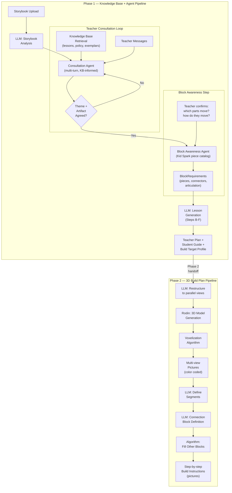

### Phase 1 Scope

Everything from storybook upload through to generating the Teacher Lesson Plan, Student Activity Guide, and a Build Target Profile enriched with block-level awareness. Phase 1 includes three major runtime stages:

1. **Teacher Consultation Loop** — A multi-turn, KB-informed dialog between the teacher and the Consultation Agent. The agent guides the teacher through theme identification, learning objective selection, and build artifact agreement. It retrieves relevant lesson examples, policy rules, and build-target exemplars from the knowledge base during the conversation to inform its suggestions. The loop ends when the teacher explicitly approves the lesson direction.

2. **Block Awareness Step** — Once the artifact is agreed upon, the Block Awareness Agent asks the teacher about movement and articulation requirements (e.g., "will the wings flap?", "will the propeller spin?"). It maps these to specific Kid Spark piece types and produces a `BlockRequirements` spec.

3. **Generation Pipeline** (Steps B–F) — Takes the `ConsultationSummary` and `BlockRequirements` as inputs and generates the full lesson package.

### Phase 2 Scope (Future)

The 3D build plan pipeline takes the confirmed build target and:
1. Generates a reference picture and restructures it into parallel views
2. Uses **Rodin** (3rd-party 3D model generation) to create a segmented 3D model
3. Runs **voxelization** to convert the model into a block-compatible grid
4. Generates **multi-view color-coded pictures** of the voxelized model
5. Uses an LLM to **define segments** and **connection blocks** (position, orientation, type — add-on or replacing)
6. Runs algorithms to **fill remaining blocks** and produce **step-by-step build instructions** with pictures

Phase 2 replaces the lightweight Build Target Profile (Phase 1, Step C) with a full topology-aware `BuildPlan`.

---

## 5. System Architecture

### High-Level Architecture

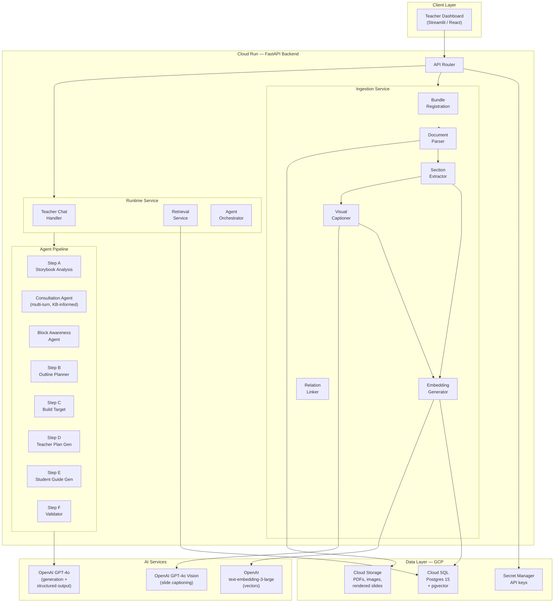

### Request Flow: Teacher Generates a Lesson

This sequence diagram shows the full flow: storybook upload, automatic analysis, the multi-turn teacher consultation loop (KB-informed), the block awareness step, and the generation pipeline.

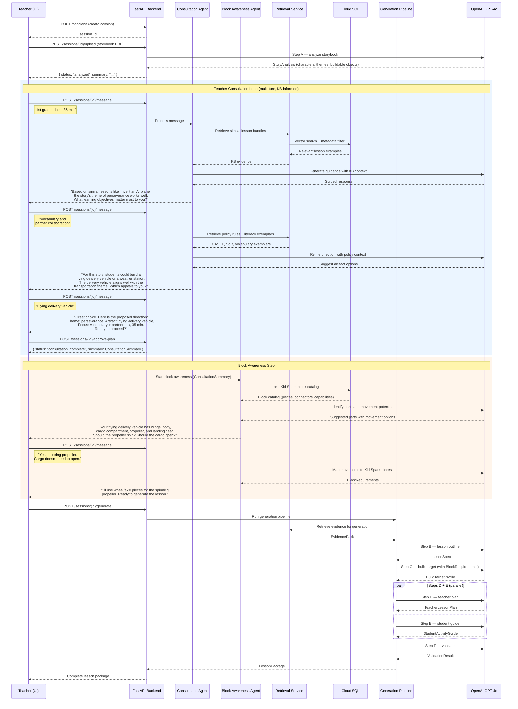

---

## 6. GCP Infrastructure

### Services Used

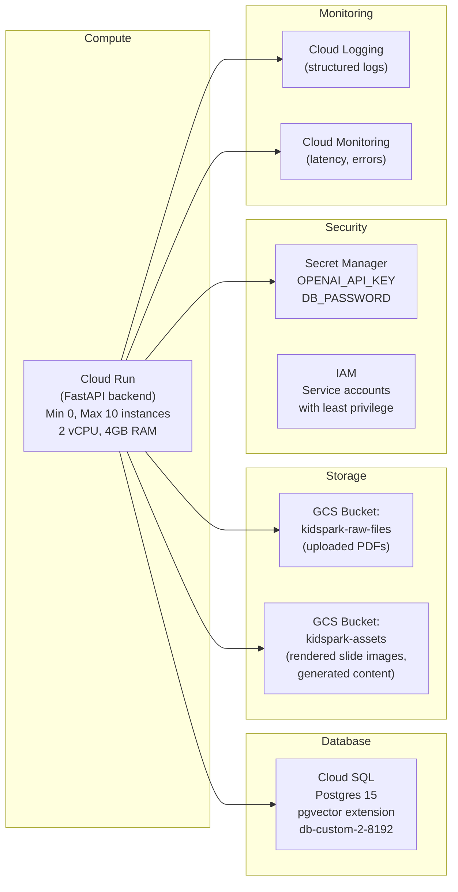

### Cloud SQL Setup

Cloud SQL for PostgreSQL with the pgvector extension provides both relational storage and vector search in one managed service.

**Instance specification:**
- PostgreSQL 15
- Machine type: `db-custom-2-8192` (2 vCPU, 8 GB RAM)
- Storage: 50 GB SSD (auto-increase enabled)
- Region: `us-central1` (or nearest to team)
- High availability: disabled for dev, enabled for production
- pgvector extension: enabled via `CREATE EXTENSION vector;`

**Connection**: Cloud Run connects to Cloud SQL via the built-in Cloud SQL Auth Proxy sidecar. No public IP needed.

```python
# config.py — Database connection
import os

DATABASE_URL = (
    f"postgresql+asyncpg://{os.environ['DB_USER']}:{os.environ['DB_PASSWORD']}"
    f"@/{os.environ['DB_NAME']}"
    f"?host=/cloudsql/{os.environ['CLOUD_SQL_CONNECTION_NAME']}"
)
```

### Cloud Storage Layout

```
kidspark-raw-files/
  bundles/
    storytime_inventing.grade1.invent_an_airplane/
      teacher_plan.pdf
      activity_guide.pdf
      slide_companion.pdf
    storytime_inventing.gradeK.build_a_bridge/
      ...
  storybooks/
    session_{id}/
      uploaded_storybook.pdf
  policy/
    standards_alignment_framework.pdf

kidspark-assets/
  slides/
    storytime_inventing.grade1.invent_an_airplane/
      slide_page_01.png
      slide_page_02.png
      ...slide_page_22.png
  generated/
    session_{id}/
      teacher_plan.json
      student_guide.json
      build_target_profile.json
```

### Secret Manager

All sensitive configuration is stored in GCP Secret Manager, not in environment variables or config files:

| Secret Name | Purpose |
|---|---|
| `openai-api-key` | OpenAI API key for GPT-4o and embeddings |
| `db-password` | Cloud SQL password |
| `db-user` | Cloud SQL username |

```python
# config.py — Secret access
from google.cloud import secretmanager

def get_secret(secret_id: str) -> str:
    client = secretmanager.SecretManagerServiceClient()
    name = f"projects/{PROJECT_ID}/secrets/{secret_id}/versions/latest"
    response = client.access_secret_version(request={"name": name})
    return response.payload.data.decode("UTF-8")
```

---

## 7. Phase 1 — Knowledge Base and Agent Pipeline

### 7.1 Database Schema

The database uses four core tables plus two supporting tables. All tables use UUID primary keys. The `knowledge_nodes` table includes a pgvector column for embedding-based search.

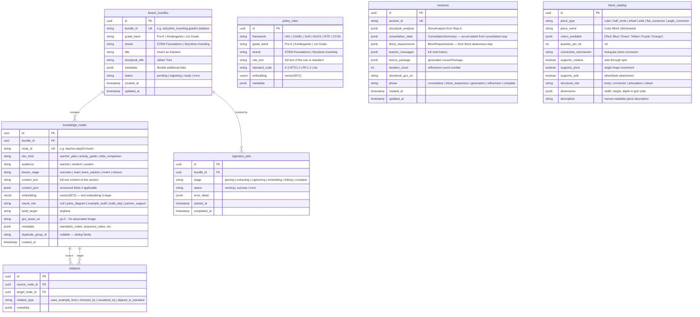

#### Example: Airplane Bundle in the Database

After ingesting the "Invent an Airplane" lesson family, the database contains:

**lesson_bundles** — 1 row:
```json
{
  "bundle_id": "storytime_inventing.grade1.invent_an_airplane",
  "grade_band": "1st Grade",
  "strand": "Storytime Inventing",
  "title": "Invent an Airplane",
  "storybook_title": "Jabari Tries",
  "status": "ready"
}
```

**knowledge_nodes** — approximately 25–35 rows, including:

| node_id | doc_kind | lesson_stage | audience | visual_role |
|---|---|---|---|---|
| `teacher.overview` | teacher_plan | overview | teacher | null |
| `teacher.objectives` | teacher_plan | overview | teacher | null |
| `teacher.vocabulary` | teacher_plan | overview | teacher | null |
| `teacher.step01.read` | teacher_plan | read | teacher | null |
| `teacher.step02.learn_explore` | teacher_plan | learn_explore | teacher | null |
| `teacher.step03.invent` | teacher_plan | invent | teacher | null |
| `teacher.closure` | teacher_plan | closure | teacher | null |
| `activity.p1.read` | activity_guide | read | student | null |
| `activity.p1.vocabulary` | activity_guide | read | student | null |
| `activity.p1.parts_diagram` | activity_guide | learn_explore | student | parts_diagram |
| `activity.p2.example_airplane` | activity_guide | invent | student | example_build |
| `activity.p2.reflection` | activity_guide | closure | student | null |
| `slide.p10.parts_diagram` | slide_companion | learn_explore | student | parts_diagram |
| `slide.p12.community_agreements` | slide_companion | invent | student | partner_support |
| `slide.p14.build_step_1` | slide_companion | invent | student | build_step |
| `slide.p15.build_step_2` | slide_companion | invent | student | build_step |
| ... | ... | ... | ... | ... |

**relations** — approximately 10–15 rows:

| source | relation_type | target |
|---|---|---|
| `teacher.step03.invent` | `uses_example_from` | `activity.p2.example_airplane` |
| `teacher.step03.invent` | `uses_example_from` | `slide.p14.build_step_1` |
| `teacher.closure` | `mirrored_by` | `activity.p2.reflection` |
| `activity.p1.parts_diagram` | `visualized_by` | `slide.p10.parts_diagram` |
| `teacher.step03.invent` | `mirrored_by` | `slide.p12.community_agreements` |
| bundle | `aligned_to_standard` | `policy.grade1.K-2-ETS1-2` |

---

### 7.2 Ingestion Pipeline (Developer A)

Developer A builds the pipeline that transforms raw PDF lesson files into structured, searchable knowledge nodes in the database.

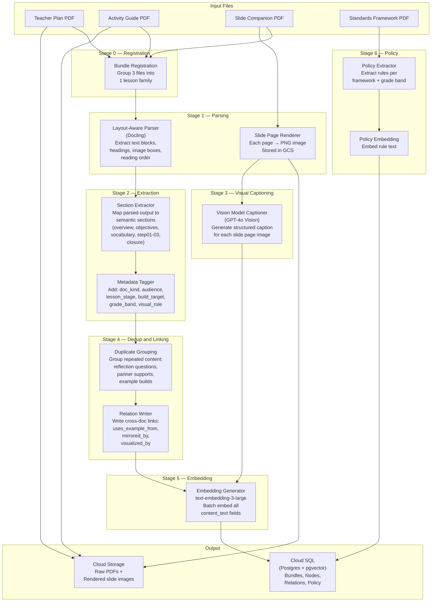

#### Stage 0 — Bundle Registration

When an admin uploads a set of lesson files, the system groups them into a single bundle:

```python
# Example: registering the airplane lesson family
POST /api/v1/bundles
Content-Type: multipart/form-data

{
  "bundle_id": "storytime_inventing.grade1.invent_an_airplane",
  "grade_band": "1st Grade",
  "strand": "Storytime Inventing",
  "title": "Invent an Airplane",
  "storybook_title": "Jabari Tries",
  "teacher_plan": <file: 4693-teacher-lesson-plan.pdf>,
  "activity_guide": <file: 4694-activity-guide.pdf>,
  "slide_companion": <file: 4695-slide-companion.pdf>
}
```

Files are uploaded to GCS. A `lesson_bundles` row is created with status `pending`. An `ingestion_jobs` row is created.

#### Stage 1 — Layout-Aware Parsing

The parser uses **Docling** (IBM's open-source document conversion toolkit) to extract structured content from PDFs while preserving layout, heading hierarchy, and image bounding boxes.

Why Docling over plain text extraction (pypdf):
- Preserves heading hierarchy (identifies "Step 01: Read" as a section header)
- Detects image regions and their position in reading order
- Outputs a unified structured representation across PDF formats
- Runs on modest hardware (no GPU required for text extraction)

For Slide Companions specifically, where most pages are image-only with no extractable text, each page is rendered to a PNG image and stored in GCS.

```python
# ingestion/parser.py — simplified example

from docling.document_converter import DocumentConverter

def parse_lesson_document(pdf_path: str, doc_kind: str) -> ParsedDocument:
    converter = DocumentConverter()
    result = converter.convert(pdf_path)

    sections = []
    for item in result.document.body:
        sections.append(ParsedSection(
            heading=item.label,
            text=item.text,
            page_number=item.prov[0].page_no if item.prov else None,
            has_image=item.label == "picture",
        ))

    return ParsedDocument(
        doc_kind=doc_kind,
        sections=sections,
        page_count=result.document.num_pages,
    )
```

#### Stage 2 — Section Extraction

The extractor maps the parsed output onto the known lesson section structure. The canonical Teacher Plan structure (derived from analyzing the airplane example) is:

| Section | Expected | Meaning |
|---|---|---|
| Overview | Required | Short summary of what students will do and learn |
| Learning Objectives | Required (1–3) | "I can..." statements |
| Curriculum Connections | Expected | Cross-disciplinary framing |
| Activity Details | Required | Time, grade, grouping |
| Materials | Required | Required inputs for the teacher |
| Lesson Vocabulary | Required | Key terms used in the lesson |
| Pre-Lesson Preparation | Expected | Teacher setup work |
| Plan for All Learners | Required (policy) | Accessibility/differentiation |
| Anticipatory Set | Required | Opening hook (5 min) |
| Step 01: Read | Required | Story + literacy segment |
| Step 02: Learn & Explore | Required | Real-world STEM concept bridge |
| Step 03: Invent | Required | Hands-on build segment |
| Closure & Reflection | Required | Share-out + discussion |

The extractor creates one `KnowledgeNode` per section, with metadata:

```python
# ingestion/extractor.py — example node creation

KnowledgeNode(
    bundle_id=bundle.id,
    node_id="teacher.step03.invent",
    doc_kind="teacher_plan",
    audience="teacher",
    lesson_stage="invent",
    content_text="""Students will build an airplane using the Kid Spark
    Early Inventors STEM Lab. This can be done individually or with a
    partner. If students need help getting started, display the Example
    Airplane build plans from the Slide Companion...""",
    build_target="airplane",
    metadata={
        "standards_codes": ["K-2-ETS1-2"],
        "has_partner_support": True,
        "has_exemplar_reference": True,
    }
)
```

#### Stage 3 — Visual Captioning

For slide companion pages that are image-only, the captioner sends each rendered page image to GPT-4o Vision and generates a structured description:

```python
# ingestion/captioner.py — example

async def caption_slide_page(image_gcs_uri: str, page_number: int, bundle_context: str) -> SlideCaption:
    response = await openai_client.chat.completions.create(
        model="gpt-4o",
        messages=[{
            "role": "user",
            "content": [
                {"type": "text", "text": f"""Describe this lesson slide page.
                Context: This is page {page_number} of a slide companion for: {bundle_context}.
                Provide: page_type, detailed caption, build_target, sequence_index (if build step)."""},
                {"type": "image_url", "image_url": {"url": image_gcs_uri}}
            ]
        }],
        response_format=SlideCaption,  # Pydantic structured output
    )
    return response.parsed
```

Example output for slide page 14 (first build step):

```json
{
  "page_type": "build_step",
  "caption": "Step 03: Invent. The slide shows how to begin building the example airplane. Frame 1 shows a long blue beam. Frame 2 adds a red support block under the beam and another blue block below it.",
  "build_target": "airplane",
  "sequence_index": 1
}
```

This caption becomes a `KnowledgeNode` with `visual_role="build_step"` and is embedded alongside text nodes, creating a **text-searchable shadow** of the image content.

#### Stage 4 — Dedup and Relation Linking

The airplane lesson repeats content across its three documents. Dedup does not delete — it groups, so retrieval does not over-weight repeated content:

| Duplicate Family | Where It Appears | Action |
|---|---|---|
| Reflection questions | Teacher closure, Activity Guide p2, Slides p21–22 | Assign one `duplicate_group_id`, link via `mirrored_by` |
| Community agreements | Teacher Step 03, Slide p12–13 | Link teacher text to visual student variant |
| Example airplane | Teacher inset, Activity Guide p2, Slides p14–18 | Link under one `example_build` family |
| Airplane parts | Teacher vocabulary, Activity/Slide parts diagram | Link to one concept family |

Relation linking writes explicit cross-document edges:

```python
# ingestion/linker.py — example

Relation(
    source_node_id=nodes["teacher.step03.invent"].id,
    target_node_id=nodes["activity.p2.example_airplane"].id,
    relation_type="uses_example_from",
)
Relation(
    source_node_id=nodes["teacher.closure"].id,
    target_node_id=nodes["activity.p2.reflection"].id,
    relation_type="mirrored_by",
)
```

#### Stage 5 — Embedding

All `content_text` fields are embedded using OpenAI `text-embedding-3-large` (3072 dimensions). Vectors are stored in the pgvector column on each node.

```python
# ingestion/embedder.py — batch embedding

from openai import OpenAI

async def embed_nodes(nodes: list[KnowledgeNode], batch_size: int = 100):
    client = OpenAI()
    for batch in chunked(nodes, batch_size):
        texts = [n.content_text for n in batch]
        response = client.embeddings.create(
            model="text-embedding-3-large",
            input=texts,
        )
        for node, emb in zip(batch, response.data):
            node.embedding = emb.embedding
    # Bulk update in database
```

#### Stage 6 — Policy/Standards Ingestion

The Standards Alignment & Framework document is parsed separately. Each standard becomes a `PolicyRule`:

```python
PolicyRule(
    framework="NGSS",
    grade_band="1st Grade",
    strand="Storytime Inventing",
    standard_code="K-2-ETS1-2",
    rule_text="Develop a simple sketch, drawing, or physical model to illustrate "
              "how the shape of an object helps it function as needed to solve a given problem.",
)

PolicyRule(
    framework="CASEL",
    grade_band="1st Grade",
    strand="Storytime Inventing",
    rule_text="CASEL 1-5: Self-Awareness, Self-Management, Social Awareness, "
              "Relationship Skills, Responsible Decision-Making",
)

PolicyRule(
    framework="UDL",
    grade_band="all",
    strand="all",
    rule_text="Multiple Means of Engagement, Representation, and Action & Expression. "
              "Ensure visual, verbal, and tactile methods.",
)
```

---

### 7.3 Retrieval and Agent Pipeline (Developer B)

Developer B builds the runtime system that uses the knowledge base to generate new lesson packages.

#### Retrieval Service

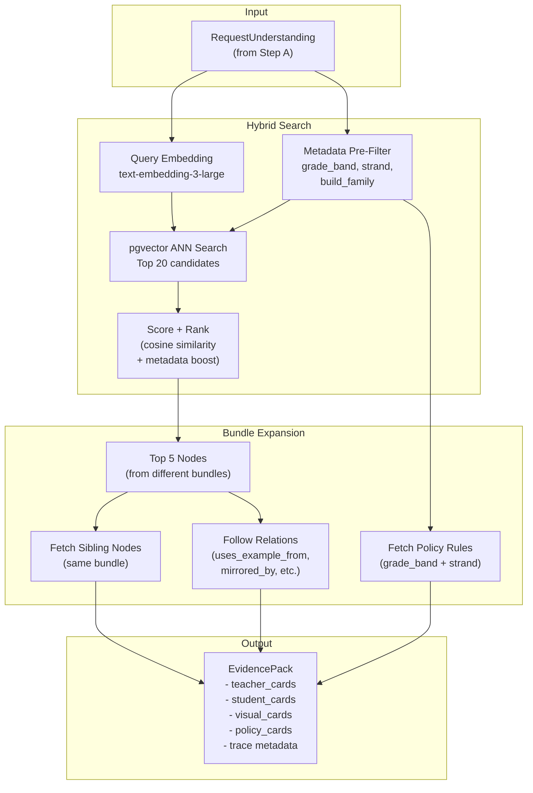

**Bundle expansion** is the critical retrieval behavior. When `teacher.step03.invent` from the airplane bundle scores highly, the system also pulls:
- All teacher-plan sections from the same bundle (overview, objectives, vocabulary, etc.)
- Linked activity guide sections (`activity.p2.example_airplane` via `uses_example_from`)
- Linked slide captions (`slide.p14.build_step_1` via `uses_example_from`)
- Partner support slides (`slide.p12.community_agreements` via `mirrored_by`)
- Grade-band policy rules (`policy.grade1.K-2-ETS1-2`, UDL, CASEL, SoR)

This ensures the agent receives **coherent, cross-document context** — not scattered fragments.

**Example retrieval for a new storybook** ("Milo's Flying Delivery", 1st grade, 35 min, perseverance, partner talk, flying machine):

```python
# retrieval/search.py — simplified

async def retrieve_evidence(request: RequestUnderstanding) -> EvidencePack:
    # 1. Embed the query
    query_text = f"{request.build_target_candidate} {request.theme} {request.grade_band}"
    query_vector = await embed_text(query_text)

    # 2. Metadata pre-filter + vector search
    candidates = await db.execute("""
        SELECT *, embedding <=> :query AS distance
        FROM knowledge_nodes
        WHERE grade_band = :grade
        ORDER BY distance ASC
        LIMIT 20
    """, {"query": query_vector, "grade": request.grade_band})

    # 3. Bundle expansion — for top 5 nodes, fetch all siblings
    top_bundles = set(c.bundle_id for c in candidates[:5])
    all_siblings = await db.execute("""
        SELECT * FROM knowledge_nodes
        WHERE bundle_id = ANY(:bundle_ids)
    """, {"bundle_ids": list(top_bundles)})

    # 4. Follow relations
    related = await db.execute("""
        SELECT r.*, kn.* FROM relations r
        JOIN knowledge_nodes kn ON r.target_node_id = kn.id
        WHERE r.source_node_id = ANY(:node_ids)
    """, {"node_ids": [c.id for c in candidates[:5]]})

    # 5. Fetch policy rules
    policies = await db.execute("""
        SELECT * FROM policy_rules
        WHERE grade_band = :grade AND strand = :strand
    """, {"grade": request.grade_band, "strand": "Storytime Inventing"})

    # 6. Assemble EvidencePack
    return EvidencePack(
        teacher_cards=[n for n in all_siblings if n.audience == "teacher"],
        student_cards=[n for n in all_siblings if n.audience == "student"],
        visual_cards=[n for n in all_siblings if n.visual_role is not None],
        policy_cards=policies,
        trace=[TraceEntry(node_id=c.node_id, score=c.distance, bundle_id=c.bundle_id)
               for c in candidates[:5]],
    )
```

#### Agent Pipeline — Step by Step

The pipeline uses **Pydantic AI** agents. The full runtime flow has three phases: an interactive consultation phase, a block awareness phase, and an automated generation pipeline. The orchestrator manages transitions between phases.

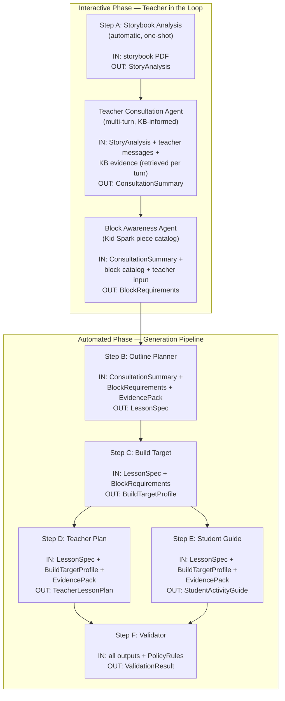

##### Step A — Storybook Analysis

An automatic, one-shot analysis of the uploaded storybook. This runs immediately after upload, before the teacher consultation begins. It extracts the raw material that the Consultation Agent uses to guide the conversation.

```python
from pydantic_ai import Agent
from models.schemas import StoryAnalysis

story_analysis_agent = Agent(
    'openai:gpt-4o',
    result_type=StoryAnalysis,
    system_prompt="""You are a children's literature analyst. Given a storybook text,
    extract: title, main characters, settings, key plot events, central themes,
    buildable objects/characters/scenes, vocabulary opportunities, and
    social-emotional learning angles. This analysis will be used to guide a
    teacher through lesson planning."""
)
```

Example output:
```json
{
  "title": "Milo's Flying Delivery",
  "characters": ["Milo (young inventor)", "Grandma Rose", "neighborhood friends"],
  "settings": ["Milo's workshop", "the neighborhood", "the sky"],
  "key_events": ["Milo builds a flying machine", "first delivery fails", "friends help redesign", "successful delivery to Grandma"],
  "themes": ["perseverance", "community", "invention"],
  "buildable_objects": ["flying delivery vehicle", "workshop", "package/cargo"],
  "vocabulary_opportunities": ["delivery", "propeller", "design", "invention"],
  "sel_angles": ["helping others", "not giving up", "teamwork"]
}
```

##### Teacher Consultation Agent (Multi-Turn, KB-Informed)

This is the core interactive phase. Unlike the other pipeline steps, the Consultation Agent is **conversational** — it engages in a multi-turn dialog with the teacher, guided by evidence from the knowledge base.

**Purpose**: Many teachers may not know how to structure a Kid Spark lesson. The Consultation Agent is instructive — it proactively suggests directions, shows relevant examples from existing lessons, and progressively narrows the conversation toward a concrete lesson plan direction.

**How it works**:

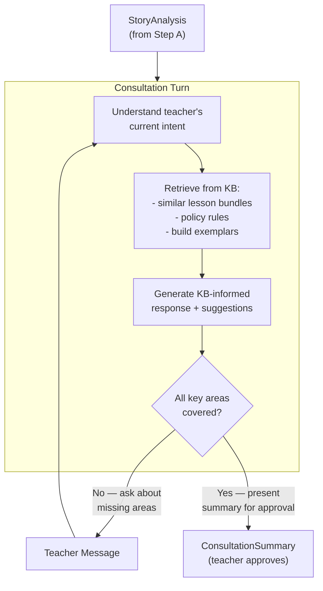

**Key areas the agent must cover** before producing a summary:

| Area | What the Agent Does | Example |
|---|---|---|
| **Central theme** | Identifies the story's themes and helps teacher pick one to focus on | "The story has themes of perseverance and community. Which resonates more with your class goals?" |
| **Grade band + duration** | Confirms logistical constraints | "What grade level and how much time do you have?" |
| **Learning objectives** | Suggests objectives based on KB exemplars and policy rules | "Based on similar 1st grade lessons, common objectives include 'I can build a model of X' and 'I can tell about my design.' Would these work?" |
| **Build artifact** | Proposes buildable objects from the story, informed by KB build-target exemplars | "Students could build Milo's flying delivery vehicle. In similar lessons, students built airplanes with 5 key parts. Does a flying vehicle work for your class?" |
| **Literacy focus** | Suggests vocabulary and sound awareness based on Science of Reading policy | "The word 'delivery' starts with Dd. We could include a rhyming activity. Does that fit your literacy goals?" |
| **SEL focus** | Recommends social-emotional themes based on CASEL policy | "Partner talk and community helping are strong SEL angles for this story." |

**Agent definition**:

```python
consultation_agent = Agent(
    'openai:gpt-4o',
    deps_type=ConsultationDeps,
    system_prompt="""You are KidSpark AI, an expert curriculum designer for Kid Spark
    block-building lessons. You are guiding a teacher through planning a new lesson
    based on a storybook they uploaded.

    You have access to the knowledge base via tools. Use retrieve_lessons to find
    similar existing lessons and retrieve_policy to find curriculum rules. Reference
    these in your responses to ground your suggestions in real examples.

    Your job is to be INSTRUCTIVE — if the teacher is unsure, suggest concrete
    options. Progressively cover: theme, grade/duration, learning objectives,
    build artifact, literacy focus, and SEL focus.

    When all areas are covered, present a clear summary and ask for approval."""
)

@consultation_agent.tool
async def retrieve_lessons(ctx: RunContext[ConsultationDeps], query: str, grade_band: str) -> str:
    """Retrieve similar lesson bundles from the knowledge base."""
    evidence = await retrieval_service.search(query=query, grade_band=grade_band, limit=3)
    return format_evidence_for_context(evidence)

@consultation_agent.tool
async def retrieve_policy(ctx: RunContext[ConsultationDeps], grade_band: str, framework: str) -> str:
    """Retrieve policy rules (UDL, CASEL, SoR, standards) for a grade band."""
    rules = await retrieval_service.get_policy_rules(grade_band=grade_band, framework=framework)
    return format_rules_for_context(rules)
```

**Example conversation** (showing KB retrieval mid-dialog):

> **Teacher**: "I just uploaded 'Milo's Flying Delivery'. I'm teaching 1st grade."
>
> *Agent internally calls `retrieve_lessons("flying machine transportation 1st grade", "1st Grade")` and gets the airplane bundle as a match.*
>
> **Agent**: "Great story! I found a similar lesson in our library — 'Invent an Airplane' for 1st grade, which is also about flying machines and perseverance. That lesson runs 35 minutes with a Read, Learn & Explore, and Invent structure. Would a similar format work for you? And how much class time do you have?"
>
> **Teacher**: "About 35 minutes. I want to focus on vocabulary and partner work."
>
> *Agent internally calls `retrieve_policy("1st Grade", "CASEL")` and `retrieve_policy("1st Grade", "SoR")`.*
>
> **Agent**: "For 1st grade partner work, our curriculum framework recommends CASEL competencies including relationship skills and social awareness. For literacy, we can feature 'Dd is for delivery' with a rhyming activity — the word 'delivery' ends with the /ee/ sound, similar to how the airplane lesson used 'machine.' For the build, students could create their own flying delivery vehicle with key parts: wings, body, propeller, cargo compartment, and landing gear. Does this direction sound right?"
>
> **Teacher**: "Yes, that sounds perfect."
>
> **Agent**: "Here's a summary of what we've agreed on:
> - **Theme**: Perseverance through invention
> - **Grade**: 1st Grade, 35 minutes
> - **Build artifact**: Flying delivery vehicle
> - **Learning objectives**: Build a model of a flying delivery vehicle; tell about its parts
> - **Literacy focus**: Dd is for delivery, rhyming with /ee/
> - **SEL focus**: Partner talk, helping others
>
> Ready to proceed to the next step?"

The teacher then calls `POST /sessions/{id}/approve-plan` to confirm. This produces a `ConsultationSummary` and transitions the session to the block awareness phase.

##### Block Awareness Agent (Kid Spark Piece Catalog)

Once the build artifact is agreed upon, the Block Awareness Agent determines what Kid Spark pieces will be needed, with particular focus on **movable and articulated parts**.

**Purpose**: The teacher knows what they want students to build, but may not know which Kid Spark pieces enable specific movements (spinning, pivoting, rolling). This agent bridges that gap by asking targeted questions about articulation and internally mapping answers to the Kid Spark block catalog.

**How it works**:

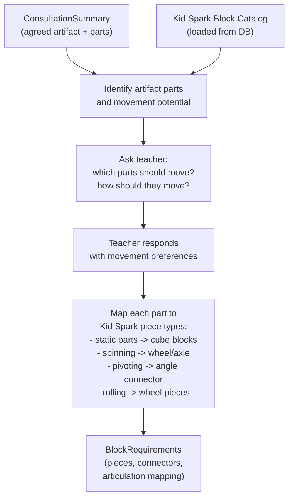

**Kid Spark piece-to-movement mapping**:

| Movement Type | Kid Spark Piece | How It Works |
|---|---|---|
| **Spinning** (continuous rotation) | Wheel/axle piece | Axle passes through cube block window; attached piece spins freely |
| **Pivoting** (limited arc movement) | Angle connector | Two cubes connected at an angle; one can hinge relative to the other |
| **Rolling** (ground movement) | Wheel pieces + axle | Wheels on axle mounted to underside of body |
| **Static structure** | Cube blocks (windowed) | Standard building blocks; triangular prism connectors join faces |
| **Bridging** (flat connection) | Flat connector | Bridges two cube faces that don't share a direct edge |

**Agent definition**:

```python
block_awareness_agent = Agent(
    'openai:gpt-4o',
    result_type=BlockRequirements,
    deps_type=BlockAwarenessDeps,
    system_prompt="""You are a Kid Spark block-building expert. Given an agreed build
    artifact, you determine which Kid Spark Early Inventors STEM Lab pieces are needed.

    You have the full block catalog available. Your job is to:
    1. List the main parts of the artifact
    2. Ask the teacher which parts should move and how
    3. Map each part to specific Kid Spark piece types
    4. Identify which special connectors are needed for articulated parts
    5. Produce a BlockRequirements spec

    Be concise and helpful. If the teacher isn't sure about movement, suggest
    what would be fun and educational based on the artifact type."""
)
```

**Example exchange**:

> **Agent**: "Your flying delivery vehicle has these main parts: **wings**, **body**, **cargo compartment**, **propeller**, and **landing gear**. Let me ask about movement:
> - Should the **propeller** spin?
> - Should the **wings** move or stay fixed?
> - Should the **cargo compartment** open?
> - Should it have **rolling wheels** on the landing gear?"
>
> **Teacher**: "Spinning propeller for sure. Fixed wings. No opening cargo. Rolling wheels would be fun."
>
> **Agent**: "Got it. Here's what I'll plan for:
> - **Propeller**: Wheel/axle piece — the axle passes through a cube block so the propeller spins freely
> - **Wings**: Standard cube blocks — fixed, structurally stable
> - **Body + Cargo**: Cube blocks — main structure, no moving parts
> - **Landing gear**: Wheel pieces + axle — mounted underneath so it rolls
>
> This uses approximately 12 cube blocks, 2 wheel/axle assemblies, and 2 flat connectors. Ready to generate the lesson?"

**Example `BlockRequirements` output**:

```json
{
  "artifact_label": "flying delivery vehicle",
  "parts": [
    {
      "part_name": "propeller",
      "movement": "spinning",
      "suggested_pieces": ["wheel_axle"],
      "piece_count": 1,
      "notes": "Axle through front-mounted cube block"
    },
    {
      "part_name": "wings",
      "movement": "static",
      "suggested_pieces": ["cube_block"],
      "piece_count": 4,
      "notes": "Two cubes per wing, extending from body sides"
    },
    {
      "part_name": "body",
      "movement": "static",
      "suggested_pieces": ["cube_block"],
      "piece_count": 4,
      "notes": "Central fuselage structure"
    },
    {
      "part_name": "cargo_compartment",
      "movement": "static",
      "suggested_pieces": ["cube_block"],
      "piece_count": 2,
      "notes": "Attached under or behind body"
    },
    {
      "part_name": "landing_gear",
      "movement": "rolling",
      "suggested_pieces": ["wheel_axle", "flat_connector"],
      "piece_count": 2,
      "notes": "Wheels mounted on axles under body"
    }
  ],
  "connector_types_needed": ["flat_connector", "wheel_axle"],
  "total_cube_blocks": 10,
  "total_special_pieces": 4,
  "articulation_summary": "Spinning propeller (1x wheel/axle), rolling landing gear (2x wheel/axle)"
}
```

##### Step B — Outline Planner

Takes the `ConsultationSummary` + `BlockRequirements` + `EvidencePack` and produces a `LessonSpec` — the shared internal blueprint from which both the Teacher Plan and Student Guide are rendered. Because the consultation and block awareness phases have already established the theme, artifact, objectives, and piece requirements, the Outline Planner has rich, teacher-confirmed context to work with.

The LessonSpec fields are designed to mirror the canonical lesson structure:

```json
{
  "theme": "perseverance through delivery",
  "objectives": ["build a model of a flying delivery vehicle", "tell about its parts and how it works"],
  "lesson_flow": [
    {"activity": "Anticipatory Set", "duration_minutes": 5, "description": "Discussion: How do packages get delivered?"},
    {"activity": "Step 01: Read", "duration_minutes": 10, "description": "Read Milo's Flying Delivery. Dd is for delivery."},
    {"activity": "Step 02: Learn & Explore", "duration_minutes": 5, "description": "Explore parts of a flying delivery vehicle."},
    {"activity": "Step 03: Invent", "duration_minutes": 10, "description": "Build your own flying delivery vehicle."},
    {"activity": "Closure & Reflection", "duration_minutes": 5, "description": "Share designs and reflect."}
  ],
  "teacher_prompts": ["What parts will you build first?", "How will your vehicle carry packages?"],
  "student_steps": ["Read", "Learn & Explore", "Invent", "Share"],
  "materials": ["Kid Spark Early Inventors STEM Lab", "Milo's Flying Delivery (storybook)", "Activity Guide"],
  "standards_alignment": ["K-2-ETS1-2", "RF.1.2", "L.1.4", "SL.1.1"],
  "build_target_profile_ref": "flying_delivery_vehicle"
}
```

##### Step C — Build Target (Enriched with Block Awareness)

Produces a `BuildTargetProfile` by combining the `LessonSpec` with the `BlockRequirements` from the Block Awareness Agent. Because the block awareness phase has already mapped parts to Kid Spark pieces and identified articulation, the Build Target Profile is richer than a simple label — it includes specific piece references and movement descriptions that the teacher and student materials can reference. Full topology-aware 3D build plans remain Phase 2.

```json
{
  "target_label": "flying delivery vehicle",
  "target_family": "flying machine / transportation",
  "required_visible_parts": ["wings", "body", "cargo compartment", "propeller", "landing gear"],
  "teacher_planning_prompts": [
    "What parts will you build first?",
    "How can you build a cargo compartment that opens?",
    "Which blocks can make strong wings?"
  ],
  "variation_prompts": [
    "What could you add or change to make it your own?",
    "How would you make it carry more packages?"
  ]
}
```

##### Steps D + E — Teacher Plan and Student Guide (Parallel)

These two agents run **in parallel** since they both depend on the same inputs (LessonSpec + BuildTargetProfile + EvidencePack) but not on each other.

The orchestrator is split into three phases. The first two are interactive (teacher in the loop), the third is automated.

```python
# agents/orchestrator.py

import asyncio

# ── Phase 1: Storybook Analysis (automatic, on upload) ──

async def analyze_storybook(storybook_text: str, session: Session) -> StoryAnalysis:
    result = await story_analysis_agent.run(storybook_text)
    session.storybook_analysis = result.data
    return result.data


# ── Phase 2: Teacher Consultation (multi-turn, called per message) ──

async def handle_consultation_message(
    message: str, session: Session
) -> ConsultationResponse:
    deps = ConsultationDeps(
        story_analysis=session.storybook_analysis,
        chat_history=session.teacher_messages,
    )
    result = await consultation_agent.run(message, deps=deps)
    session.teacher_messages.append({"role": "user", "content": message})
    session.teacher_messages.append({"role": "assistant", "content": result.data.response})
    return result.data


async def finalize_consultation(session: Session) -> ConsultationSummary:
    """Called when teacher approves the consultation direction."""
    deps = ConsultationDeps(
        story_analysis=session.storybook_analysis,
        chat_history=session.teacher_messages,
    )
    summary = await consultation_agent.run(
        "Produce the final ConsultationSummary from our conversation.", deps=deps
    )
    session.consultation_state = summary.data
    session.phase = "block_awareness"
    return summary.data


# ── Phase 3: Block Awareness (1-2 turns, then auto) ──

async def handle_block_awareness_message(
    message: str, session: Session
) -> BlockAwarenessResponse:
    catalog = await db.fetch_all("SELECT * FROM block_catalog")
    deps = BlockAwarenessDeps(
        consultation_summary=session.consultation_state,
        block_catalog=catalog,
        chat_history=session.teacher_messages,
    )
    result = await block_awareness_agent.run(message, deps=deps)
    session.block_requirements = result.data
    return result.data


# ── Phase 4: Generation Pipeline (automated, no teacher input) ──

async def run_generation_pipeline(session: Session) -> LessonPackage:
    consultation = session.consultation_state
    block_reqs = session.block_requirements

    evidence = await retrieve_evidence(consultation)

    # Step B — Outline
    lesson_spec = await outline_agent.run(
        f"Consultation: {consultation}\nBlocks: {block_reqs}\nEvidence: {evidence}",
    )

    # Step C — Build Target (enriched with block requirements)
    build_target = await build_target_agent.run(
        f"LessonSpec: {lesson_spec.data}\nBlockReqs: {block_reqs}",
    )

    # Steps D + E — parallel
    teacher_plan_task = teacher_plan_agent.run(
        f"LessonSpec: {lesson_spec.data}\nBuild: {build_target.data}\nEvidence: {evidence}",
    )
    student_guide_task = student_guide_agent.run(
        f"LessonSpec: {lesson_spec.data}\nBuild: {build_target.data}\nEvidence: {evidence}",
    )
    teacher_plan, student_guide = await asyncio.gather(teacher_plan_task, student_guide_task)

    # Step F — Validate
    validation = await validator_agent.run(
        f"TeacherPlan: {teacher_plan.data}\nStudentGuide: {student_guide.data}\n"
        f"LessonSpec: {lesson_spec.data}\nPolicy: {evidence.policy_cards}",
    )

    return LessonPackage(
        teacher_plan=teacher_plan.data,
        student_guide=student_guide.data,
        build_target_profile=build_target.data,
        validation=validation.data,
    )
```

##### Step F — Validator

Checks the generated package against structural and policy requirements:

| Check | What It Catches | Example Failure |
|---|---|---|
| `required_sections_present` | Missing teacher or student sections | No closure/reflection in teacher plan |
| `time_consistency` | Minutes don't add up | 35-min request but 50 min of phases |
| `build_awareness_present` | Build target missing or unsupported | Student guide asks for vehicle but no parts list |
| `literacy_component_present` | No literacy in Storytime Inventing | Missing vocabulary or sound awareness |
| `udl_support_present` | No multiple means of representation | Only verbal, no visual supports |
| `teacher_student_alignment` | Mismatched tasks | Teacher says 5 parts, student guide says 3 |
| `policy_alignment` | Wrong grade-band standards | Grade-1 plan uses K-only alignment |

If validation fails, the validator attempts one auto-fix and re-validates. If it still fails, the error is returned to the teacher for manual adjustment.

#### Iterative Refinement

The teacher can review the generated package, provide feedback, and request re-generation. The system supports at least 3 refinement iterations:

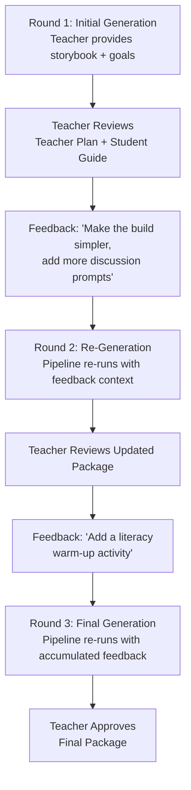

Each iteration carries forward:
- All previous teacher messages (accumulated context)
- The previous generated package (so the agent sees what to change)
- Specific feedback instructions (injected into agent prompts)
- Iteration count (so agents know which round this is)

---

## 8. Phase 2 — 3D Build Plan Integration

Phase 2 upgrades Step C from a lightweight `BuildTargetProfile` to a full topology-aware `BuildPlan` by integrating with the 3rd-party 3D modeling pipeline.

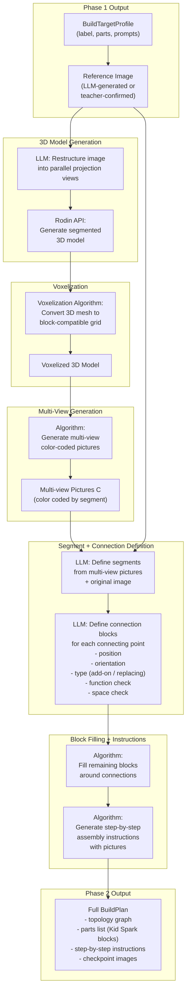

### Kid Spark Block Types

The system must map voxelized shapes to actual Kid Spark Early Inventors STEM Lab pieces. Based on the physical block kit, the available piece types include:

| Piece Type | Colors Available | Quantity | Connection Mechanism |
|---|---|---|---|
| Cube block (windowed) | Red, Blue, Green, Yellow, Purple, Orange | ~16 each | Triangular prism connectors on faces |
| Half-circle block | Pink, Blue | ~4 each | Same connector system |
| Wheel/axle piece | Black/Red | ~4 | Axle-through connection |
| Flat connector | Various | ~10 | Bridge between cube faces |
| Angle connector | Red | ~6 | Corner/angled connections |

Phase 2 development will need a **block catalog** that defines each piece's dimensions, connection points, and structural properties. The connection block LLM step uses this catalog plus the multi-view pictures to determine which block goes where, how it connects, and whether the connection is structurally sound.

---

## 9. Developer Workstream Split

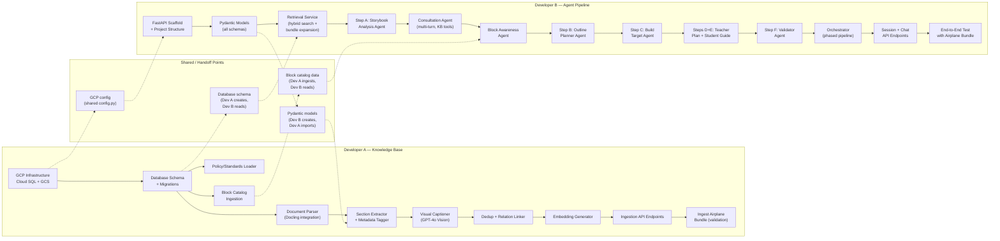

### Handoff Contracts

The two developers share four interfaces. These must be agreed upon early (Phase 1a) so both can work independently:

**1. Database Tables** (Dev A owns, Dev B reads)
- Dev B's retrieval service queries `knowledge_nodes`, `relations`, and `policy_rules`
- Dev B's Block Awareness Agent reads `block_catalog`
- Dev B does not write to these tables (read-only consumer)

**2. Pydantic Models** (Dev B owns, both use)
- Dev B defines all schemas in `models/schemas.py`
- Dev A imports `KnowledgeNodeCreate`, `RelationCreate`, `PolicyRuleCreate` for ingestion writes
- Dev B uses `ConsultationSummary`, `BlockRequirements`, `EvidencePack`, `LessonSpec`, etc. for runtime

**3. GCP Config** (shared)
- Both devs use the same `config.py` for database URLs, GCS buckets, and secret references
- Cloud Run service is deployed from a single Docker image containing both workstreams

**4. Block Catalog Data** (Dev A ingests, Dev B reads)
- Dev A populates the `block_catalog` table with Kid Spark piece definitions (types, colors, quantities, connection mechanisms, movement capabilities)
- Dev B's Block Awareness Agent loads this catalog at runtime to map movement requirements to specific pieces

### What Each Developer Can Test Independently

| Developer A | Developer B |
|---|---|
| Upload PDFs and verify parsing output | Create mock `knowledge_nodes` rows and test retrieval |
| Check extracted sections match expected structure | Test consultation agent with hardcoded StoryAnalysis |
| Verify captions are generated for slide pages | Test block awareness agent with mock block catalog |
| Confirm embeddings are stored in pgvector | Verify pipeline produces valid `LessonPackage` |
| Populate block catalog and verify piece data | Test API endpoints and phased session flow with mock data |
| Ingest the full airplane bundle and inspect the DB | Generate a lesson from the airplane bundle (after Dev A ingests it) |

---

## 10. API Reference

### Ingestion APIs (Developer A)

| Method | Endpoint | Description |
|---|---|---|
| `POST` | `/api/v1/bundles` | Register a new lesson bundle (upload 3 PDF files) |
| `POST` | `/api/v1/bundles/{bundle_id}/ingest` | Trigger full ingestion pipeline for a bundle |
| `GET` | `/api/v1/bundles` | List all bundles with status |
| `GET` | `/api/v1/bundles/{bundle_id}` | Get bundle detail with node summary |
| `GET` | `/api/v1/bundles/{bundle_id}/nodes` | List all knowledge nodes in a bundle |
| `POST` | `/api/v1/policy/ingest` | Ingest the standards/framework document |
| `GET` | `/api/v1/ingestion-jobs/{job_id}` | Check ingestion job status |

### Runtime APIs (Developer B)

Session endpoints follow a phased model. The session progresses through phases: `consultation` -> `block_awareness` -> `generation` -> `refinement` -> `complete`. The `/message` endpoint routes to the appropriate agent based on the current phase.

| Method | Endpoint | Description | Phase |
|---|---|---|---|
| `POST` | `/api/v1/sessions` | Create a new teacher session | -- |
| `POST` | `/api/v1/sessions/{id}/upload` | Upload storybook PDF/DOCX; triggers automatic Step A analysis | -- |
| `POST` | `/api/v1/sessions/{id}/message` | Send teacher message; routed to Consultation Agent or Block Awareness Agent based on session phase | consultation, block_awareness |
| `GET` | `/api/v1/sessions/{id}/consultation` | Get current consultation state and progress | consultation |
| `POST` | `/api/v1/sessions/{id}/approve-plan` | Teacher approves the consultation direction; transitions to block_awareness phase | consultation |
| `POST` | `/api/v1/sessions/{id}/generate` | Trigger generation pipeline (Steps B-F); only available after block awareness is complete | generation |
| `GET` | `/api/v1/sessions/{id}/package` | Get the generated LessonPackage | generation, refinement |
| `POST` | `/api/v1/sessions/{id}/refine` | Submit feedback and re-generate | refinement |
| `GET` | `/api/v1/sessions/{id}/trace` | Get evidence trace for the current package | any |
| `GET` | `/api/v1/blocks/catalog` | Get the Kid Spark block catalog | any |
| `POST` | `/api/v1/retrieve` | Direct retrieval query (for debugging) | any |
| `GET` | `/api/v1/nodes/{node_id}` | Inspect a specific knowledge node | any |

### Example: Full Session Flow

```bash
# 1. Create session
POST /api/v1/sessions
→ { "session_id": "abc-123", "phase": "consultation" }

# 2. Upload storybook (triggers automatic analysis)
POST /api/v1/sessions/abc-123/upload
Content-Type: multipart/form-data
file: milos_flying_delivery.pdf
→ {
    "status": "analyzed",
    "story_analysis": {
      "title": "Milo's Flying Delivery",
      "themes": ["perseverance", "community", "invention"],
      "buildable_objects": ["flying delivery vehicle", "workshop"]
    },
    "phase": "consultation"
  }

# 3. Teacher Consultation Loop (multi-turn)
POST /api/v1/sessions/abc-123/message
{ "message": "I'm teaching 1st grade, about 35 minutes" }
→ {
    "response": "Great! I found a similar lesson — 'Invent an Airplane' for 1st grade, also about flying machines and perseverance. That lesson runs 35 minutes. The story's themes of perseverance and community are strong. What learning objectives matter most — vocabulary, partner collaboration, or something else?",
    "phase": "consultation",
    "areas_covered": ["grade_band", "duration"],
    "areas_remaining": ["objectives", "artifact", "literacy", "sel"]
  }

POST /api/v1/sessions/abc-123/message
{ "message": "Vocabulary and partner collaboration" }
→ {
    "response": "For 1st grade partner work, our curriculum recommends CASEL relationship skills. For literacy, we can feature 'Dd is for delivery' with rhyming. Students could build a flying delivery vehicle with wings, body, propeller, cargo, and landing gear. Does this direction work?",
    "phase": "consultation",
    "areas_covered": ["grade_band", "duration", "objectives", "literacy", "sel"],
    "areas_remaining": ["artifact"]
  }

POST /api/v1/sessions/abc-123/message
{ "message": "Yes, flying delivery vehicle sounds perfect" }
→ {
    "response": "Here is the proposed direction:\n- Theme: Perseverance\n- Artifact: Flying delivery vehicle\n- Literacy: Dd is for delivery + rhyming\n- SEL: Partner talk + helping others\n\nReady to approve and move to block planning?",
    "phase": "consultation",
    "ready_to_approve": true
  }

# 4. Teacher approves → transitions to block awareness phase
POST /api/v1/sessions/abc-123/approve-plan
→ {
    "status": "approved",
    "consultation_summary": { ... },
    "phase": "block_awareness"
  }

# 5. Block Awareness Phase (1-2 turns)
POST /api/v1/sessions/abc-123/message
→ {
    "response": "Your flying delivery vehicle has 5 main parts. Let me ask about movement:\n- Should the propeller spin?\n- Should the wings move or stay fixed?\n- Should the cargo compartment open?\n- Should it have rolling wheels on the landing gear?",
    "phase": "block_awareness"
  }

POST /api/v1/sessions/abc-123/message
{ "message": "Spinning propeller and rolling wheels. Wings and cargo stay fixed." }
→ {
    "response": "I'll use wheel/axle pieces for the propeller and landing gear. This needs ~10 cube blocks and 4 special pieces. Ready to generate the lesson!",
    "phase": "block_awareness",
    "block_requirements": { ... },
    "ready_to_generate": true
  }

# 6. Generate lesson package
POST /api/v1/sessions/abc-123/generate
→ {
    "status": "complete",
    "iteration": 1,
    "package": {
      "teacher_plan": { ... },
      "student_guide": { ... },
      "build_target_profile": { ... },
      "validation": { "is_valid": true, "warnings": [] }
    },
    "phase": "refinement"
  }

# 7. Refine (optional, up to 3 iterations)
POST /api/v1/sessions/abc-123/refine
{ "feedback": "Add more scaffolding for students who struggle to start building" }
→ {
    "status": "complete",
    "iteration": 2,
    "package": { ... updated package with additional scaffolding ... },
    "phase": "refinement"
  }
```

---

## 11. Data Model Reference

All data structures are Pydantic v2 models defined in `models/schemas.py`.

### StoryAnalysis (Step A Output)

```python
class StoryAnalysis(BaseModel):
    title: str                             # "Milo's Flying Delivery"
    characters: list[str]                  # ["Milo", "Grandma Rose", "neighborhood friends"]
    settings: list[str]                    # ["workshop", "neighborhood", "the sky"]
    key_events: list[str]                  # ["builds flying machine", "first delivery fails", ...]
    themes: list[str]                      # ["perseverance", "community", "invention"]
    buildable_objects: list[str]           # ["flying delivery vehicle", "workshop"]
    vocabulary_opportunities: list[str]    # ["delivery", "propeller", "design"]
    sel_angles: list[str]                  # ["helping others", "not giving up", "teamwork"]
```

### ConsultationSummary (Consultation Agent Output)

```python
class ConsultationSummary(BaseModel):
    agreed_theme: str                      # "perseverance through invention"
    agreed_artifact: str                   # "flying delivery vehicle"
    artifact_parts: list[str]             # ["wings", "body", "propeller", "cargo", "landing gear"]
    learning_objectives: list[str]         # ["build a model of a flying vehicle", "tell about parts"]
    grade_band: str                        # "1st Grade"
    duration_minutes: int                  # 35
    literacy_focus: str                    # "Dd is for delivery, rhyming with /ee/"
    sel_focus: str                         # "partner talk, helping others"
    teacher_preferences: list[str]         # ["partner collaboration", "vocabulary emphasis"]
    kb_evidence_used: list[str]            # ["storytime_inventing.grade1.airplane", ...]
    storybook_title: str                   # "Milo's Flying Delivery"
```

### BlockRequirements (Block Awareness Agent Output)

```python
class ArtifactPart(BaseModel):
    part_name: str                         # "propeller"
    movement: str                          # "spinning" | "pivoting" | "rolling" | "static"
    suggested_pieces: list[str]            # ["wheel_axle"]
    piece_count: int                       # 1
    notes: str                             # "Axle through front-mounted cube block"

class BlockRequirements(BaseModel):
    artifact_label: str                    # "flying delivery vehicle"
    parts: list[ArtifactPart]
    connector_types_needed: list[str]      # ["flat_connector", "wheel_axle"]
    total_cube_blocks: int                 # 10
    total_special_pieces: int              # 4
    articulation_summary: str              # "Spinning propeller (1x wheel/axle), rolling gear (2x)"
```

### KidSparkPiece (Block Catalog)

```python
class KidSparkPiece(BaseModel):
    piece_type: str                        # "cube" | "half_circle" | "wheel" | "axle" | ...
    piece_name: str                        # "Cube Block (Windowed)"
    colors_available: list[str]            # ["Red", "Blue", "Green", "Yellow", "Purple", "Orange"]
    quantity_per_kit: int                  # 16
    connection_mechanism: str              # "triangular prism connector"
    supports_rotation: bool                # True if can spin on axis
    supports_pivot: bool                   # True if can hinge
    supports_axle: bool                    # True if can hold axle through
    structural_role: str                   # "body" | "connector" | "articulation" | "wheel"
    dimensions: dict                       # {"width": 1, "height": 1, "depth": 1} in grid units
    description: str                       # human-readable description
```

### LessonSpec

```python
class TimeBlock(BaseModel):
    activity: str                          # "Step 01: Read"
    duration_minutes: int                  # 10
    description: str                       # "Read story. Dd is for delivery."

class LessonSpec(BaseModel):
    theme: str
    objectives: list[str]
    lesson_flow: list[TimeBlock]
    teacher_prompts: list[str]
    student_steps: list[str]
    materials: list[str]
    standards_alignment: list[str]
    build_target_profile_ref: str
    validation_flags: dict[str, bool]      # filled by validator
```

### BuildTargetProfile

```python
class BuildTargetProfile(BaseModel):
    target_label: str                      # "flying delivery vehicle"
    target_family: str                     # "flying machine / transportation"
    required_visible_parts: list[str]      # ["wings", "body", "cargo", "propeller"]
    exemplar_assets: list[str]             # GCS URIs or node_ids of reference images
    teacher_planning_prompts: list[str]
    variation_prompts: list[str]
```

### TeacherLessonPlan

```python
class TeacherPrompt(BaseModel):
    context: str
    prompt_text: str
    expected_response: str

class TeacherLessonPlan(BaseModel):
    title: str
    overview: str
    learning_objectives: list[str]
    curriculum_connections: list[str]
    activity_details: dict                 # time, grade, grouping
    materials: list[str]
    vocabulary: list[dict[str, str]]       # [{"term": "...", "definition": "..."}]
    pre_lesson_preparation: list[str]
    plan_for_all_learners: str
    anticipatory_set: str
    step_01_read: str
    step_02_learn_explore: str
    step_03_invent: str
    closure_reflection: str
    teacher_prompts: list[TeacherPrompt]
    troubleshooting_tips: list[dict[str, str]]
    standards: list[str]
```

### StudentActivityGuide

```python
class StudentGuideSection(BaseModel):
    section_type: str                      # "read" | "vocabulary" | "learn_explore" | "invent" | "reflection"
    title: str
    content: str
    visual_description: str | None         # what image should accompany this section

class StudentActivityGuide(BaseModel):
    title: str
    grade_band: str
    sections: list[StudentGuideSection]
    example_build_description: str
    real_world_connection: str
    reflection_questions: list[str]
```

### EvidencePack

```python
class EvidenceCard(BaseModel):
    node_id: str
    bundle_id: str
    content_text: str
    doc_kind: str
    audience: str
    lesson_stage: str
    relevance_score: float

class TraceEntry(BaseModel):
    node_id: str
    bundle_id: str
    score: float
    retrieval_reason: str

class EvidencePack(BaseModel):
    teacher_cards: list[EvidenceCard]
    student_cards: list[EvidenceCard]
    visual_cards: list[EvidenceCard]
    policy_cards: list[EvidenceCard]
    trace: list[TraceEntry]
```

### LessonPackage (Final Output)

```python
class ValidationResult(BaseModel):
    is_valid: bool
    errors: list[str]
    warnings: list[str]
    auto_fixes_applied: list[str]
    checks: dict[str, bool]                # per-check results

class LessonPackage(BaseModel):
    teacher_plan: TeacherLessonPlan
    student_guide: StudentActivityGuide
    build_target_profile: BuildTargetProfile
    validation: ValidationResult
    evidence_trace: list[TraceEntry]       # what KB content contributed
    iteration: int                         # which refinement round
    session_id: str
```

---

## 12. Deployment and Operations

### Dockerfile

```dockerfile
FROM python:3.12-slim

WORKDIR /app

COPY requirements.txt .
RUN pip install --no-cache-dir -r requirements.txt

COPY app/ ./app/

EXPOSE 8080

CMD ["uvicorn", "app.main:app", "--host", "0.0.0.0", "--port", "8080"]
```

### Cloud Build Configuration

```yaml
# cloudbuild.yaml
steps:
  - name: 'gcr.io/cloud-builders/docker'
    args: ['build', '-t', 'gcr.io/$PROJECT_ID/kidspark-api:$COMMIT_SHA', '.']

  - name: 'gcr.io/cloud-builders/docker'
    args: ['push', 'gcr.io/$PROJECT_ID/kidspark-api:$COMMIT_SHA']

  - name: 'gcr.io/google.com/cloudsdktool/cloud-sdk'
    entrypoint: gcloud
    args:
      - 'run'
      - 'deploy'
      - 'kidspark-api'
      - '--image'
      - 'gcr.io/$PROJECT_ID/kidspark-api:$COMMIT_SHA'
      - '--region'
      - 'us-central1'
      - '--platform'
      - 'managed'
      - '--allow-unauthenticated'
      - '--add-cloudsql-instances'
      - '${_CLOUD_SQL_CONNECTION}'
      - '--set-env-vars'
      - 'DB_NAME=kidspark,DB_USER=kidspark_app'
      - '--set-secrets'
      - 'OPENAI_API_KEY=openai-api-key:latest,DB_PASSWORD=db-password:latest'
      - '--memory'
      - '4Gi'
      - '--cpu'
      - '2'
      - '--timeout'
      - '300'
      - '--concurrency'
      - '10'
```

### Environment Variables

| Variable | Source | Description |
|---|---|---|
| `DB_NAME` | Env var | PostgreSQL database name |
| `DB_USER` | Env var | PostgreSQL username |
| `DB_PASSWORD` | Secret Manager | PostgreSQL password |
| `OPENAI_API_KEY` | Secret Manager | OpenAI API key |
| `CLOUD_SQL_CONNECTION_NAME` | Env var | `project:region:instance` |
| `GCS_RAW_BUCKET` | Env var | `kidspark-raw-files` |
| `GCS_ASSETS_BUCKET` | Env var | `kidspark-assets` |
| `ENVIRONMENT` | Env var | `dev` or `production` |

---

## 13. Timeline

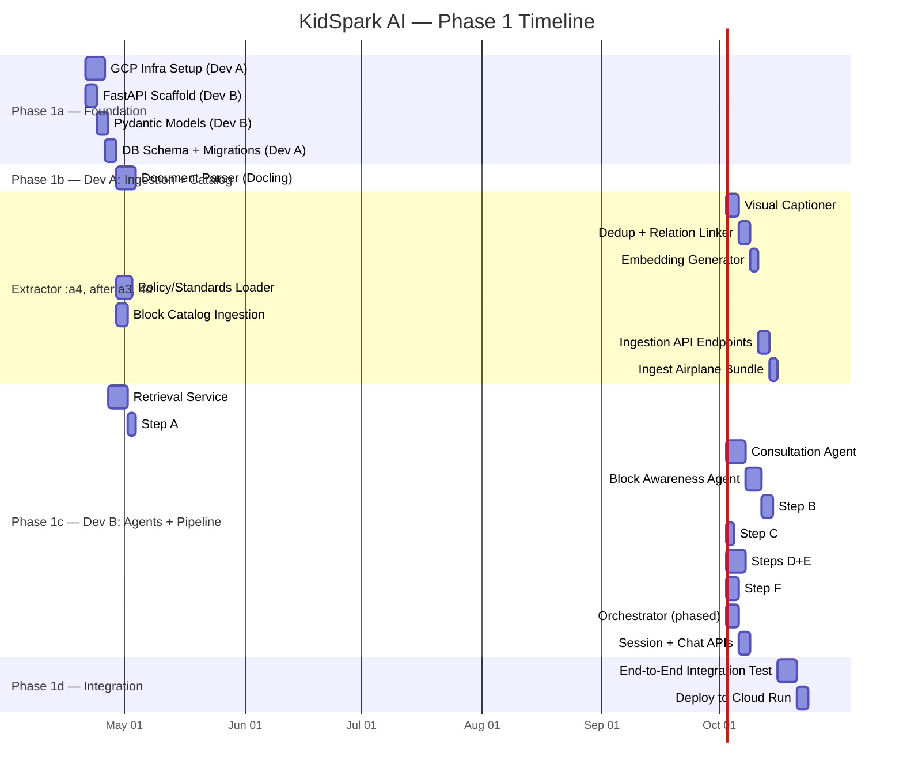

### Milestones

| Milestone | Target | Success Criteria |
|---|---|---|
| **Infrastructure Ready** | End of Week 1 | Cloud SQL, GCS, Cloud Run scaffold, DB tables + block_catalog created |
| **Airplane Bundle Ingested** | End of Week 3 | All 3 airplane PDFs parsed, ~30 nodes with embeddings in DB, relations linked, block catalog populated |
| **Consultation Agent Working** | End of Week 4 | Multi-turn teacher consultation loop functional with KB retrieval, producing ConsultationSummary |
| **Block Awareness Agent Working** | End of Week 5 | Block awareness agent maps artifacts to Kid Spark pieces, produces BlockRequirements |
| **Pipeline Generates a Lesson** | End of Week 6 | Full pipeline (consultation → block awareness → generation) produces a valid LessonPackage |
| **End-to-End Working** | End of Week 7 | Upload storybook → consult → approve → block awareness → generate → refine, deployed on Cloud Run |
| **All 72 Bundles Ingested** | End of Week 8 | Full lesson library in the knowledge base, retrieval returns relevant bundles |

---

*This document serves as the authoritative technical specification for Phase 1 of KidSpark AI. Both developers should reference this document for architecture decisions, data contracts, and integration points. For questions or changes, update this document and notify the other developer.*
