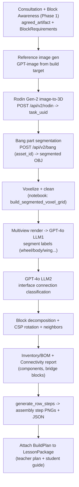

# Phase 2: 3D Build Plan Integration

**Overview:** Assess the Block Instructions notebook, chain it with Hyper3D Rodin (image-to-3D) + Bang (part segmentation) and our Phase 1 agent output into one asynchronous "build plan" workflow, standardized on OpenAI GPT-4o. This document is an assessment + integration design with a concrete list of gaps/questions for the notebook team.

> **Update (reviewed `my_notebook_25 (CSP).ipynb`)** - The team shipped a meaningfully more complete notebook. Major changes vs the first version: (a) the **full Hyper3D Rodin + Bang + status + download chain is now in the notebook** (top "Hyper3d Rodin Call" section, currently commented), confirming the exact 3-call flow we researched; (b) **LLM1 labeling now has a real vision attempt** using Ollama `llava:13b` (note: "switch to qwen2-vl later"), still alongside hardcoded labels; (c) rotation is upgraded to a proper **CSP (constraint-satisfaction) solver** with MALE/FEMALE face scoring that converges; (d) a real **block inventory / BOM** is produced (2x2x2 Blue, 2x2x3 Green, 2x2x4 Yellow with counts + a yellow cap); (e) a new **Connectivity Report** validates each interface (VALID/INVALID), computes connected components, attachment degrees, and **bridge blocks**; (f) a consolidated **Pipeline Output Cell**. Sections below are updated accordingly.

## 1. What the notebook actually does

`my_notebook_25 (CSP).ipynb` (in `Block_Instructions (pre-connection)/`) turns an image into voxel-based Kid Spark assembly instructions. Stages (in cell order):

- **Hyper3d Rodin Call (NEW)** - full client (commented out): `POST /api/v2/rodin` (image-to-3D, `tier=Gen-2`, `geometry_file_format=obj`, `material=None`, `quality=medium`, input `images=Bird1.jpg`) -> poll `POST /api/v2/status` with `subscription_key` until `Done` -> `POST /api/v2/bang` (`asset_id`, `strength=5`, obj) -> poll status -> `POST /api/v2/download` -> fetch OBJ. **Security flag: a live `API_KEY` is hardcoded in the cell** and must be removed/rotated and moved to Secret Manager/env.
- **Pre-voxelization** - `load_obj_segments_manual()` reads OBJ `o <name>` blocks into separate meshes; `normalize_meshes()` scales to unit bounds. Sample `toy_airplane_30k/tripo_convert_1f420a52-b8e1-4d94-a634-567465fa35c8.obj` has 20 named parts (`o tripo_part_0..19`).
- **Voxelization** - `build_segmented_voxel_grid(file_path, voxel_size=16, samples_per_triangle=30)` -> 16^3 grid, then cleans: `enforce_2x2_footprint`, `clean_vertical_columns`, `thicken_floor_and_ceiling_per_column`, `remap_segments_to_2x2_grid`.
- **Post-segmentation graph** - `split_segment_connected_components`, `compute_segment_adjacency`, `compute_contact_surfaces`, `compute_interface_centroid`.
- **Multiview render for LLM** - `generate_multiview` / `display_multiview` render 8 views + legend via matplotlib `ax.voxels`.
- **LLM1 (segment labeling)** - hardcoded labels still present, BUT now a real vision call exists using Ollama `llava:13b` (comment: "switch to qwen2-vl (more computationally heavy model) later"). Confirms labeling is intended to be **vision-based** over the multiview images.
- **LLM2 (connection classification)** - live call to local Ollama `qwen2.5:14b`, `temperature=0.2`, structured `format=connection_schema`.
- **Wheel handling + reservations** - `detect_wheel_segments` (substring "wheel"); the older multi-attempt reservation experiments ("Attempt 1/2/05-12/05-13") + duplicate helpers are still present above as dead code.
- **Block decomposition** - `BlockInstance`, `FaceType(MALE/FEMALE)`, `BLOCK_FACE_TEMPLATES`, `voxel_to_2x2_columns`, "Build Columns".
- **CSP Rotation Optimization (UPGRADED)** - `build_block_grid`, `score_block_rotation` (reward MALE<->FEMALE +10, penalize MALE/MALE -1000, FEMALE/FEMALE -100), `build_block_graph`; iterative solver converges (sample run: iteration 0->5, 20 -> 0 rotation changes).
- **Inventory / BOM (NEW)** - counts blocks by type with colors and a `max_yellow_blocks` cap. Sample: `2x2x2 (Blue): 12`, `2x2x3 (Green): 4`, `2x2x4 (Yellow): 12` = 28 blocks.
- **Connectivity Report (NEW)** - `report_connections` prints pairwise `MALE <-> FEMALE VALID/INVALID`, connected components (sample: 1 component / 28 blocks = fully connected), attachment degrees per block, and **bridge blocks** (articulation points).
- **Neighbor Mapping + Build Instructions** - `generate_row_steps(blocks)` groups blocks by Y row into assembly steps; per-step matplotlib renderer produces step images via the "Pipeline Output Cell".

## 2. Critical analysis / gaps

- **LLM backend mismatch** - notebook uses local Ollama (`qwen2.5:14b` for connections, `llava:13b` for labeling); our system uses OpenAI. Decision: **standardize on GPT-4o** (vision handles the multiview images for labeling). Both LLM calls must be ported. The new `llava:13b` attempt confirms vision is the right modality for LLM1.
- **Segment labeling still not production-ready** - LLM1 has a started vision implementation but labels are still hardcoded for the airplane. For arbitrary storybook builds this must become a reliable GPT-4o vision call over the multiview images. **Still the biggest functional gap.**
- **Upstream confirmed = Rodin + Bang** - the notebook now contains the chain explicitly: segmentation comes from Hyper3D **Bang!** (`/api/v2/bang`, `strength=5`) applied to a Rodin Gen-2 `asset_id`. This de-risks `rodin_client.py` (we can port the cell directly). The Tripo sample is just a stand-in. **Open:** does Rodin+Bang reliably yield the `o <part>` OBJ structure the loader expects, and how stable is part count across builds?
- **Exploratory, not production code** - the consolidated path is now clearer (Block Decomposition -> Build Columns -> CSP -> Connectivity -> Pipeline Output), but the older "Attempt" reservation branches + duplicate helpers remain as dead code. Refactor should keep the CSP/connectivity path and drop the rest. No single entry function yet; output is still matplotlib `plt.show()` + stdout (the inventory/connectivity are printed, not serialized).
- **Rendering is heavy** - many `ax.voxels` 3D renders (multiview + per-step + debug). CPU-bound; must run server-side to PNG, minimized.
- **Determinism** - KMeans + `np.random` colors; CSP convergence appears stable but seeds must be fixed for reproducible plans.
- **New outputs to capture** - the **inventory/BOM** and **connectivity report (components + bridge blocks)** are valuable, lesson-ready artifacts and should become first-class fields in our `BuildPlan` (BOM maps directly to Kid Spark kit piece counts; bridge blocks flag structurally critical / articulation-relevant pieces).

## 3. User experience / timing

This is a long, multi-minute pipeline and **cannot be a synchronous request**. Rough per-stage estimate:

- Reference image (GPT-image/DALL-E): ~10-20s
- Rodin Gen-2 image-to-3D: ~90s+ (async submit + 5s poll loop)
- Bang part segmentation: ~60s+ (async submit + 5s poll loop)
- Download + voxelize + clean: ~10-30s
- LLM1 labeling + LLM2 connections (GPT-4o): ~5-15s each
- Block decomposition + CSP rotation solve: fast (sample converged in 5 iterations)
- Render N assembly-step PNGs: ~10-30s

**Total ~3-6 minutes.** Implication: a **background job** with a status/progress model (mirrors the spec's Cloud Run + `ingestion_jobs` async pattern). The teacher approves the build target, generation runs in the background with phase-level progress ("Generating 3D model...", "Segmenting parts...", "Computing blocks...", "Rendering steps..."), and the lesson package is finalized when done. The Phase 1 lesson plan (teacher/student text) should be generated and shown first so the teacher is never blocked staring at a spinner.

## 4. Proposed chained workflow

`BlockRequirements` from Phase 1 (parts + movement: spinning/rolling) feeds the reference-image prompt and gives the wheel/articulation step a semantic hint instead of relying only on the "wheel" substring.

## 5. Integration design (no code yet - plan only)

New backend package `backend/build3d/` (Developer B, Phase 2):

- `reference_image.py` - build target text + parts -> GPT-image reference PNG.
- `rodin_client.py` - async client: Rodin Gen-2 image-to-3D, Bang segmentation, status polling, asset download (direct port of the notebook's new "Hyper3d Rodin Call" cells). Config: `HYPER3D_API_KEY` (from env/Secret Manager, NOT hardcoded), base `https://api.hyper3d.com/api/v2`.
- `voxelizer.py` - port of notebook pre-voxelization + voxelization + cleaning into pure functions.
- `segment_labeler.py` - **new** GPT-4o vision implementation of LLM1 over multiview images (replaces both the `llava:13b` attempt and the hardcoded labels).
- `connection_classifier.py` - port LLM2 to GPT-4o structured outputs (port `connection_schema`).
- `block_decomposer.py` - port `BlockInstance`/`FaceType`/`BLOCK_FACE_TEMPLATES`/"Build Columns" + the **CSP rotation solver** (`build_block_grid`, `score_block_rotation`, `build_block_graph`); drop the dead "Attempt" reservation branches.
- `connectivity.py` - port `report_connections` (VALID/INVALID interfaces, connected components, attachment degrees, bridge blocks) returning a structured report instead of stdout.
- `instructions.py` - `generate_row_steps` + server-side PNG step renderer + JSON serializer.
- `pipeline.py` - single entry `generate_build_plan(build_target, block_requirements) -> BuildPlan` orchestrating the above with progress callbacks.

Schema + API + orchestrator wiring:

- `backend/models/schemas.py` - add `BlockInstanceModel`, `AssemblyStep`, `BlockInventory` (per-type counts + colors + yellow cap), `ConnectivityReport` (components, attachment degrees, bridge blocks, invalid interfaces), `BuildPlan` (steps, inventory, connectivity, image URIs/paths, source asset ids), and a `BuildJobStatus` enum/state.
- `backend/agents/orchestrator.py` - extend Phase 4 to launch the build3d pipeline as a background task and store `BuildPlan` on the session; keep the text lesson generation synchronous-ish and the 3D part async.
- `backend/agents/build_target.py` - Step C consumes/links the resulting `BuildPlan`.
- `backend/api/sessions.py` - add `POST /sessions/{id}/build-plan` (start), `GET /sessions/{id}/build-plan` (status + result), serve step images.
- `backend/config.py` - add `HYPER3D_API_KEY`, Rodin/Bang base URL, `RODIN_TIER=Gen-2`, `BANG_STRENGTH`, voxel defaults.
- `pages/kidspark.py` - after block awareness, show a "Generating build plan" progress panel that polls the status endpoint and then renders the assembly-step images inline.

Offline/dev mode: keep the existing mock pattern - when `HYPER3D_API_KEY`/`OPENAI_API_KEY` are absent, return the bundled `toy_airplane_30k` OBJ and a precomputed `BuildPlan` so the chain is testable without paid APIs.

## 6. Questions for the notebook team

Resolved by `my_notebook_25 (CSP)`: the Rodin+Bang chain (now in the notebook), LLM1 modality (vision), and the existence of an inventory + connectivity output. Remaining/updated:

1. **LLM1 (labeling):** the new vision attempt uses `llava:13b` with "switch to qwen2-vl later". Can you share the exact prompt + expected label set/output schema? Any reason not to standardize on GPT-4o vision (our Phase 1 stack)?
2. **Rodin/Bang stability:** with `tier=Gen-2`, `quality=medium`, Bang `strength=5`, how stable is the part count and the `o <part>` OBJ structure across different input images? Any guidance on choosing `strength` per object complexity? (Also: please rotate the API key that is currently hardcoded in the notebook.)
3. **Canonical code path:** confirm the supported path is Block Decomposition -> Build Columns -> CSP rotation -> Connectivity -> Pipeline Output, and that the older "Attempt 1/2/05-12/05-13" reservation branches + duplicate helpers can be dropped.
4. **LLM2 schema:** can you share the full `connection_schema` and the connection-type taxonomy it outputs?
5. **Output contract:** the inventory (2x2x2/2x2x3/2x2x4 + colors + `max_yellow_blocks`) and connectivity report (components, attachment degrees, bridge blocks) are currently printed. Is there (or can we add) a JSON serialization of `blocks` + `instruction_steps` + inventory + connectivity that the lesson plan should consume?
6. **Block type set:** is the kit fixed to exactly 2x2x2 (Blue), 2x2x3 (Green), 2x2x4 (Yellow)? What drives `max_yellow_blocks`, and should counts be constrained to real Kid Spark kit quantities?
7. **Bridge blocks + articulation:** how should "bridge blocks" be surfaced to teachers/students? Does the wheel/connection logic ingest external movement hints (our `BlockRequirements`: spinning/rolling/pivoting/static), or only the "wheel" label substring?
8. **INVALID interfaces:** the connectivity report shows several `FEMALE <-> FEMALE INVALID` pairs even after CSP. Are these acceptable (gravity-stacked) or must the plan guarantee zero invalid interfaces before it is shown to a teacher?
9. **Determinism:** are KMeans / `np.random` / CSP seeds fixed so a given OBJ yields a stable plan and inventory?
10. **Connectors ("pre-connection"):** what is the remaining work implied by the "pre-connection" filename, and what does it change in the output contract we should design around now?
11. **Cost/limits:** expected Rodin + Bang per-generation cost, latency, and rate limits at classroom scale?

## 7. Suggested sequencing

1. Confirm answers to Section 6 (esp. Q1, Q3, Q4, Q5) - these unblock the port.
2. Port the notebook's Rodin+Bang cells into `rodin_client.py` + add `reference_image.py`; smoke test (image -> segmented OBJ). Move the API key to env/Secret Manager.
3. Refactor notebook into `voxelizer.py` / `block_decomposer.py` (incl. CSP) / `connectivity.py` / `instructions.py` behind `pipeline.generate_build_plan`, validated against the bundled airplane OBJ to reproduce the 28-block inventory + connectivity + assembly steps.
4. Implement GPT-4o `segment_labeler.py` (LLM1, replacing `llava`) + port `connection_classifier.py` (LLM2).
5. Wire schemas (incl. inventory + connectivity) + async job + API + Streamlit progress UI.

---

## Implementation checklist

- [ ] Get answers from notebook team on Section 6 questions (LLM1 prompt/schema, canonical CSP/connectivity path, LLM2 schema, output/serialization contract, INVALID-interface policy) and rotate the hardcoded Hyper3D API key.
- [ ] Port notebook "Hyper3d Rodin Call" cells into `backend/build3d/rodin_client.py` + add `reference_image.py`: GPT-image reference -> Rodin Gen-2 image-to-3D -> Bang segmentation -> poll -> download segmented OBJ; key from env/Secret Manager; smoke test.
- [ ] Refactor notebook into `voxelizer.py`, `block_decomposer.py` (incl. CSP rotation solver), `connectivity.py`, `instructions.py` behind `pipeline.generate_build_plan()`; reproduce 28-block inventory + connectivity + assembly steps from bundled OBJ.
- [ ] Implement GPT-4o `segment_labeler.py` (LLM1, vision over multiview, replacing `llava:13b`) and port `connection_classifier.py` (LLM2 structured output).
- [ ] Add `BuildPlan`/`AssemblyStep`/`BlockInstance`/`BlockInventory`/`ConnectivityReport` schemas + `BuildJobStatus`; extend orchestrator with async background build job.
- [ ] Add build-plan start/status endpoints in `api/sessions.py` and progress + assembly-step image/inventory/connectivity UI in `pages/kidspark.py`; add Hyper3D config + offline mock.
