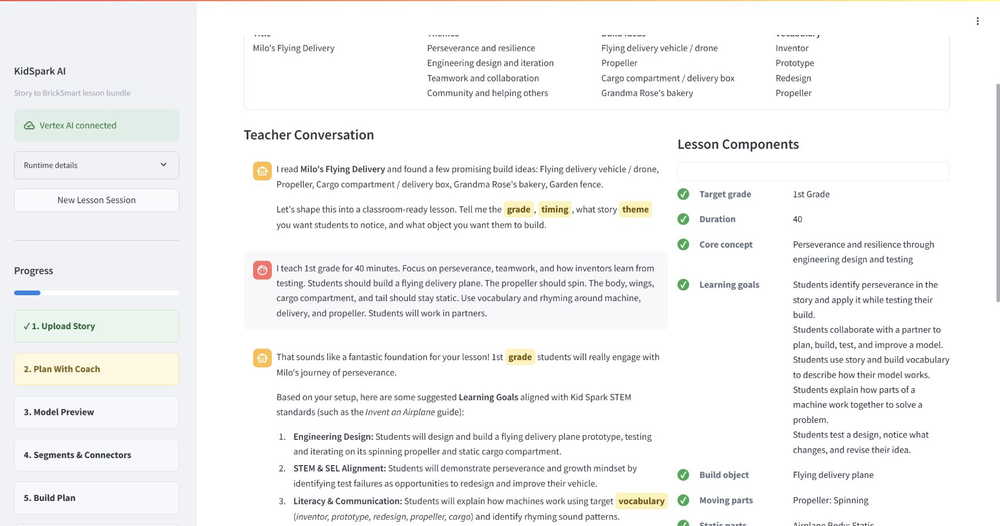

# KidSpark AI / BrickSmart

KidSpark AI turns a story into a teacher-reviewed STEM and literacy experience built around a physical BrickSmart model. A teacher uploads or types a story, collaborates with a planning coach, reviews a generated 3D object, checks its segmented and voxelized construction, approves a kit-feasible build plan, and downloads a classroom-ready lesson bundle.

The application was developed for **The Jacobs Institute for Innovation in Education at the University of San Diego**. It is designed for teachers who want to connect read-alouds, literacy instruction, engineering practices, social-emotional learning, and hands-on construction without having to become 3D-modeling or curriculum-alignment specialists.

> **Handoff status:** This repository contains the final integrated application, including the Gemini-based planning workflow, retrieval-augmented generation (RAG), Hyper3D Rodin and Bang integration, notebook-derived physicalization, finite-kit validation, and three-document lesson bundle. Production redeployment is intentionally separate from merging documentation changes.

## Contents

- [What KidSpark Does](#what-kidspark-does)
- [Teacher Workflow](#teacher-workflow)
- [Core Capabilities](#core-capabilities)
- [Architecture](#architecture)
- [Repository Map](#repository-map)
- [Local Development](#local-development)
- [Configuration](#configuration)
- [Testing](#testing)
- [GCP Deployment](#gcp-deployment)
- [Operations and Troubleshooting](#operations-and-troubleshooting)
- [Security and Limitations](#security-and-limitations)
- [Further Documentation](#further-documentation)

## What KidSpark Does

KidSpark AI helps a teacher move from source material to an actionable classroom lesson. The system reads a story or PDF, extracts educational opportunities, retrieves relevant prior KidSpark evidence, and guides the teacher through decisions that require professional judgment: grade level, time, theme, learning goals, build object, motion, static structure, literacy focus, SEL focus, and classroom constraints.

Those teacher-approved choices become the contract for the rest of the pipeline. Gemini creates the planning conversation and structured lesson context. Hyper3D Rodin creates a 3D source model. Hyper3D Bang separates the model into semantic components. The notebook-derived physicalization code converts those components into a voxel representation and candidate BrickSmart parts. A validated planner then checks geometry, connections, inventory, movement intent, and build order before the teacher can approve the instructions.

The final output is not a single generic report. It is a coordinated classroom bundle:

1. **Teacher lesson plan** with objectives, timing, instructional flow, standards/framework anchors, prompts, differentiation, and reflection.
2. **Student activity guide** with concise, child-facing directions, vocabulary, real-world connections, and reflection.
3. **Slide companion** with the image-heavy build sequence, discussion prompts, vocabulary, and classroom presentation flow.

The application keeps the teacher in control at every consequential transition. AI output is a proposal, not an automatic publication decision.

## Teacher Workflow

### Step 1: Upload Story

The teacher uploads a PDF or types/pastes a story. KidSpark extracts text, identifies likely themes, proposes candidate build objects, highlights vocabulary and phonics opportunities, and shows framework evidence before the teacher continues.


### Step 2: Plan With the KidSpark Coach

The planning coach asks focused questions rather than presenting a long form. A live Lesson Components panel tracks the approved grade, duration, theme, goals, build object, moving parts, static parts, literacy focus, SEL focus, and constraints. The confirmation gate remains locked until every required component is populated.

The coach uses retrieved KidSpark evidence and static framework guidance to suggest useful options, but it must resolve missing checklist items before claiming the lesson is ready.




### Step 3: Review Model Preview

The teacher reviews the Rodin visual prompt and BrickSmart build constraints. These include the maximum validated block count, maximum semantic parts, moving-part limit, inventory basis, symmetry preference, and Bang segmentation requirements. Rodin generation can take several minutes, so the UI displays stage-specific progress and preserves the session while the teacher waits.

The teacher approves the model only when its broad form and moving/static separation are suitable for segmentation.


### Step 4: Review Segments and Connectors

After model approval, Bang segmentation and notebook physicalization run. The teacher sees color-coded segments, orthographic/isometric multiviews, the block approximation, movement mappings, connector candidates, and validation diagnostics.

The pipeline automatically tunes voxelization and may merge safe static regions. It preserves moving parts and required semantic structure. When an output still exceeds inventory or segmentation limits, the screen provides a concrete recovery recommendation and can prefill the next Rodin prompt and build constraints.


### Step 5: Review Build Plan

The build plan is created from actual notebook/CSP and validated-planner output, not demo placeholders. The teacher reviews the inventory, final build reference, individual construction stages, parts used, connector notes, and movement notes. A standard-kit build cannot be approved unless validation succeeds or an explicitly labeled CSP review mode satisfies the configured safe limits.


### Step 6: Review Lesson Bundle

KidSpark creates the lesson plan, activity guide, and slide companion. Each document is validated independently for required sections, audience, framework references, unresolved placeholders, and notebook image inclusion. The teacher previews and approves all three before downloading.


## Core Capabilities

| Capability | Purpose | Primary implementation |
|---|---|---|
| Story ingestion | Extracts text and structure from typed stories and PDFs | FastAPI session endpoints and PDF extraction utilities |
| Planning coach | Guides teacher decisions and maintains a structured readiness checklist | Gemini, prompt guards, session planning state |
| RAG | Retrieves prior lesson and standards evidence by query and grade band | Cloud SQL PostgreSQL, pgvector, Gemini embeddings |
| Framework matching | Anchors recommendations in KidSpark STEM/literacy guidance | Retrieval evidence plus static framework adapter |
| 3D generation | Produces a simplified teacher-approved model | Hyper3D Rodin |
| Segmentation | Separates semantic/moving regions for physicalization | Hyper3D Bang |
| Voxelization | Converts 3D segments into discrete block-compatible regions | Notebook-derived Python runtime |
| Auto-simplification | Tunes voxel size and merges safe static regions within bounded attempts | Physicalization orchestration |
| Validated planning | Checks block catalog, inventory, placement, interfaces, and build order | `backend/bricksmart` planner and adapter |
| Document generation | Creates and validates three classroom PDFs with real build images | Document bundle pipeline, ReportLab/PDF utilities |

## Architecture

KidSpark is a Python application with a Streamlit teacher interface and a FastAPI backend. In Cloud Run, a small process launcher starts FastAPI on the container loopback interface and Streamlit on the Cloud Run port. Streamlit calls the local API, while the backend coordinates GCP and Hyper3D services.


### Main integrations

| Integration | Use |
|---|---|
| **Vertex AI Gemini** | Planning conversation, structured extraction, prompt generation, lesson/document content, fallback generation |
| **Gemini Embedding** | 3,072-dimension text embeddings for retrieval |
| **Vertex multimodal embedding** | Selective visual embeddings when stable page/image crops are available |
| **Cloud SQL PostgreSQL + pgvector** | Document bundles, extracted PDF nodes, standards rules, embeddings, retrieval filters |
| **Google Cloud Storage** | Source and processed KidSpark corpus artifacts |
| **Secret Manager** | Runtime database URL and external API credentials |
| **Hyper3D Rodin** | Text-guided 3D model generation |
| **Hyper3D Bang** | 3D semantic segmentation |
| **BrickSmart validated planner** | Catalog-aware placement, inventory feasibility, and true build steps |

The main RAG path uses direct Cloud SQL retrieval when database settings are available. A service-based retrieval adapter can be configured instead. If neither is available, the planning experience degrades to a clearly identified static evidence adapter rather than fabricating database results.

## Repository Map

```text
BrickSmart/
├── home.py                        # Streamlit entry point
├── cloudrun_start.py              # Starts FastAPI + Streamlit in Cloud Run
├── pages/
│   ├── kidspark.py                # Primary six-step teacher UI
│   └── kidspark_demo.py           # Legacy/debug workflow
├── backend/
│   ├── api/                       # FastAPI routes, settings, session APIs
│   ├── agents/                    # Planning/document agents and prompts
│   ├── build3d/                   # Rodin, Bang, notebook, recovery orchestration
│   ├── bricksmart/                # Validated planner runtime
│   ├── bricksmart_inventory/      # Catalog and kit inventory support
│   ├── ingestion/                 # Corpus processing and administrative RAG API
│   ├── retrieval/                 # Runtime retrieval adapters
│   └── tests/                     # Backend and integration tests
├── block_catalog/                 # Validated BrickSmart part catalog
├── config/inventory/              # Inventory profiles, including standard kit
├── model_registry/                # Validated model metadata
├── model_store/                   # Model artifacts used by planner fixtures
├── docs/                          # Design, deployment, RAG, and handoff docs
├── examples/                      # Example inputs and validated fixtures
├── tests/                         # Broader application tests
└── work/build_jobs/               # Local generated jobs; not durable Cloud Run storage
```

The primary teacher workflow is `pages/kidspark.py` plus `backend/api/sessions.py`. The ingestion service under `backend/ingestion` is an administrative/data-preparation surface and is not automatically mounted into the main Cloud Run process. Runtime retrieval is intentionally separated from ingestion so the teacher application can query an already prepared corpus without exposing ingestion controls.

## Local Development

### Prerequisites

- Python 3.11 or a project-compatible Python version.
- Git.
- Google Cloud CLI for Vertex AI, Cloud SQL, GCS, and Secret Manager access.
- A GCP identity authorized for project `kidspark-499901`.
- Hyper3D credentials for real Rodin/Bang runs.
- Optional local Cloud SQL Auth Proxy for direct pgvector retrieval.

### Install

```powershell
git clone https://github.com/yujia-l/BrickSmart.git
cd BrickSmart
python -m venv .venv
.\.venv\Scripts\Activate.ps1
python -m pip install --upgrade pip
python -m pip install -r requirements.txt
```

Create a local `.env` from `.env.example`. Never commit `.env`, service-account JSON, database passwords, or API keys.

```powershell
Copy-Item .env.example .env
```

Authenticate for local Vertex/GCP access:

```powershell
gcloud auth login
gcloud auth application-default login
gcloud config set project kidspark-499901
```

If direct Cloud SQL retrieval is used, start the Cloud SQL Auth Proxy in another terminal and set the local database URL to the proxy port. Prefer short-lived identity-based access or Secret Manager retrieval over storing a password in shell history.

### Run

The closest local equivalent to Cloud Run is:

```powershell
python cloudrun_start.py
```

For UI-only development, start Streamlit directly:

```powershell
streamlit run home.py --server.port 8501
```

Then open `http://127.0.0.1:8501/kidspark`.

For API-focused development:

```powershell
uvicorn backend.api.main:app --host 127.0.0.1 --port 8001 --reload
```

The legacy `/kidspark_demo` route remains useful for debugging saved output, but it is not the primary teacher experience.

## Configuration

Use `.env.example` as the source of truth for supported variables. Important categories include:

| Category | Typical variables | Notes |
|---|---|---|
| GCP | `GCP_PROJECT_ID`, `GOOGLE_CLOUD_PROJECT`, region/location | Production project is `kidspark-499901` |
| Gemini | primary/fallback generation model, embedding model, dimensions | Defaults target Gemini 3.6 Flash with 3.5 Flash fallback |
| Database | `POSTGRESQL_DATABASE_URL` or Cloud SQL components | Keep credentials in Secret Manager |
| Storage | source and processed bucket names | Used by ingestion and evidence tracing |
| Hyper3D | API base URL and API key | Required for real Rodin/Bang calls |
| RAG | retrieval mode/service URL, grade band, top-k values | Direct DB and service adapters are supported |
| Build limits | inventory basis, block/segment/moving-part caps | Teacher-visible constraints must match backend validation |
| Saved output | fixture or offline mode settings | Avoids external credit use during regression tests |

Generation is configured for a primary Gemini model and a fallback model. The fallback is a reliability measure, not a silent downgrade: logs record which provider/model path was used. OpenAI is not required by the current KidSpark runtime.

Canonical retrieval grade bands are:

- `Grades_Pre-K-1st`
- `Grades_2nd-5th`
- `Grades_6th-8th`

These values matter because retrieval can apply an exact grade-band filter.

## Testing

Run focused tests before full suites:

```powershell
python -m pytest backend/tests/test_validated_planner_adapter.py -q
python -m pytest backend/tests -q
python -m pytest tests -q
```

Validate import and syntax surfaces:

```powershell
python -m compileall backend pages home.py cloudrun_start.py
python -c "from backend.api.main import app; print(app.title)"
```

Use saved model/Bang output for most integration testing. This exercises voxelization, auto-recovery, validated planning, UI review, and document generation without spending Rodin/Bang credits. A real end-to-end run should be reserved for explicit release validation because it can take several minutes and consume external credits.

Recommended release checks:

1. Start the local app from a clean shell.
2. Upload a sanitized sample story.
3. Complete the planning checklist and verify the readiness gate.
4. Use a saved Rodin/Bang result or explicitly authorize a live run.
5. Confirm segment and block limits are visible and consistent.
6. Confirm each build step uses notebook/validated-planner imagery.
7. Generate all three documents and verify their independent validation state.
8. Open each PDF and confirm that its expected images render.

## GCP Deployment

The deployment baseline in this repository targets:

| Resource | Repository deployment baseline |
|---|---|
| Project | `kidspark-499901` |
| Region | `us-central1` |
| Cloud Run service | `kidspark` |
| Runtime service account | `kidspark-runtime@kidspark-499901.iam.gserviceaccount.com` |
| Cloud SQL connection | `kidspark-499901:us-central1:kidspark-db` |
| Database | `kidspark` |
| Source bucket | `kidspark-project-data` |
| Processed bucket | `kidspark-data-processed` |
| Application URL | `https://kidspark-2msfnwk43a-uc.a.run.app/kidspark` |

These values were confirmed against repository deployment configuration and the accessible deployed application. A final infrastructure publication check still requires an interactive `gcloud auth login` because unattended token refresh was unavailable during this documentation run.

The repository does not contain an automated GitHub deployment workflow. Deployment is manual and must be treated as an explicit operational action.

Typical source deployment:

```powershell
gcloud auth login
gcloud config set project kidspark-499901
gcloud run deploy kidspark `
  --source . `
  --region us-central1 `
  --service-account kidspark-runtime@kidspark-499901.iam.gserviceaccount.com `
  --add-cloudsql-instances kidspark-499901:us-central1:kidspark-db
```

Use Secret Manager bindings for database and external API values rather than literal environment variables. The exact deploy command should preserve the currently approved CPU, memory, timeout, concurrency, minimum/maximum instances, secret mappings, and unauthenticated/authenticated access policy. Export the current service YAML before changing these values.

Post-deployment verification:

```powershell
gcloud run services describe kidspark --region us-central1
curl https://<service-host>/health
curl https://<service-host>/health/ready
```

Then perform the browser smoke test through `/kidspark`. A successful container start is not sufficient: confirm planning, retrieval, model-progress polling, saved-output physicalization, and PDF download.

## Operations and Troubleshooting

### Planning button remains disabled

Check the Lesson Components panel. The backend readiness guard, not the conversational prose, controls the gate. Missing learning goals, moving parts, static parts, or constraints must be captured structurally. Inspect the session response rather than trusting an agent statement that planning is complete.

### Retrieval returns no evidence

Verify database connectivity, `pgvector`, populated `document_bundle`, `pdf_node`, and `standard_rules` tables, non-null embeddings, and the exact grade-band value. Confirm the query embedding dimension matches stored vectors. If fallback evidence is active, the UI/logs should identify it.

### Rodin or Bang appears stuck

External generation is asynchronous. Check the backend polling log and task status. Cloud Run request and instance timeouts must accommodate the full job. Do not resubmit repeatedly without checking the existing task, because that can consume credits and create duplicate work.

### Segmentation succeeds but validation fails

Block count and semantic segment count are separate constraints. The auto-recovery loop can change voxel size and merge safe static regions, but it cannot safely erase a required moving part or repair an unsuitable source mesh indefinitely. Use the generated recovery recommendation to regenerate a simpler Rodin model when bounded tuning cannot satisfy both constraints.

### Planner returns `INCOMPLETE`

Inspect `validated_planner`, `auto_tuning`, inventory feasibility, source/physical segment counts, and artifact paths in the session result. Zero validated steps can indicate strict-planner timeout, unsupported geometry, or missing model/catalog input. CSP review output is only approvable when configured safety limits and required artifacts are satisfied.

### PDF download fails in Cloud Run

Generated files live on ephemeral container storage and can disappear when an instance is replaced. Ensure the session and download request reach the same available artifact or persist production artifacts to GCS. Check that the endpoint streams bytes rather than returning a local filesystem path.

## Security and Limitations

- Never commit `.env`, service-account JSON, API keys, database URLs with passwords, or generated user stories.
- Use workload identity and the Cloud Run service account for Google APIs where possible.
- Keep secrets in Secret Manager and grant only the runtime identity access required to read them.
- Treat uploaded stories and generated lessons as potentially sensitive educational content. Define retention and deletion policies before broad classroom use.
- Sanitize logs. Do not log full stories, prompts containing personal data, credentials, or signed URLs.
- Rodin/Bang are third-party processing boundaries. Review terms, data handling, quotas, and cost before using non-public classroom content.
- Teacher approval is required because generated curriculum and physical instructions can be incomplete or unsuitable.
- Offline demo mode uses a lightweight planning parser. It can fail to promote free-form movement language into the structured `moving_parts` field even when the prose is understandable; the readiness gate remains disabled in that case. Use live Gemini or a structured saved fixture when validating the complete planning conversation.
- Cloud Run local storage is ephemeral. Current sessions are primarily in memory and are not a durable system of record.
- Visual embeddings are selective. The existing processed corpus must contain stable page/image crop URIs before visual retrieval can be relied on.
- Automatic simplification is bounded to avoid long loops. Exceptional geometry can still require a new model preview.
- The standard-kit planner validates against the configured catalog and inventory profile, not every physical condition in a classroom. Teachers should still inspect stability and age appropriateness.

## Further Documentation

- [Local Environment Setup](docs/LOCAL_ENV_SETUP.md)
- [Technical Design](docs/KIDSPARK_TECHNICAL_DESIGN.md)
- [Project Overview](docs/KIDSPARK_PROJECT_OVERVIEW.md)
- [GCP Deployment Guide](DEPLOYMENT_GCP.md)
- [RAG Retrieval Integration](backend/retrieval/README.md)
- [API OpenAPI Snapshot](docs/openapi/kidspark-api.openapi.json)
- [Validated Structural Planner](docs/STRUCTURAL_PLANNER.md)

For maintainers, begin with the technical design and its operational checklists. For sponsors, educators, and new collaborators, begin with the project overview.

## Release and Maintenance Checklist

Treat a KidSpark release as an application, data, model, and classroom-content change. A code-only smoke test does not cover the complete system. Before creating a release candidate, record the source commit, active Gemini generation and embedding models, inventory profile, block catalog version, database migration state, and external Rodin/Bang API versions. Regenerate the sanitized OpenAPI snapshot when routes or schemas change, and update the technical design when an integration boundary or confirmation gate changes.

For database or retrieval changes, apply migrations in a non-production environment first. Confirm `pgvector` availability, vector dimensions, canonical `grade_band` values, evidence metadata, and expected row counts before promoting. Re-embedding the corpus is required when the embedding model or dimensions change. Keep the old corpus or a database backup until representative retrieval queries pass with traceable evidence.

For 3D changes, retain at least one known-good saved model and Bang result. Run it through voxelization, automatic simplification, connector inference, standard-kit planning, and document generation. Verify both block count and semantic segment count: satisfying one limit does not imply the other is valid. A release must not silently substitute placeholder art when validated notebook imagery is missing.

For operations, export the current Cloud Run service description before deployment, verify secret references and service-account permissions, and retain the prior revision for rollback. After deployment, inspect health endpoints, structured logs, retrieval behavior, external polling, session transitions, and PDF downloads. Record the validation evidence with the release or pull request so a future maintainer can distinguish a tested configuration from a repository default.

When diagnosing an incident, preserve task IDs and sanitized status events, but never copy credentials, signed URLs, full uploaded stories, or student information into an issue. If recovery requires a model or infrastructure change, document the decision and its rollback path in `docs/` before the next release.
