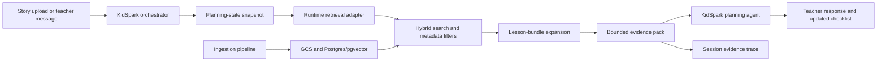

# KidSpark Teacher-Conversation RAG Integration

The goal is to let the planning coach consult prior lesson bundles, framework
rules, activity guides, and slide companions without changing the
teacher-facing workflow.

The ingestion process prepares and refreshes the knowledge base. The runtime
retrieval layer queries that prepared data during story analysis and teacher
conversation, then supplies a compact evidence pack to the existing planning
agent.

## Integration Blueprint

RAG fits into the current request path between KidSpark's planning-state
snapshot and the teacher-facing planning agent:



The existing API, session, and UI flow remain in place. The main implementation
work is to add the retrieval adapter, call it from the orchestrator, and pass
its result into the current consultation agent.

### Where Retrieval Connects

There are three insertion points in `backend/agents/orchestrator.py`:

1. `run_storybook_analysis()`
   - Runs after the uploaded story has been extracted and analyzed.
   - Retrieves similar lesson families, story themes, build examples, and
     relevant framework anchors.
   - Saves the initial evidence pack and trace on the session.
2. `route_message()`
   - Runs for each teacher-planning turn.
   - Builds a focused retrieval query from the teacher's latest message,
     captured planning state, and remaining checklist fields.
   - Reuses cached evidence when the effective query has not changed.
   - Passes the resulting evidence to `handle_consultation_message()`.
3. `confirm_teacher_planning()`
   - Runs after every required lesson component has been confirmed.
   - Preserves the evidence trace with the approved planning context so later
     model prompts and lesson documents can retain source provenance.

The HTTP routes in `backend/api/sessions.py` already call these orchestration
functions, so the RAG lookup does not require a separate endpoint or a new
teacher-chat screen.

### Separation Of Concerns

- **Knowledge preparation: `backend/ingestion/`**
  - Parse source documents and create chunks, embeddings, lesson bundles,
    relations, and policy records.
  - Load prepared artifacts into GCS and Postgres/pgvector.
  - Run as an offline or administrative process rather than during a teacher
    request.
- **Runtime retrieval: `backend/retrieval/`**
  - Search prepared records, apply metadata filters, expand matching lesson
    bundles, assemble evidence, cache results, and handle lookup failures.
  - Return structured evidence and provenance without composing the teacher's
    final response.
- **Conversation coordination: `backend/agents/orchestrator.py`**
  - Decide when retrieval is useful, build the query context, store retrieval
    status on the session, and pass evidence to the planning agent.
- **Teacher coaching: `backend/agents/consultation.py`**
  - Use the evidence to make grounded suggestions and ask focused questions.
  - Continue to rely on teacher confirmation before marking lesson components
    complete.

This separation keeps document processing away from the interactive request
path while allowing ingestion and retrieval implementations to evolve without
changing the KidSpark UI or teacher-session API.

### Minimum Implementation Checklist

To complete the first working integration:

1. Implement search in `backend/retrieval/search.py`.
2. Implement lesson-family expansion in `backend/retrieval/expansion.py`.
3. Implement bounded evidence assembly in `backend/retrieval/evidence.py`.
4. Add `backend/retrieval/runtime.py` as the stable adapter used by the
   orchestrator.
5. Add retrieval state and trace fields to `SessionState`.
6. Call the adapter from story analysis and teacher-message handling.
7. Add an optional `evidence` argument to `handle_consultation_message()`.
8. Add timeout, cache, empty-result, and provenance tests.
9. Verify that RAG failure falls back to the current static reference context
   without interrupting the teacher conversation.

## Adapter To Implement

Add an implementation such as `backend/retrieval/runtime.py` with one stable
async interface:

```python
async def retrieve_for_teacher_turn(
    *,
    story_text: str,
    story_analysis: dict,
    teacher_message: str | None,
    planning_state: dict,
    missing_fields: list[str],
    limit: int = 8,
) -> TeacherEvidence:
    ...
```

`TeacherEvidence` should be serializable and contain:

```json
{
  "teacher_cards": [
    {
      "node_id": "airplane.teacher.step03",
      "bundle_id": "invent-an-airplane",
      "title": "Invent",
      "text": "Bounded source excerpt or summary",
      "score": 0.91,
      "source_uri": "gs://bucket/Knowledge_chunks/bundles/..."
    }
  ],
  "student_cards": [],
  "visual_cards": [],
  "policy_cards": [
    {
      "rule_id": "ngss-k-2-ets1-2",
      "framework": "NGSS",
      "text": "Age-appropriate rule or summary",
      "source_uri": "gs://bucket/Knowledge_chunks/policies/..."
    }
  ],
  "trace": [
    {
      "node_id": "airplane.teacher.step03",
      "bundle_id": "invent-an-airplane",
      "score": 0.91
    }
  ],
  "status": "ok"
}
```

The adapter may call an in-process `templated_retrieve()` function or a
retrieval service endpoint. Keep that choice behind this interface so the
orchestrator and UI do not depend on storage or transport details.

## Retrieval Sequence

Implement the existing retrieval stubs in this order:

1. `search.py`
   - Build a query from the story, current teacher message, captured planning
     state, and the next missing checklist fields.
   - Apply metadata filters such as grade band, audience, document kind,
     lesson stage, and framework.
   - Return ranked knowledge nodes with scores and source identifiers.
2. `expansion.py`
   - Expand high-scoring nodes to their lesson bundle siblings and declared
     relations.
   - Include policy rules relevant to the grade, lesson stage, and requested
     learning focus.
3. `evidence.py`
   - Deduplicate and categorize the expanded results.
   - Enforce a strict context budget.
   - Preserve trace entries and source URIs for debugging and attribution.
4. `runtime.py`
   - Expose `retrieve_for_teacher_turn()`.
   - Handle timeouts, cache lookups, metrics, and fallback.

## Orchestrator Wiring

Add optional retrieval fields to `SessionState` in
`backend/models/schemas.py`:

```python
rag_evidence: dict = Field(default_factory=dict)
rag_trace: list[dict] = Field(default_factory=list)
rag_query_signature: str | None = None
rag_status: str = "not_requested"
```

In `run_storybook_analysis()`, retrieve an initial evidence pack using the
story analysis and an empty teacher message. This should surface related lesson
families and core framework policies.

In `route_message()`:

1. Calculate the current `planning_state_snapshot()`.
2. Calculate `_missing_planning_fields()`.
3. Build a deterministic signature from:
   - normalized teacher message
   - grade/duration
   - theme and learning goals
   - build object
   - moving/static parts
   - missing checklist fields
4. Retrieve only when the signature changed.
5. Pass a compact, labeled evidence section into
   `handle_consultation_message()`.
6. Store the returned trace and status on the session.

Update `handle_consultation_message()` with an optional argument:

```python
evidence: dict | None = None
```

The prompt should clearly separate source evidence from instructions:

```text
REFERENCE EVIDENCE
- Prior lesson examples: ...
- Framework and policy anchors: ...

Use this evidence to make grounded suggestions. Do not claim that an example is
required. Ask the teacher to confirm choices before marking checklist fields as
complete.
```

Do not let retrieved text override system instructions, teacher-confirmed
planning state, safety rules, inventory limits, or validated build constraints.

## Query Guidance By Planning Topic

Use the next missing checklist field to keep retrieval relevant:

- `target_grade` or `duration`: grade-band pacing, UDL, and classroom grouping.
- `core_concept` or `learning_goals`: related lesson themes, NGSS, CCSS, CASEL,
  and Science of Reading anchors.
- `build_object`: prior build artifacts and real-world connections.
- `moving_parts` or `static_parts`: mechanics examples and age-appropriate
  articulation patterns.
- `literacy_focus`: vocabulary, phonics, rhyme, and read-aloud prompts.
- `sel_focus`: collaboration, perseverance, reflection, and discussion prompts.
- `constraints`: inventory, time, group size, accessibility, and materials.

Bundle expansion is important. A matching teacher-plan paragraph should bring
in its related student activity and slide-companion material instead of
returning unrelated chunks from several lessons.

## Storage And Configuration

Use environment variables or Secret Manager references. Never commit keys,
service-account JSON, database passwords, or signed URLs.

Suggested runtime settings:

```text
KIDSPARK_RAG_ENABLED=true
KIDSPARK_RAG_TIMEOUT_SECONDS=4
KIDSPARK_RAG_RESULT_LIMIT=8
KIDSPARK_RAG_CACHE_TTL_SECONDS=600
KIDSPARK_RAG_SERVICE_URL=
KIDSPARK_RAG_GCS_PREFIX=gs://<bucket>/Knowledge_chunks/
KIDSPARK_RAG_DB_INSTANCE=
KIDSPARK_RAG_DB_NAME=
KIDSPARK_RAG_DB_SECRET=
```

If using direct Postgres access, confirm that `pgvector` is enabled and add the
runtime packages to `backend/requirements.txt` and root `requirements.txt`:

```text
psycopg[binary]
pgvector
```

`docling`, `pydantic-settings`, and `sentence-transformers` belong in the
ingestion deployment unless runtime retrieval imports them directly.

## Failure And Fallback

RAG is advisory and must not block a teacher conversation.

- Use a short timeout.
- On timeout, connection failure, empty data, or malformed evidence, set
  `rag_status` to a useful value and continue with the current static KidSpark
  reference context.
- Never mark a checklist field complete because retrieval suggested a value.
  Only teacher input or explicit teacher acceptance can complete it.
- Log trace IDs and source IDs, but do not log full story text, API keys, or
  database credentials.

## Acceptance Tests

Add tests that prove:

1. Initial story analysis retrieves a related lesson bundle and policy cards.
2. A teacher turn about learning goals retrieves objective/framework evidence.
3. A later moving-parts turn retrieves mechanics evidence without losing the
   earlier teacher-approved fields.
4. Repeated equivalent turns reuse cached evidence.
5. Bundle expansion returns coherent teacher, student, and slide content.
6. A retrieval timeout still returns a normal teacher response.
7. Retrieved text cannot complete the planning checklist by itself.
8. The final model context retains source trace IDs for document generation.

For local tests, use a deterministic fake retrieval adapter. Integration tests
may use a small known bundle fixture. Do not require live GCP access for the
default unit-test suite.
