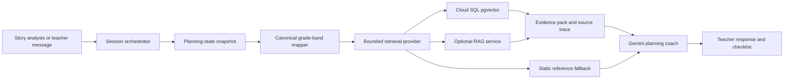

# KidSpark Runtime Retrieval

KidSpark retrieves prior lesson plans, student activity guides, slide
companions, and framework rules during the teacher-planning conversation.
Retrieval is advisory: a database outage or empty result falls back to the
checked-in KidSpark reference evidence and never blocks the teacher.

## Runtime Path



The integration points are:

- `backend/agents/orchestrator.py` builds a retrieval query for initial story
  analysis and every teacher turn, caches the result signature, and stores the
  source trace on the session.
- `backend/retrieval/provider.py` enforces a ten-second timeout, bounded
  context size, ten-minute cache, canonical grade filter, direct/service
  transport choice, and fallback behavior.
- `backend/agents/consultation.py` receives the evidence as a labeled reference
  section. Retrieved content cannot override teacher choices or complete a
  checklist field.
- `backend/ingestion/app/` parses, captions, embeds, persists, and retrieves the
  knowledge corpus.

## Canonical Grade Bands

Runtime UI values are normalized before an exact database filter:

- `Grades_Pre-K-1st`
- `Grades_2nd-5th`
- `Grades_6th-8th`

The ingestion source path and `pdf_node.grade_band` must use the same values.

## Model Contract

- Generation primary: `gemini-3.6-flash`, Vertex location `global`
- Generation fallback: `gemini-3.5-flash`, Vertex location `global`
- Text embeddings: `gemini-embedding-001`, 3072 dimensions,
  `us-central1`
- Selective visual embeddings: `multimodalembedding@001`, 1408 dimensions,
  only for parts diagrams, build steps, example builds, and diagrams

Ingestion saves stable page/image crops under:

```text
gs://kidspark-data-processed/Knowledge_chunks/images/<bundle>/<doc-kind>/...
```

The text caption, OCR, educational purpose, image URI, and optional visual
vector stay on the same knowledge node. Text retrieval remains the required
first-stage path; visual vectors are additive.

## Database Contract

Cloud SQL must have:

- PostgreSQL 15+
- `vector` extension
- `document_bundle`
- `pdf_node`
- `standard_rules`
- `schema_migrations`

Apply the checked-in migration:

```bash
psql "$DATABASE_URL" -f backend/ingestion/postgres/migrations/2026-07-vertex-rag-v1.sql
```

The ingestion startup also applies idempotent migrations and indexes. The
readiness endpoint reports extension, table, document, and embedding counts:

```text
GET /health/ready
```

`data_ready` means at least one current Vertex vector is available and hybrid
retrieval can operate. `corpus_fully_embedded` requires at least 95 percent
text-vector coverage and is the production corpus-completion signal.

## Local Test

1. Authenticate without downloading a key:

```bash
gcloud auth application-default login
gcloud auth application-default set-quota-project kidspark-499901
```

2. Start the Cloud SQL Auth Proxy:

```bash
cloud-sql-proxy kidspark-499901:us-central1:kidspark-db --port 5555
```

3. Copy `.env.example` to `.env`, add the local proxy database URL and Rodin
   secret, then start the combined app:

```bash
python cloudrun_start.py
```

4. Verify:

```bash
curl http://127.0.0.1:8001/health/ready
```

Default unit tests use offline/fake providers and do not require live GCP.

## Corpus Load And Backfill

Load processed GCS artifacts first without making thousands of embedding
requests:

```bash
python -m app.services.ingest --no-embed
```

Then run resumable, quota-bounded backfill jobs:

```bash
python -m app.services.ingest --backfill-only --max-embeddings 100
python -m app.services.ingest --backfill-only --max-embeddings 20 \
  --bundle-name <processed-bundle-name>
```

Each completed batch commits independently. The current project quota observed
for `gemini-embedding-001` in `us-central1` is five online prediction requests
per minute, so the default is deliberately four requests per minute. Request a
quota increase before the full 24,000-node corpus re-embedding; do not raise
`EMBED_REQUESTS_PER_MINUTE` beyond the approved quota.

The current processed bucket does not yet contain page/image crops. Reprocess
the source PDFs with `SAVE_IMAGE_CROPS=true` before treating selective visual
retrieval as populated. Text and policy retrieval remain operational during
that migration.

## Production Settings

```text
GCP_PROJECT_ID=kidspark-499901
VERTEX_GENERATION_LOCATION=global
VERTEX_EMBEDDING_LOCATION=us-central1
GEMINI_PRIMARY_MODEL=gemini-3.6-flash
GEMINI_FALLBACK_MODEL=gemini-3.5-flash
KIDSPARK_RAG_ENABLED=true
KIDSPARK_RAG_TIMEOUT_SECONDS=10
RAG_QUERY_UNDERSTANDING_ENABLED=false
DATABASE_REQUIRED=true
GCS_BUCKET_NAME=kidspark-project-data
GCS_PROCESSED_BUCKET=kidspark-data-processed
EMBED_MODEL=gemini-embedding-001
EMBED_DIM=3072
EMBED_REQUESTS_PER_MINUTE=4
```

`POSTGRESQL_DATABASE_URL` and `HYPER3D_API_KEY` come from Secret Manager. Do
not commit passwords, API keys, service-account JSON, signed URLs, or populated
`.env` files.

For the current research phase, project members may retain broad console
visibility. A later hardened deployment should use a dedicated runtime service
account and separate researcher, ingestion, and operator groups.
