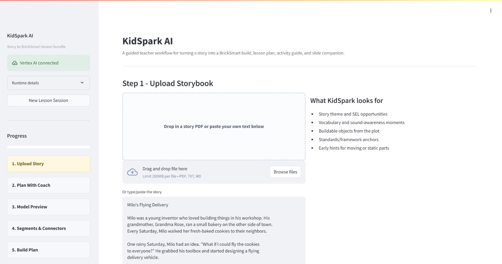
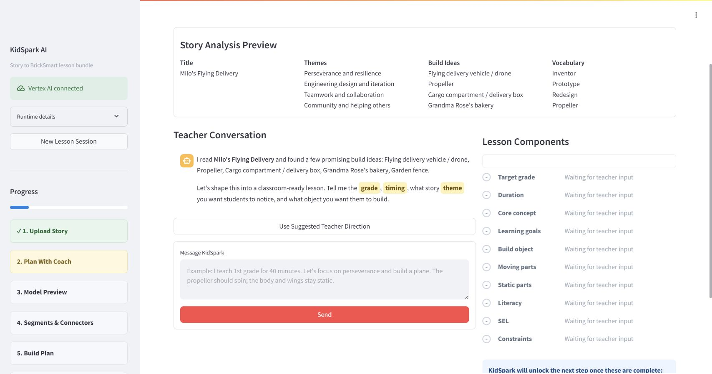
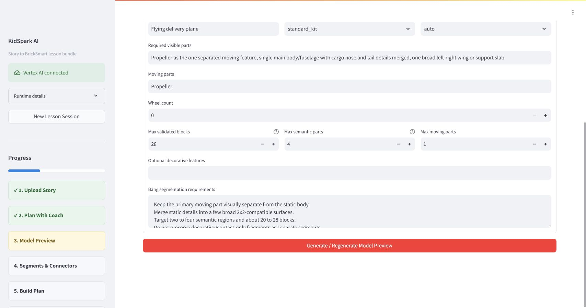
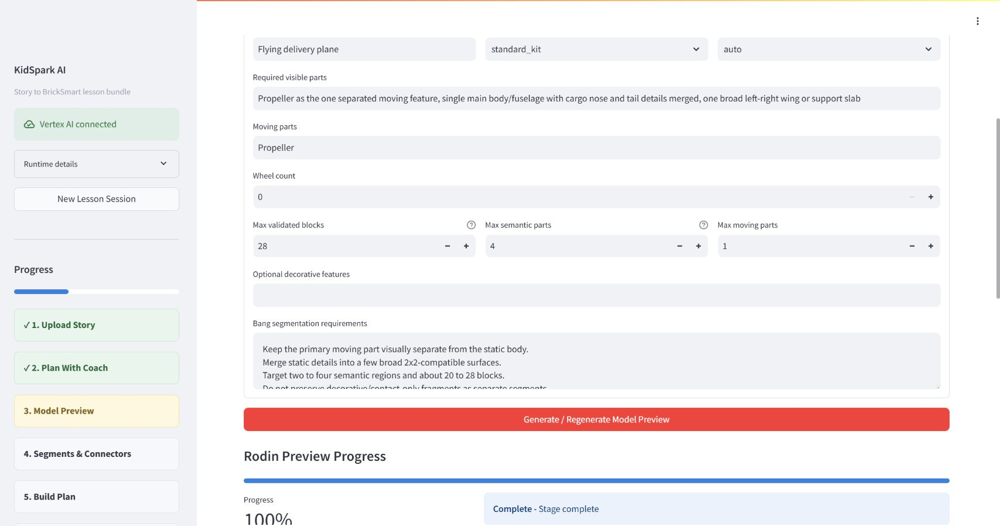
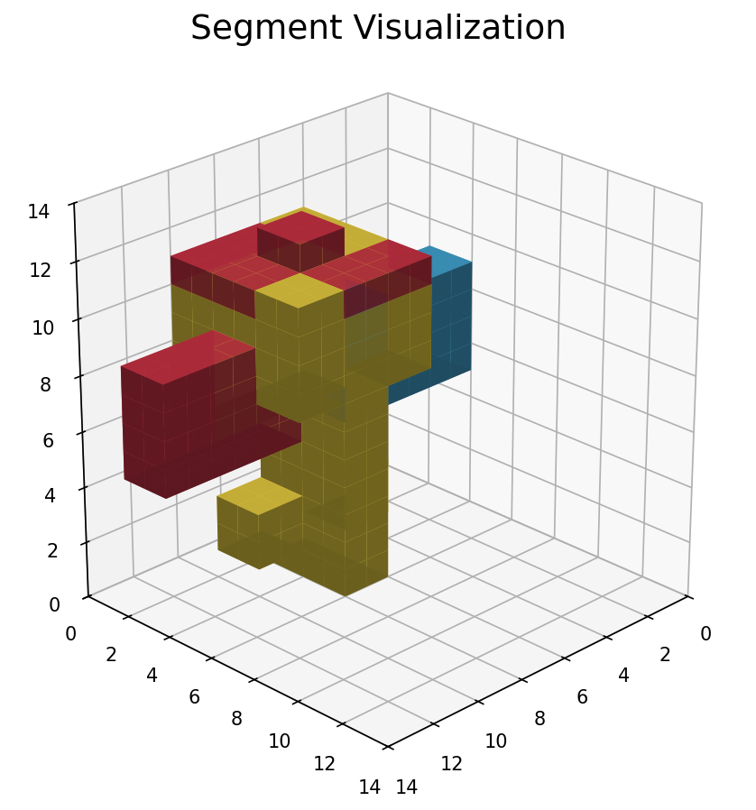
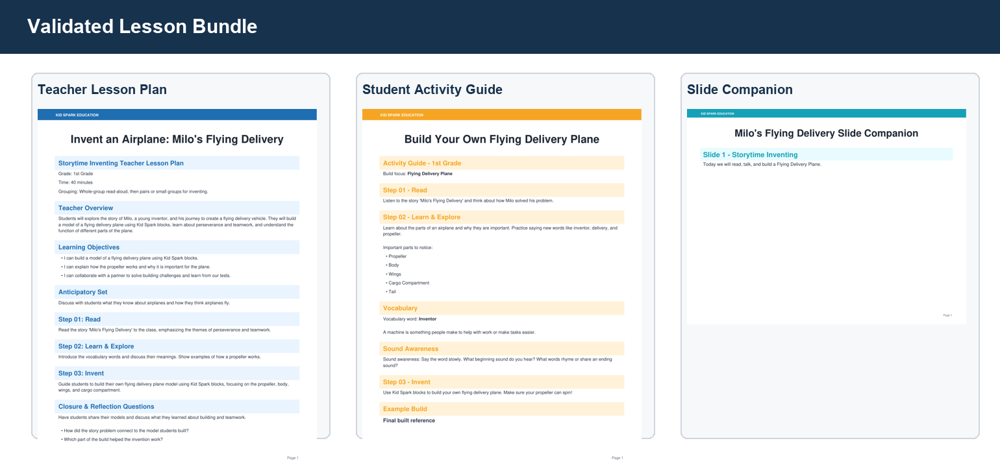

# KidSpark AI / BrickSmart Project Overview

**Project period:** February-August 2026 
**Prepared for:** The Jacobs Institute for Innovation in Education at the University of San Diego 
**Audience:** Sponsors, educators, researchers, project collaborators, and technical teams
**Status:** Final project handoff

## Executive Summary

KidSpark AI is a guided teacher tool that turns a story into an integrated STEM and literacy lesson with a physical BrickSmart building activity. It brings together curriculum planning, prior lesson evidence, conversational AI, 3D generation, semantic segmentation, voxel-based construction design, kit-aware validation, and classroom document creation in one teacher-reviewed experience.

The project began with an ambitious question: could a teacher start with a story and finish with a coherent lesson, a buildable classroom object, step-by-step visual instructions, and student materials without having to manually coordinate many disconnected technical systems? Between February and August 2026, the team transformed that question into a working six-stage application.

The completed workflow asks the teacher to remain the decision-maker. KidSpark reads the story and proposes possibilities, but the teacher chooses the lesson emphasis, learning goals, object to build, moving and static parts, literacy focus, social-emotional focus, and classroom constraints. The system then creates a 3D candidate, translates it into BrickSmart-compatible construction regions, checks whether it can be built with the selected kit, and creates a lesson plan, activity guide, and slide companion that all share the same approved facts and images.

The result is more than a lesson-plan generator. It is an orchestration system that connects educational intent to a physical design and then carries that design back into classroom materials. The project demonstrates how AI can support a teacher as a thought partner while preserving teacher authority, evidence, physical constraints, and validation.

## 1. Sponsor Context and Project Vision

The work was undertaken with guidance from The Jacobs Institute for Innovation in Education at the University of San Diego and with requirements relayed from the KidSpark team. Sponsors challenged the project team to explore an end-to-end experience in which existing stories and educational resources could lead to new hands-on classroom activities.

The desired system needed to recognize that lesson planning is not simply filling a template. Teachers make judgments about age, time, classroom dynamics, learning priorities, student language, and what should be emphasized from a story. At the same time, the proposed physical build must remain possible with real materials. A beautiful illustration or generic AI plan is not enough if it cannot be assembled with a KidSpark/BrickSmart kit.

The project vision therefore combined three kinds of intelligence:

1. **Educational intelligence:** understand the story, prior lessons, standards, literacy opportunities, and classroom context.
2. **Design intelligence:** turn the chosen concept into a simple object with recognizable functional parts.
3. **Physical intelligence:** convert the design into buildable regions and instructions that respect real block types, quantities, contacts, and movement.

Those dimensions shaped the final architecture and the team structure. Curriculum/retrieval, agent/orchestration, 3D/voxelization, inventory/segmentation, frontend, and sponsor coordination all had to meet at explicit interfaces.

## 2. The Initial Challenge

At the start of the project, useful pieces existed in separate forms. KidSpark reference lesson plans demonstrated an educational pattern. Research notebooks explored 3D segmentation, voxelization, and instruction rendering. Rodin could create 3D models, and Bang could split them into segments. Large language models could discuss stories and draft lesson content. None of those parts alone produced a dependable teacher workflow.

Several practical gaps had to be closed:

- a conversational assistant could sound complete while required lesson information was still missing;
- a 3D model could look correct but contain too many small regions for a classroom build;
- voxelization could reduce block count while still preserving too many semantic segments;
- generated build-step pictures could become placeholders disconnected from the actual model;
- a proposed plan could require more blocks than one kit contains;
- external 3D services could take minutes, leaving a teacher unsure whether anything was happening;
- a single generated report could not serve the different needs of teachers and students;
- prior lesson evidence and standards needed to be available during, not after, the teacher conversation.

The team treated these as design problems rather than isolated bugs. The final application uses structured state, confirmation gates, progress polling, explicit 3D constraints, bounded automatic recovery, inventory validation, and audience-specific document generation to address them.

## 3. What the Team Built

KidSpark AI presents a linear six-step workspace.

### Step 1: Upload the story

The teacher uploads a PDF or enters story text. KidSpark extracts and analyzes the story, identifies likely themes, proposes build objects, highlights vocabulary and phonics opportunities, and displays framework anchors. This gives the teacher an informed starting point without locking the lesson direction.

### Step 2: Plan with the KidSpark coach

The teacher collaborates with a conversational planning coach. The coach asks about grade, duration, central concept, learning goals, build artifact, motion, static structure, literacy, SEL, and constraints. A visible Lesson Components panel shows what is complete and what still needs attention.

The assistant is deliberately a coach rather than a static form. It can suggest an interesting theme from the story, explain how a build can express that theme, and propose age-appropriate learning goals. It cannot declare the lesson ready on its own. The application checks structured data and unlocks the next step only after the checklist is complete and the teacher confirms.

### Step 3: Review the model preview

KidSpark converts the teacher-approved plan into a 3D brief. The brief emphasizes broad, separated, block-compatible regions rather than decorative detail. It tells Rodin which part should move and which regions should remain static. The teacher reviews the prompt and build constraints, waits through visible progress, and approves the generated model only when it looks suitable.

### Step 4: Review segments and connectors

Bang separates the model into semantic parts. The notebook-derived processing pipeline converts those parts into color-coded voxel regions, detects contacts, and proposes connectors. The teacher can see orthographic and isometric views, segment labels, moving/static mapping, and connector intent.

The system measures two different limits: how many blocks the build uses and how many semantic/physical regions it contains. It can automatically try a small number of safer voxel and merge settings. Required and moving parts are protected. If the model cannot be simplified safely, KidSpark explains what must change and prefills a new model brief rather than leaving the teacher with an unexplained failure.

### Step 5: Review the build plan

The validated planner checks the candidate against the BrickSmart block catalog and inventory. It produces a final build reference, inventory, and image-backed construction stages. The plan uses actual notebook/planner output, not unrelated example pictures. Infeasible builds are blocked, while a clearly labeled review-ready path can be used when safe limits are satisfied but strict research planning times out.

### Step 6: Review the lesson bundle

The teacher receives three connected documents:

- a teacher lesson plan with objectives, standards/framework alignment, timing, prompts, differentiation, and reflection;
- a student activity guide with vocabulary, real-world connection, concise activity structure, and reflection;
- a slide companion containing the image-heavy build sequence and classroom discussion flow.

Each document is validated and approved independently. The final images come from the same physicalized build the teacher reviewed.

\pagebreak

## 4. The Teacher Experience

The design aims to make technically complex work feel understandable and calm. Teachers see one stage at a time, with a persistent progress rail and a clear confirmation action. Related outputs are grouped for comparison rather than spread across separate technical tools.

In the planning conversation, important questions are visually emphasized. The Lesson Components panel turns a long dialogue into a shared checklist. This helps the teacher see why the assistant is asking a question and prevents the conversation from drifting after the required information is complete.

During Rodin, Bang, voxelization, and document generation, progress is visible. The application tells the teacher that these operations may take several minutes and continues to track the job. The design avoids implying that a long-running external service has failed simply because the browser has no new result yet.

The most important usability principle is that the interface explains blocked outcomes. Earlier iterations could display `INCOMPLETE` with no useful next step. The final design distinguishes block count, segment count, inventory, planner timeout, and geometry problems. When it recommends regeneration, it carries the recommended prompt and constraint changes back to the model screen.

The teacher is not expected to understand pgvector, OBJ meshes, or contact centroids. Those systems operate behind the scenes. What the teacher sees is educational intent, visible parts, movement, stability, inventory, and steps.

## 5. Educational Design

KidSpark AI connects story meaning to an engineering activity. The story is not a decorative introduction to an unrelated build. During planning, the teacher selects what students should notice and practice. A perseverance story may lead to a design-test-improve cycle. A story about collaboration may shape group roles and reflection. Vocabulary from the story is carried into discussion, labeling, and student explanation.

The framework evidence supports STEM practices, literacy integration, Universal Design for Learning, NGSS, CCSS, CASEL, and Science of Reading where relevant. The system does not force every framework into every lesson. It selects and explains applicable anchors while preserving the teacher's context.

The final documents use a common instructional structure inspired by the reference materials:

1. **Step 01: Read** builds understanding of the story, characters, problem, and vocabulary.
2. **Step 02: Learn & Explore** connects the story to real-world function, STEM concepts, language, and observation.
3. **Step 03: Invent** guides the physical build, testing, collaboration, and improvement.
4. **Closure & Reflection** helps students explain the connection between story, design choices, function, and learning.

The three-document bundle separates audiences without separating facts. Teachers receive depth and facilitation guidance. Students receive concise, approachable language. The slide companion carries the build visuals that the whole class needs to see.

## 6. Retrieval-Augmented Generation

The planning coach becomes more useful when it can draw from previous KidSpark lessons and standards rather than relying only on general model knowledge. The project added a retrieval-augmented generation pipeline for this purpose.

Prior resources are processed into document bundles and smaller educational nodes. Each node includes text, page/source information, grade band, and a numerical embedding representing meaning. PostgreSQL with the pgvector extension stores these representations. When the teacher is considering a lesson direction, KidSpark forms a query, filters to the relevant grade band, retrieves related evidence, and passes that evidence to the planning coach.

The final production direction uses Google Cloud models throughout: Gemini 3.6 Flash for primary generation, Gemini 3.5 Flash as fallback, and `gemini-embedding-001` for text embeddings. The corpus is intended to be re-embedded at 3,072 dimensions rather than treating unknown prior vectors as a production dependency.

Some educational PDFs contain important images. The team chose a selective visual approach rather than embedding every image indiscriminately. Meaningful page or image crops can receive multimodal embeddings when stable files exist in Google Cloud Storage. The same image should also have OCR, a caption, its role, and its educational purpose represented as text so ordinary retrieval remains effective.

Retrieval is designed to degrade gracefully. If the database is unavailable or not yet populated, the application can use a static evidence adapter built from the provided framework and airplane reference materials. This is visibly identified in system state; it is not presented as a successful database lookup.

## 7. 3D Generation and Physicalization

The 3D part of the project required a new bridge between visual design and physical construction.

Rodin produces a continuous 3D model. Bang produces semantic regions. KidSpark blocks are discrete physical pieces with fixed dimensions, inventories, and connectors. The notebook and Python runtime convert between those worlds by normalizing the model, voxelizing each region, cleaning fragments, detecting adjacency, mapping motion, proposing connectors, and rendering views.

A key project insight was that fewer blocks and fewer segments are separate goals. A coarse voxel grid might reduce a model to 20 blocks but still retain eight colors/regions, exceeding the classroom design limit. Conversely, merging regions too aggressively can erase a propeller or hinge. The final automatic recovery loop therefore checks both constraints while protecting required and moving parts.

The happy path tries bounded variations internally. Teachers should not have to bounce between model and segment screens repeatedly because of settings the system can safely tune itself. Only genuinely incompatible source geometry returns to the teacher. The recovery message explains whether to reduce visible parts, merge static detail, reduce wheel/decorative features, or regenerate with a more compact shape.

## 8. Kit-Aware Validation

Kim Nguyen's work on the relationship between segmentation, BrickSmart part types, dimensions, denominations, and kit contents was central to moving from visual approximation to classroom feasibility. The final workflow includes a finite `standard_kit` inventory profile. The planner checks whether the proposed parts and quantities exist and blocks approval when they do not.

Jacob Tassos's work on voxelization, notebooks, and converting geometry into actionable construction stages made it possible to carry the segmented design into human-readable instructions. The notebook-derived images show how pieces accumulate and where they connect. The validated planner adds catalog and placement checks around that physical representation.

These contributions solved an important credibility problem: an AI lesson should not ask students to build with parts the classroom does not have. The current validation cannot replace a teacher's physical stability and safety inspection, but it provides a much stronger foundation than unconstrained image or text generation.

\pagebreak

## 9. Major Accomplishments

### 9.1 One coherent end-to-end workflow

The project integrated story intake, guided planning, evidence retrieval, 3D generation, segmentation, voxelization, validated planning, and document generation. Each part can be tested independently, yet the teacher experiences them as one sequence.

### 9.2 A teacher coach with deterministic readiness

The planning assistant combines conversational support with a structured checklist. The team resolved repeated conversational loops and premature completion claims by making backend readiness authoritative. The continue action is enabled only after required lesson components exist.

### 9.3 GCP-native AI and retrieval direction

The application was migrated toward Vertex AI Gemini generation and Gemini embeddings in the Jacobs Institute project. This removes reliance on a personal OpenAI key and aligns model, data, secrets, and deployment in the same cloud environment.

### 9.4 Evidence-grounded planning

The RAG design allows prior student plans, lessons, and standards to influence current suggestions. It includes exact grade-band filtering, evidence tracing, fallback behavior, and an ingestion/retrieval separation that can support future corpus growth.

### 9.5 Real physicalization output in the UI

The application no longer substitutes stock/demo build cards for notebook results. Teachers see actual segment multiviews, block approximation, connector candidates, final reference, and step images from the candidate they approved.

### 9.6 Constraint-aware automatic recovery

The physicalization pipeline evaluates block and segment budgets together, records tuning attempts, protects moving/required parts, and can suggest a revised Rodin prompt when safe recovery is exhausted.

### 9.7 Three coordinated classroom documents

The final lesson bundle separates teacher depth, student activity, and visual presentation. It validates required sections and image inclusion and keeps editable source artifacts for future changes.

## 10. Validation and Current Readiness

The team used unit tests, integration tests, validated geometry fixtures, saved external outputs, PDF rendering, and browser testing. Focused planner tests confirmed valid standard-kit output and expected inventory failures. Historical planner suites exercised catalog, placement, instruction, and packaging behavior. Saved KidSpark sessions enabled repeated testing of physicalization and documents without consuming external 3D credits.

The validated handoff reference generated a 26-block, four-segment build with three primary instruction stages and a valid three-document lesson bundle. The output PDFs contained the expected build imagery.

A sanitized deployed session completed story analysis, teacher planning, Rodin prompt review, and Rodin generation. The subsequent Bang/notebook stage remained long-running during final documentation capture. This is documented as an operational limitation rather than hidden. The application's progress UI correctly communicated that the job was active.

The project is ready for Jacobs Institute technical evaluation and controlled hosted testing. Before broader production use, the team recommends durable session/artifact storage, task-queue processing, formal access/retention policy, corpus verification/re-embedding, and automated deployment checks.

\pagebreak

## 11. Design Challenges and Lessons Learned

### Challenge: conversational confidence is not completeness

An assistant may confidently say a plan is ready because the conversation sounds complete. The team learned to separate language generation from state validation. The checklist and confirmation gate now depend on structured data.

### Challenge: visual quality is not physical feasibility

A model that resembles a plane may contain delicate or separate details that are poor inputs for segmentation and blocks. Physical constraints must influence Rodin before generation, not only reject the model later.

### Challenge: segment count survives voxel simplification

Reducing resolution does not necessarily merge semantic regions. The recovery loop needs explicit, safe static-region merging and an early source-segment check. Moving parts must remain separate even when other details merge.

### Challenge: strict planning can time out

Research planners can be computationally expensive. The project introduced clear status and a constrained review-ready path when the notebook output is complete and within safety caps. It never treats a timeout as identical to a fully validated result.

### Challenge: long-running services need humane feedback

Rodin and Bang can take minutes. Progress, friendly waiting language, deduplication, and persistent stage state are product requirements, not cosmetic additions.

### Challenge: generated documents need audience design

A single long report does not work equally well for a teacher, a child, and a projected class activity. The three-document architecture improved both content and layout while keeping a shared source of truth.

### Challenge: integration exposes stale artifacts

When a teacher regenerates a model, all dependent segment and plan results must be invalidated. The team learned to treat model generations and fingerprints as dependencies rather than relying on screen navigation.

\pagebreak

## 12. Institutional and Classroom Value

For teachers, KidSpark reduces the coordination burden between story comprehension, standards, hands-on design, and classroom materials. It helps surface choices and examples while leaving the teacher in control. Visual checkpoints allow a teacher to judge the object and build before printing materials.

For students, the workflow connects language to making. Students can read about a problem, discuss relevant words and real-world mechanisms, construct a model, test a moving feature, collaborate, and explain revisions. The build becomes evidence of understanding rather than an isolated craft.

For the Jacobs Institute, the project demonstrates a reusable pattern for educational AI: combine evidence retrieval, structured teacher decisions, generative services, domain-specific validation, and audience-specific publication. The same architecture could support additional stories, kit profiles, subjects, or design challenges.

For researchers, the project provides testable boundaries. Retrieval quality, planning dialogue, 3D simplification, physical feasibility, document usefulness, and classroom outcomes can be evaluated separately and together. Saved artifacts make controlled comparison possible without repeatedly paying for external generation.

## 13. Current Limitations

KidSpark remains a research-to-production handoff rather than a finished commercial platform.

- Generated sessions and documents rely heavily on process memory and ephemeral container storage.
- The live 3D pipeline can be slow and depends on external quotas and service behavior.
- Some models cannot be safely simplified into the configured standard kit.
- Selective visual retrieval requires stable processed image/page crops in GCS.
- The processed corpus and embedding migration require operational verification.
- Authentication, authorization, and educational-data retention need institutional decisions.
- The slide companion is PDF rather than editable presentation format.
- Offline demonstration mode uses simplified language parsing and may require a structured saved fixture for a complete planning-flow regression; the same readiness checks prevent an incomplete plan from advancing.
- Classroom stability, safety, accessibility, and learning impact need continued educator evaluation.
- Deployment is manual; the repository does not yet contain automated CI/CD.

These limitations are visible in the technical design and recovery behavior. They should guide the next investment rather than diminish what the integrated prototype accomplished.

\pagebreak

## 14. Recommended Next Steps

### Immediate handoff work

1. Review and merge the final documentation package.
2. Reauthenticate the GCP operator account and verify the live resource baseline.
3. Confirm Cloud SQL corpus table and embedding counts.
4. Run the saved-output end-to-end regression in the approved deployment revision.
5. Schedule a separately authorized production deployment only if runtime changes are included.

### Production hardening

1. Persist sessions and generated artifacts in managed storage.
2. Move long-running Rodin/Bang/physicalization tasks to a durable task queue.
3. Add institutional authentication and role-based access.
4. Define privacy, retention, deletion, copyright, and acceptable-use policies.
5. Automate build, test, secret scanning, deployment, smoke testing, and rollback.
6. Add dashboards for model latency, fallback use, retrieval quality, segment recovery, planner status, and document failures.

### Educational and research development

1. Evaluate lesson quality with teachers across grade bands.
2. Test whether RAG evidence improves planning decisions and reduces preparation time.
3. Expand the validated block catalog and inventory profiles.
4. Study physical stability and student ability to follow generated instructions.
5. Add editable slide export and accessibility review.
6. Develop corpus governance and visual-embedding evaluation.
7. Measure how effectively students connect story themes, vocabulary, engineering, and reflection.

## 15. Handoff Status

The repository contains the integrated application, deployment documentation, RAG blueprint, validated planner code and tests, 3D physicalization code, generation/document services, and this final handoff package. Markdown is the authoritative documentation source; DOCX and PDF versions are publication artifacts for review and distribution.

Production deployment is a separate explicit action. Merging documentation does not automatically change Cloud Run. This protects the evaluated application while the Jacobs Institute team reviews the handoff.

\pagebreak

## 16. Project Team and Contributions

The project succeeded because educational, AI, data, 3D, physical-design, frontend, integration, and sponsor perspectives were combined. The profiles below preserve the contribution information supplied by the project team and edit it for clarity and consistency.

### Cla-Petra Omaku

Cla-Petra Omaku worked on the application backend, with a particular focus on retrieval. She designed the RAG pipeline and the embedding/vectorization workflow for previous student plans and lesson resources. Her work established how educational evidence could be processed, stored, and retrieved to support the teacher-planning conversation.

Cla-Petra also contributed to the overall backend design and helped conceptualize the frontend experience. Her retrieval work made the teacher coach more than a generic conversational model by creating a path for prior KidSpark materials and standards to inform new planning decisions.

### Eyoha Girma

Eyoha Girma worked across the backend and frontend. His responsibilities included agent orchestration, prompt design, story/PDF intake, and the integration harness that brings retrieved evidence into the planning coach. He developed the guided teacher walkthrough and helped ensure the conversational experience updated structured lesson components and confirmation gates.

Eyoha also led much of the end-to-end application integration. He connected the Rodin API, incorporated notebooks and outputs from the 3D design team, and shaped the architecture that carries teacher intent through generation, physicalization, review, and document publication. His work joined the project's separate research components into a coherent teacher workflow.

### Jacob Tassos

Jacob Tassos worked on the backend 3D design and on the core problem of translating Rodin-generated objects into voxel and instruction representations. He investigated how OBJ geometry could be converted into the voxel structures needed to represent KidSpark/BrickSmart blocks and how those structures could become steps that an agent and teacher could understand.

Jacob developed and refined the project notebooks, including segmentation inspection, voxelization, contact reasoning, and instruction rendering. He contributed to the integration design that moved notebook research into the application and also participated in frontend design. His ability to bridge 3D geometry and actionable human instructions was instrumental to the project's success.

### Kim Nguyen

Kim Nguyen worked on backend 3D design, segmentation, and the relationship between voxel output and real KidSpark/BrickSmart materials. She studied how the existing blocks work, their dimensions and denominations, the limits of a kit, and the need to prevent generated instructions from requiring unavailable pieces.

Kim helped make the voxelization process adhere to strict BrickSmart guidelines. Her work ensured that output regions could map to specific block types and inventory constraints instead of remaining abstract colored cubes. She also contributed to overall backend and frontend design. Her physical-kit and segmentation expertise was instrumental to making the project credible and buildable.

### Mrinalini Nathan

Mrinalini Nathan served as the project coordinator from The Jacobs Institute for Innovation in Education. She supported access to resources, aligned the team's work with Jacobs Institute leadership, and helped provide backend, frontend, third-party, Rodin, and GCP resources.

Mrinalini participated in the overall design and requirements process and helped the team navigate institutional goals and dependencies. Her coordination enabled the technical team to focus on delivery while remaining connected to sponsor expectations.

### Perla Myers

Perla Myers was a project sponsor from The Jacobs Institute. She communicated core KidSpark guidelines and helped define the expected deliverables, scope, and institutional goals. Her guidance kept the work connected to the practical outcomes expected by the KidSpark and Jacobs Institute teams.

Perla also supported team coordination and project meetings. Her participation helped translate sponsor priorities into concrete requirements for the application and handoff.

### Yujia Liu

Yujia Liu served as project lead and was responsible for the overall direction and delivery of the project. She oversaw backend, frontend, 3D, and voxelization work and provided technical and design guidance across implementation decisions.

Yujia set expectations for the major elements of the application, coordinated the team, resolved conflicts and integration questions, and kept the work aligned with project goals. She was the main point of contact for the team and communicated progress to sponsors and stakeholders. Her leadership connected the technical streams and drove the final outcome.

\pagebreak

## 17. Acknowledgements

The project team thanks The Jacobs Institute for Innovation in Education at the University of San Diego and the KidSpark stakeholders who provided educational resources, reference lesson plans, requirements, feedback, and access to technical services.

Special recognition is due to Jacob Tassos and Kim Nguyen for the 3D and physicalization work that made it possible to move from generated objects to constrained, inspectable BrickSmart builds. Their combined research into voxelization, segmentation, part mapping, inventory, and instruction rendering was foundational.

The project also depended on close collaboration between Cla-Petra Omaku's retrieval/data work and Eyoha Girma's agent/orchestration and integration work. The resulting application could not have been achieved by treating curriculum, AI, and 3D as independent features.

Mrinalini Nathan and Perla Myers provided the institutional coordination, goals, and sponsor guidance needed for the team to make practical decisions. Yujia Liu's project leadership kept the work aligned across disciplines and through multiple iterations.

## 18. Closing Perspective

KidSpark AI shows what becomes possible when generative AI is placed inside a carefully designed educational and physical workflow. The system does not ask a model to produce a lesson and hope that the output is usable. It gathers teacher intent, retrieves evidence, exposes uncertainty, checks readiness, constrains 3D generation, validates physical resources, and requires review.

Over the six-month project period, the team moved from notebooks, reference materials, and separate service experiments to a hosted application that teachers can navigate from story upload to classroom documents. Along the way, the team addressed conversational loops, stale downstream artifacts, external wait times, excessive segments, kit shortages, placeholder imagery, and document audience differences.

The final result is both a working system and a foundation for future research. It can be hardened, extended, and evaluated while preserving the central principle established by the project: AI should make a teacher more capable and informed, while the teacher remains responsible for what enters the classroom.

---

**End of project overview.**
