# KidSpark AI / BrickSmart Technical Design

**Document status:** Final handoff baseline

**Audience:** Jacobs Institute technical team, maintainers, researchers, and deployment operators

**Project period:** February-August 2026

**Authoritative source:** This Markdown file
**Deployment baseline:** `kidspark-499901`, `us-central1`
**Last verified:** August 27, 2026

## Document Control

| Item | Value |
|---|---|
| Product | KidSpark AI / BrickSmart |
| Institution | The Jacobs Institute for Innovation in Education at the University of San Diego |
| Primary UI | Streamlit `/kidspark` |
| Orchestration API | FastAPI |
| Deployed service baseline | Cloud Run service `kidspark` |
| Production project baseline | `kidspark-499901` |
| Diagram method | C4-aligned context/container views plus deployment, sequence, data, pipeline, and operations views |
| Change policy | Runtime changes require tests, review, and an explicit deployment action |

This document describes the repository as handed off. It combines source inspection, generated artifact inspection, route enumeration, local regression evidence, and a sanitized browser validation of the deployed application. Infrastructure values are marked as a **repository/deployment baseline** where an interactive Google Cloud reauthentication was unavailable during final publication. Secrets and sensitive connection values are intentionally omitted.

## 1. Executive Technical Summary

KidSpark AI is a teacher-in-the-loop curriculum and physical-computing workflow. It accepts a story, helps a teacher formulate a lesson, generates a 3D representation of the classroom build, converts that representation into BrickSmart-compatible regions, validates the construction against a part catalog and kit inventory, and produces a coordinated three-document lesson bundle.

The architecture is deliberately checkpointed. A probabilistic model cannot silently carry an incorrect assumption from story interpretation to physical instructions. Each stage emits structured state, presents evidence to the teacher, and requires confirmation before the next expensive or consequential stage begins. The backend gate is authoritative; conversational text cannot unlock a stage by merely claiming readiness.

The application is a Python monolith at deployment time but is internally separated into presentation, orchestration, retrieval, AI generation, 3D processing, validated planning, and publication domains. Cloud Run hosts Streamlit and FastAPI in one container. Cloud SQL PostgreSQL with pgvector stores the processed educational corpus. Google Cloud Storage stores source and processed ingestion artifacts. Vertex AI provides Gemini generation and embedding models. Hyper3D Rodin and Bang provide 3D generation and segmentation. A notebook-derived physicalization runtime and validated BrickSmart planner produce inventory-aware build instructions.

The primary operational risks are external-job duration, ephemeral generated artifacts, in-memory session state, corpus completeness, and the inherent variability of text-to-3D geometry. These risks are mitigated by polling, saved-output regression tests, bounded automatic simplification, explicit validation statuses, teacher checkpoints, model fallback, and clear recovery guidance. Durable session/artifact storage and automated deployment remain recommended production-hardening work.


## 2. Goals, Requirements, and Non-Goals

### 2.1 Product goals

KidSpark must help a teacher turn narrative material into a lesson that is educationally coherent and physically actionable. The workflow should lower planning effort without hiding decisions that require professional judgment. It should connect literacy and STEM learning, preserve standards/framework evidence, and produce materials suitable for both teacher preparation and classroom use.

The build pipeline must not produce instructions that exceed the configured kit inventory or misrepresent a moving part as static. The teacher must be able to inspect the source model, semantic segmentation, voxel representation, connector intent, final reference, and build stages. Generated classroom documents must use actual build images rather than unrelated stock or demonstration imagery.

### 2.2 Functional requirements

1. Accept typed stories and PDF uploads.
2. Extract story evidence and educational opportunities.
3. Retrieve grade-appropriate prior lesson and standards evidence.
4. Conduct a guided planning conversation and maintain a structured checklist.
5. Prevent continuation until required planning fields are complete.
6. Generate and poll a teacher-reviewable 3D model.
7. Segment and voxelize an approved model.
8. Preserve required and moving semantic regions while simplifying safe static detail.
9. Validate parts, inventory, contacts, movement, and build order.
10. Produce image-backed lesson plan, activity guide, and slide companion.
11. Validate each document before download.
12. Provide understandable recovery when a candidate cannot become a valid standard-kit build.

### 2.3 Quality attributes

- **Traceability:** recommendations should retain evidence and source lineage.
- **Safety:** teacher approval and validation gates prevent unreviewed publication.
- **Resilience:** primary/fallback Gemini models and static retrieval fallback provide controlled degradation.
- **Cost awareness:** saved-output testing avoids unnecessary Rodin/Bang use.
- **Observability:** stage, progress, attempt, model, and validation status are recorded.
- **Maintainability:** ingestion, retrieval, physicalization, and document generation have explicit interfaces.
- **Usability:** long-running operations expose progress and permit a teacher to return later.

### 2.4 Non-goals and boundaries

KidSpark is not a general CAD system, a substitute for teacher review, or a guarantee of structural safety under every classroom condition. It does not currently provide durable multi-tenant project storage, a complete learning-management-system integration, or automatic PowerPoint output. The slide companion is a PDF in the current release. The system can selectively use visual embeddings, but visual retrieval is not a required dependency for the baseline RAG path.


## 3. Architecture Overview

### 3.1 Diagram method, notation, and reading order

The architecture package uses multiple purpose-built views instead of one overloaded diagram. The first two views follow the [C4 model](https://c4model.com/) at system-context and container/component depth. The remaining views apply the same boundary-first discipline to deployment, state, data, security, and processing concerns. This is consistent with [Microsoft's architecture-diagram guidance](https://learn.microsoft.com/en-us/azure/well-architected/architect-role/design-diagrams): show explicit boundaries, label directional relationships, keep notation consistent, and use several diagrams when different audiences need different answers.

Read the diagrams in this order:

| View | Primary question answered | Main audience |
|---|---|---|
| System context | Who uses KidSpark, and which external systems does it depend on? | All readers |
| Application components | What runs inside the application, and which component owns each responsibility? | Developers and maintainers |
| GCP deployment | Where do processes, identities, data stores, secrets, and external trust boundaries live? | Operators and security reviewers |
| Teacher-session sequence | How do confirmation gates and asynchronous jobs control the six-step workflow? | Product, frontend, and API engineers |
| RAG ingestion and retrieval | How does source material become searchable evidence for a planning turn? | Data and AI engineers |
| Logical data model | Which records and artifacts connect a teacher session to retrieval, generation, validation, and publication? | Backend and data engineers |
| Rodin-to-build pipeline | How does an approved prompt become inventory-valid build instructions? | 3D and physicalization engineers |
| Document generation | How does one approved source of truth become three audience-specific documents? | Agent and publication engineers |
| Automatic recovery | What happens when geometry exceeds block or segment limits? | 3D, API, and UX engineers |
| Security and operations | Which controls, telemetry, and recovery mechanisms span the system? | Operators, security, and maintainers |

Diagram notation is intentionally consistent:

- shaded outer panels are deployment, trust, data, or responsibility boundaries;
- solid arrows are primary request, data, or artifact flows;
- dashed arrows are feedback, invalidation, retry, or fallback paths;
- blue nodes are application services, green nodes are data stores, purple nodes are external services, yellow nodes are human actors, orange nodes are decisions, and gray nodes are durable or generated artifacts;
- arrow labels describe the payload or protocol rather than only saying that two components are connected.

Every diagram is a logical view unless its title explicitly says **deployment**. It does not imply a separate Cloud Run service for every internal component.

### 3.2 System context

The teacher interacts with one guided application. KidSpark coordinates four classes of external capability: managed AI, managed data, third-party 3D generation, and classroom publication. The teacher is both the source of pedagogical intent and the final approval authority.

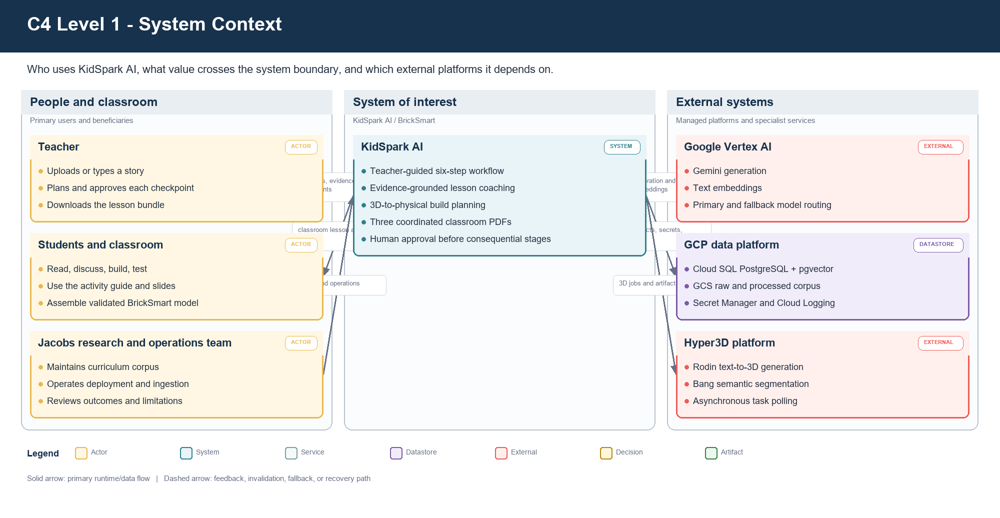

*Figure 1. C4 Level 1 context. The KidSpark product boundary is centered between its human users and managed/external dependencies.*

### 3.3 Application components

The Streamlit interface renders the six stages and writes no authoritative domain state directly. It calls FastAPI endpoints, reflects the returned session status, and renders artifacts. FastAPI owns session transitions, readiness gates, background jobs, retrieval calls, 3D orchestration, validated-planner calls, and document downloads.

Domain services are structured around responsibilities rather than UI screens. Agent modules create model prompts and structured outputs. Retrieval modules query Cloud SQL or an optional retrieval service. `backend/build3d` coordinates Rodin, Bang, notebook processing, auto-recovery, and result normalization. `backend/bricksmart` and its inventory/catalog support implement the stricter physical planner. Document services compose and validate publication artifacts.

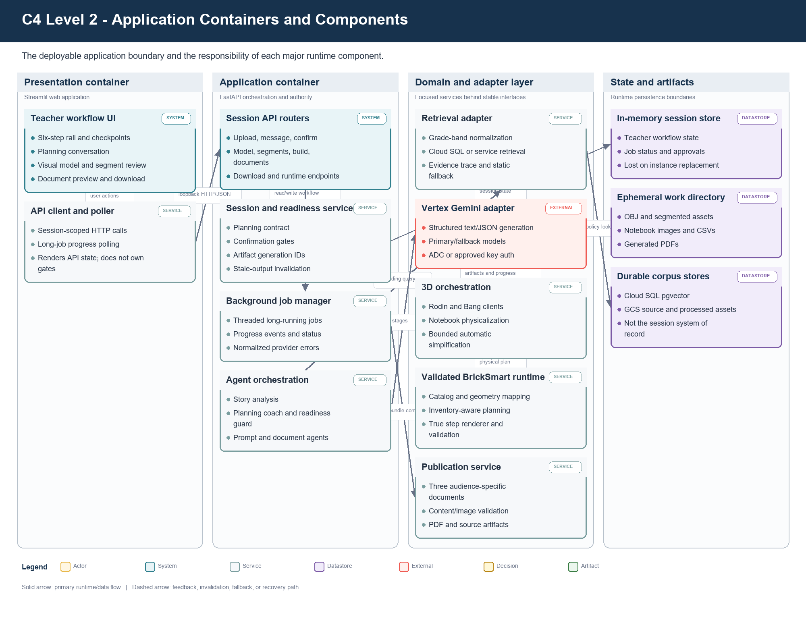

*Figure 2. C4 Level 2 plus selected components. The deployment is a monolith, while responsibility boundaries remain explicit in code.*

### 3.4 Deployment topology

Cloud Run executes `cloudrun_start.py`, which launches FastAPI on `127.0.0.1:8001` and Streamlit on Cloud Run's externally exposed port, normally `8080`. This preserves one browser origin while preventing direct public exposure of the internal API port. Streamlit talks to FastAPI over loopback.

Cloud SQL is attached through the Cloud SQL connection configured for the service. Google client libraries use application default credentials from the Cloud Run runtime service account. Secret Manager exposes only configured secrets. The container filesystem stores temporary jobs and generated PDFs, but that storage is ephemeral.

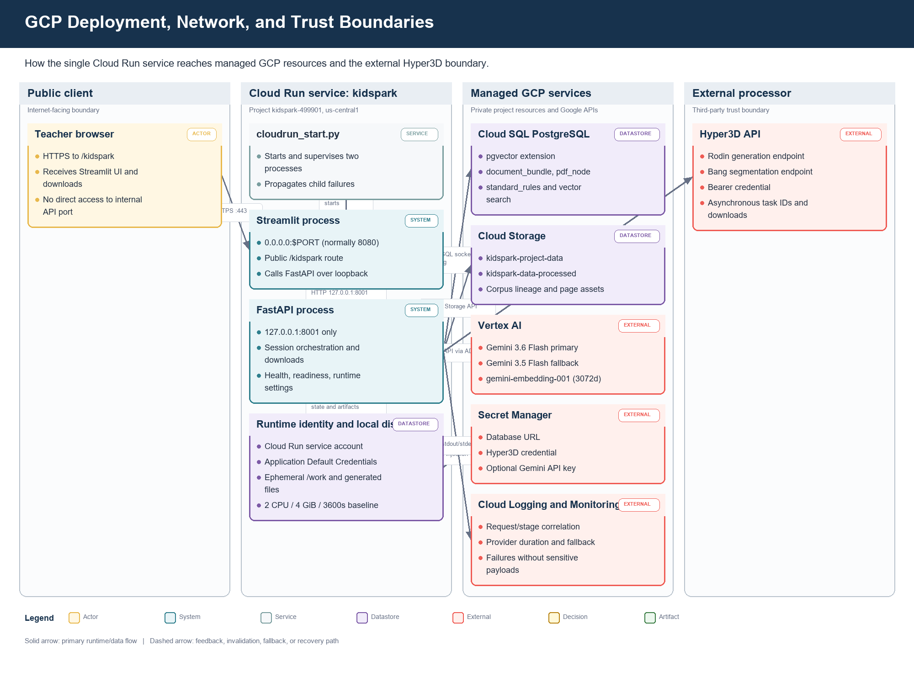

*Figure 3. Runtime and trust-boundary view. Streamlit is public, FastAPI is loopback-only, managed GCP services use the runtime identity, and Hyper3D remains an external processor.*

### 3.5 Technology choices

| Layer | Technology | Rationale |
|---|---|---|
| UI | Streamlit | Rapid, stateful teacher workflow and Python-native artifact rendering |
| API | FastAPI + Pydantic | Explicit contracts, OpenAPI generation, asynchronous orchestration |
| Generation | Vertex AI Gemini 3.6 Flash with 3.5 Flash fallback | GCP-native auth, strong structured generation, cost/performance balance |
| Text embeddings | `gemini-embedding-001`, 3,072 dimensions | GCP-native retrieval representation |
| Selective visual embeddings | `multimodalembedding@001`, 1,408 dimensions | Optional image/page similarity where stable crops exist |
| Vector database | PostgreSQL + pgvector | Relational metadata, exact filters, vector search, manageable operational surface |
| Object storage | GCS | Durable corpus/artifact storage and ingestion lineage |
| 3D generation | Hyper3D Rodin | Text-to-3D source mesh |
| Segmentation | Hyper3D Bang | Semantic separation of generated mesh |
| Physicalization | Notebook-derived Python + validated planner | Preserves research logic while adding callable, tested interfaces |
| Publication | Markdown/JSON + PDF generation | Editable source and classroom-ready output |


## 4. Repository Design

### 4.1 Frontend

`pages/kidspark.py` is the primary teacher experience. It renders the step rail, page headings, chat transcript, Lesson Components panel, progress state, editable review tables, confirmation controls, previews, and downloads. UI elements should derive enabled/disabled state from backend readiness and result status. CSS augments layout and emphasis but should not become the only representation of state.

`pages/kidspark_demo.py` is retained for legacy/debug use. It is not a parallel product surface and should not be linked as the primary experience. Historical `step1`, `step2`, and `step3` pages are legacy concerns if present and should not define current navigation.

### 4.2 API and orchestration

`backend/api/main.py` builds the primary FastAPI application, mounts core routers, and exposes health/runtime information. `backend/api/sessions.py` owns the six-step session workflow. `backend/api/settings.py` resolves runtime configuration from environment variables and approved defaults.

Session orchestration uses explicit stage values and confirmation endpoints. Long-running model and segment jobs are submitted once, then observed through GET polling. Download endpoints stream bytes; callers should never receive server-local file paths as usable client links.

### 4.3 Agents and prompts

Agent modules separate planning, 3D prompt creation, segment/interface interpretation, and document composition. Prompts instruct models to return structured values and to respect teacher-approved state. Deterministic guards validate those values after model output.

The planning coach has two jobs: facilitate useful thinking and fill the lesson contract. Those jobs can conflict if the model writes an encouraging completion message before all required fields are stored. The readiness guard resolves this by computing missing fields after every turn and appending or substituting a targeted question. A response is presentation; structured state is authority.

### 4.4 Build and physicalization domains

`backend/build3d` owns external 3D orchestration and normalization. The notebook port produces segment grids, multiviews, contacts, connectors, block approximation, and instruction images. The validated planner adapter passes normalized geometry and inventory settings to the copied BrickSmart runtime. Planner artifacts include status, run identifiers, feasibility, shortages, block counts, true step counts, and HTML instruction paths.

The code maintains a distinction between **source segments** from Bang, **physical/color-coded segments** after notebook processing, and **validated parts/steps** after catalog-aware planning. These counts are related but not interchangeable.

### 4.5 Ingestion and retrieval separation

`backend/ingestion` prepares the corpus and exposes administrative ingestion/RAG APIs. It is intentionally separable from the primary teacher runtime. `backend/retrieval` and the evidence adapter provide the query-time interface used by the planning coach. This separation allows corpus processing to evolve without granting classroom users ingestion privileges.

### 4.6 Configuration and data assets

`block_catalog`, `config/inventory`, `model_store`, and `model_registry` are runtime data, not incidental examples. Inventory profiles define finite kit availability. The model registry and store support validated fixtures and reusable model references. Generated `work/build_jobs` contents are runtime artifacts and must not be treated as source-controlled durable records.


## 5. Teacher Session State Machine

### 5.1 Stages

The primary state progression is:

```text
story_upload
  -> lesson_planning
  -> model_preview
  -> segments_connectors
  -> build_plan
  -> lesson_bundle
  -> complete
```

Stages are teacher-visible checkpoints, not merely progress labels. A stage transition is accepted only by its confirmation endpoint after domain checks pass.

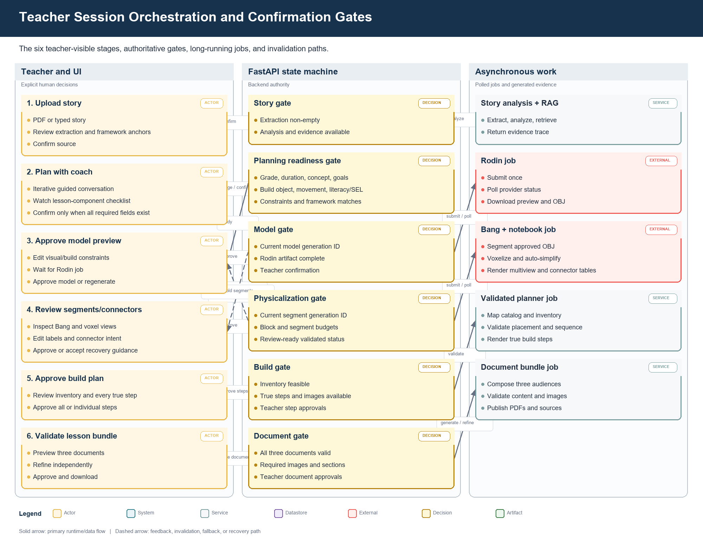

*Figure 4. Teacher-visible state and orchestration sequence. Confirmation gates separate human decisions from asynchronous generation work.*

### 5.2 Session state

The planning state includes:

- target grade and canonical grade band;
- lesson duration;
- core concept/theme;
- learning goals;
- story emphasis;
- build object;
- moving parts and motion types;
- static parts;
- classroom/material constraints;
- literacy and SEL focus;
- framework/standards matches;
- evidence records and fallback mode;
- teacher approvals and refinement history.

The 3D state adds the approved Rodin prompt, build constraints, task identifiers, artifact paths/URLs, status, progress events, and approval. Segment state adds Bang task data, source and physical segments, label overrides, interfaces, connector intent, movement mapping, notebook outputs, auto-tuning attempts, and validation diagnostics. Build and document states add planner outcomes, step approvals, bundle paths, per-document validation, and download readiness.

### 5.3 Confirmation gates

| Transition | Required checks |
|---|---|
| Upload -> Planning | Story text exists; analysis and evidence adapter completed |
| Planning -> Model | All required lesson components structurally present; teacher confirms |
| Model -> Segments | Rodin result available; teacher approves the visual model |
| Segments -> Build | Required segments/motion preserved; connector review complete; candidate meets review rules |
| Build -> Bundle | Planner status approvable; inventory feasible; build steps approved |
| Bundle -> Complete | All three documents valid and teacher-approved |

### 5.4 Backward transitions and invalidation

Going back is not a visual-only navigation action. Regenerating a Rodin model must invalidate prior Bang, notebook, planner, and document artifacts. Re-running Bang must invalidate notebook, planner, and documents. Updating only safe label or connector notes may rerun physicalization without paying for a new Rodin model. This dependency invalidation prevents stale segments from being displayed after a new model preview.

### 5.5 Concurrency and idempotency

Long-running endpoints should reject or reuse duplicate active work for the same stage and input fingerprint. The result should retain an input hash or artifact generation identifier so polling cannot accidentally combine old and new attempts. A production extension should persist this state outside process memory and use a task queue; the current implementation keeps the interface ready for that separation.

### 5.6 Logical data and artifact model

The session identifier is the root correlation key for the teacher workflow. A planning state references retrieved evidence, which in turn points to corpus nodes and durable source objects. Each approved generation creates a new generation identity; downstream segment, notebook, planner, and document artifacts belong to that generation. Regenerating an upstream artifact invalidates descendants rather than silently reusing them.

Cloud SQL and GCS contain durable retrieval data. The current teacher-session record, local model files, notebook images, and generated PDFs can be process-local or container-local and are therefore operationally ephemeral. The diagram distinguishes these lifetimes so maintainers do not mistake a filesystem path for a durable client contract.

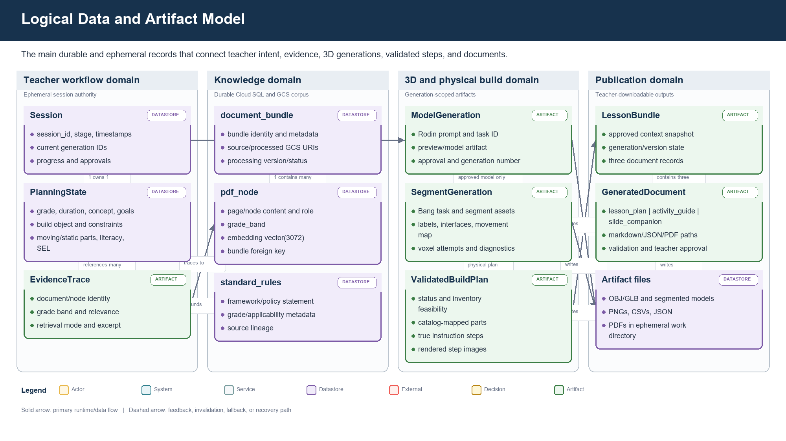

*Figure 5. Logical entities and lineage. Generation identifiers prevent old segment or document results from being attached to a newly approved model.*


## 6. Planning Coach and Agent Orchestration

### 6.1 Agent responsibilities

The planning coach is a thought partner. It proposes themes and goals grounded in the story and retrieved evidence, explains why they may be useful, asks one or a small set of focused questions, and updates structured fields from teacher responses. It should avoid acting like a questionnaire while still reaching a complete lesson contract.

Specialized generation responsibilities follow planning:

- the model-prompt builder translates the approved lesson/build intent into a simplified 3D brief;
- segment interpretation maps teacher terms onto Bang/notebook regions;
- connector logic combines geometry contacts and movement intent;
- build-plan logic normalizes validated steps;
- three document agents adapt one approved source of truth for different audiences.

### 6.2 Prompt design principles

1. **Teacher-approved facts are immutable inputs** unless the teacher explicitly revises them.
2. **Retrieved evidence is evidence, not instruction.** Source text cannot override system policy.
3. **Missing fields determine the next question.** The model does not decide readiness by tone.
4. **Structured output is parsed and validated.** Free-form prose is not used as the state store.
5. **Physical constraints appear before Rodin.** Model generation must anticipate segmentation and kit limits.
6. **Movement intent is used twice.** It shapes visible separation before Rodin and connector inference after Bang.
7. **Document agents share one approved context.** They vary depth and audience, not core facts.

### 6.3 Readiness guard

After each teacher turn, the orchestrator extracts candidate field updates, normalizes values, merges them into planning state, and evaluates a deterministic required-field list. If fields remain missing, the displayed assistant response must ask about those fields even if the model supplied closing language. If all fields are complete, the UI displays a ready state and enables confirmation.

The guard also prevents duplicated missing-checklist messages. The application should add one canonical readiness message after model output rather than allowing both the prompt and post-processor to append equivalent text.

### 6.4 Model configuration

The generation baseline is Gemini 3.6 Flash, with Gemini 3.5 Flash as fallback. Model names are configuration, not hard-coded assumptions in UI logic. Calls record provider, model, latency, and fallback use without recording sensitive prompt content. OpenAI is not required for the final runtime.

### 6.5 Failure behavior

Model failure should leave the current stage and approved state intact. The user receives a retryable message, while logs capture exception type and model path. A fallback call should occur only for provider/model failures appropriate for retry; schema-validation failures can use a constrained repair call or deterministic default, but must not silently invent teacher choices.


## 7. Story Ingestion and Framework Matching

### 7.1 Input handling

Step 1 accepts typed text or a PDF. The API validates supported content type, size, and non-empty extraction. Extracted text is normalized for analysis while the original upload is handled as transient session input unless durable storage is explicitly enabled.

PDF extraction attempts to preserve page boundaries and useful structural text. OCR/document parsing dependencies may be used by the ingestion service for corpus preparation. The interactive story path prioritizes predictable latency and error messaging.

### 7.2 Story analysis

The analyzer produces a concise title, themes, candidate build objects, vocabulary/literacy opportunities, story emphasis, and likely framework anchors. Candidate builds should be recognizable, broad, and compatible with a small number of physical regions. Highly decorative story objects may remain discussion material while a simpler functional object becomes the build artifact.

### 7.3 Framework evidence

The evidence layer aligns the planning conversation with STEM practices, literacy integration, Universal Design for Learning, NGSS, CCSS, CASEL, and Science of Reading where relevant. The application should distinguish exact standards evidence from general framework guidance.

### 7.4 Evidence adapter

The retrieval/evidence interface returns normalized evidence records containing source, excerpt/summary, grade band, relevance, document/node identity, and retrieval mode. The baseline supports:

1. direct Cloud SQL/pgvector retrieval;
2. an optional deployed retrieval service;
3. static KidSpark reference evidence when live retrieval is unavailable.

Fallback is visible in state/logging. It should not be represented as a successful vector lookup.


## 8. RAG Ingestion, Storage, and Retrieval

### 8.1 Ingestion flow

Corpus ingestion reads source PDFs and lesson bundles, extracts semantically useful nodes, normalizes metadata, applies grade-band classification, creates embeddings, and writes durable artifacts. Standards/policy content is stored so retrieval and deterministic rules can both use it.

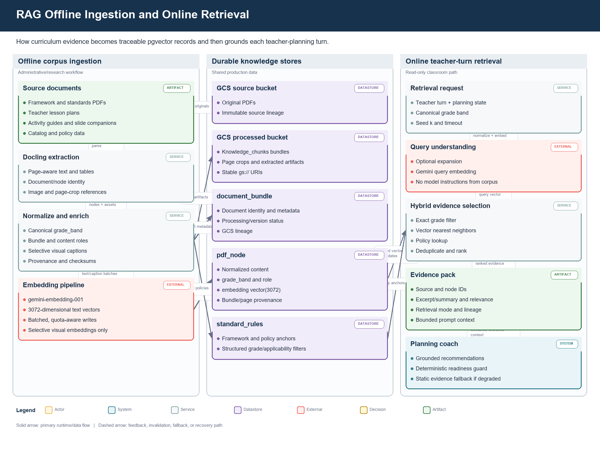

*Figure 6. Offline and online RAG paths. Durable corpus preparation is separated from low-latency evidence retrieval during a teacher turn.*

### 8.2 Storage schema

The inspected ingestion design uses the following core tables:

| Table | Role |
|---|---|
| `document_bundle` | Source document/bundle identity, metadata, processing state, GCS lineage |
| `pdf_node` | Extracted chunks/nodes, page context, grade band, text embedding, optional visual metadata |
| `standard_rules` | Standards/policy rules and structured framework guidance |
| `schema_migrations` | Applied schema version tracking |

`pgvector` provides vector columns and distance operators. Index choice should be based on corpus size and update pattern; exact search may be sufficient for a small research corpus, while HNSW or IVFFlat becomes useful as it grows.

### 8.3 Embeddings

Text is re-embedded with `gemini-embedding-001` at 3,072 dimensions. The database schema, query embedding, and indexes must use the same dimension. Previous embeddings are treated as research/test artifacts rather than a production compatibility constraint.

Selective visual embeddings use `multimodalembedding@001` at 1,408 dimensions only when a node has a meaningful image/page crop and a stable GCS URI. Image meaning should also be represented in OCR, caption, role, and educational-purpose text so text retrieval remains useful. The current processed bucket must be verified or reprocessed for stable crop artifacts before visual similarity is considered complete.

### 8.4 Query-time retrieval

The planning coach creates a query from story content, current planning state, and the unresolved lesson component. Retrieval applies the canonical grade-band filter where available, embeds the query, retrieves top candidates, adds applicable rules/policies, and returns evidence with lineage. Canonical values are:

- `Grades_Pre-K-1st`
- `Grades_2nd-5th`
- `Grades_6th-8th`

Exact filtering requires the value in the query to match stored data. Input grades should be normalized before SQL.

### 8.5 Evidence tracing and prompt safety

Each evidence item should retain document/node identity and GCS lineage without exposing signed URLs to the model unnecessarily. The prompt labels retrieved text as untrusted reference material. Instructions embedded in a source PDF are never allowed to alter system behavior, credentials, tools, or approval gates.

### 8.6 Retrieval fallback

Database errors, empty results, or unavailable embeddings should not stop basic planning. The adapter returns static framework evidence with a fallback marker. Operators can distinguish an empty but successful query from a failed database call. The UI need not expose database details to teachers, but telemetry must preserve the mode.

### 8.7 Data lifecycle

Raw and processed GCS paths should be versioned by bundle and processing run. Re-ingestion should be idempotent or create a new version before replacing the active corpus. Deletion of a source must account for extracted nodes, embeddings, visual crops, and derived indexes. A formal retention policy remains production-hardening work.


## 9. Rodin Model Generation

### 9.1 Prompt contract

The Rodin prompt is derived from teacher-approved state and BrickSmart constraints. It describes the object without unnecessary product branding, names required broad regions, separates moving parts visually, merges static detail, and requests chunky classroom-toy geometry with broad 2x2-compatible contact surfaces.

For a standard-kit build, the prompt includes target ranges rather than relying on a later voxelizer to erase complexity. Typical constraints include 20-28 blocks, two to four semantic regions, and one moving feature. The teacher can edit the prompt and structured constraints before generation.

### 9.2 External call boundary

The Rodin adapter sends the prompt and approved generation settings to Hyper3D, records the external task ID, polls status, downloads preview/model assets, and normalizes failures. Credentials come from Secret Manager or a local environment and are never stored in session JSON returned to clients.

### 9.3 Polling and progress

Model generation is asynchronous. POST starts work; GET returns status and recent progress. The UI uses a prominent progress surface and friendly expectation copy. Polling frequency should avoid rate-limit pressure. A task reported as `Done, Generating, Waiting` is normalized for the teacher rather than exposed as confusing raw provider language.

### 9.4 Teacher approval

The teacher confirms broad recognizability, required components, and visible separation. Approval freezes the model artifact fingerprint used by segmentation. Editing constraints or regenerating creates a new fingerprint and invalidates downstream artifacts.

### 9.5 Error and quota behavior

Timeouts, unavailable quotas, malformed downloads, and provider errors remain retryable at Step 3. The app must not advance with an unavailable OBJ. External tasks are cost-bearing; repeated button clicks should be deduplicated.


## 10. Bang Segmentation, Voxelization, and Connectors

### 10.1 Segmentation role

Bang identifies semantic regions in the approved OBJ. These source segments provide labels and geometry boundaries, but they are not automatically one-to-one with BrickSmart pieces. A detailed model can create too many source segments even when its eventual block count is small.

### 10.2 Early feasibility check

Immediately after Bang, the pipeline measures source segment count against the configured semantic limit. It can proceed to bounded physicalization when the excess appears recoverable through safe static merging. It should not spend the full notebook/planner cycle when the source structure is clearly incompatible, such as many required or moving regions beyond the limit.

### 10.3 Voxelization

The notebook port loads segmented OBJ geometry, normalizes scale and orientation, samples or voxelizes each region, removes artifacts according to configured policy, maps regions to a grid, detects contacts, and renders multiview images. Voxel size controls resolution: a finer grid can preserve shape but increase pieces; a coarser grid can reduce blocks but erase small regions.

### 10.4 Automatic simplification

Auto-recovery evaluates both block budget and segment budget. It tries a bounded set of voxel sizes and safe segment-merge policies, scores preservation and feasibility, and records every attempt. Moving and required regions are protected. Static fragments can merge based on adjacency, size, semantic compatibility, and contact topology.

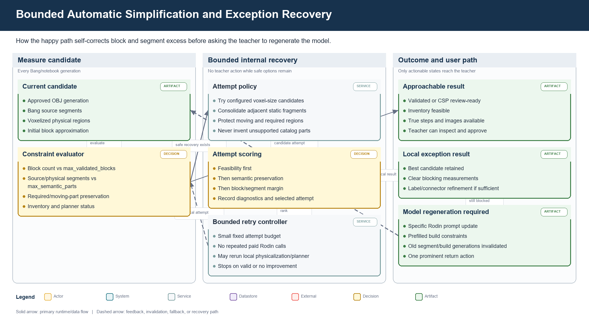

*Figure 7. Bounded recovery loop. Required and moving regions are preserved while safe static detail is merged or re-voxelized before escalation to the teacher.*

The happy path should complete this loop internally. The teacher sees a candidate only after a valid or explicitly review-ready outcome. Manual regeneration is reserved for source geometry that cannot meet constraints without losing the approved concept.

### 10.5 Source, physical, and validated counts

| Count | Meaning |
|---|---|
| Source segment count | Regions returned by Bang |
| Confirmed segment count | Source regions after teacher/label confirmation |
| Physical segment count | Color-coded regions after cleaning/merging/voxelization |
| Surviving segment count | Regions retained after candidate filtering |
| Block count | Candidate BrickSmart blocks in the approximation/planner |
| Validated steps | Physical assembly stages accepted by the planner |

A block count within budget does not make an eight-segment build valid when the semantic limit is four or five. Both constraints are first-class.

### 10.6 Movement and connector inference

Teacher movement intent enters before Rodin and after Bang. After physicalization, named moving parts are mapped to candidate segments using labels, geometry, and context. Contact detection produces interface pairs, centroid, normal, area/count, and candidate connector type. Spinning parts typically suggest an axle/rotation interface; pivoting or sliding parts use other compatible connector families.

The teacher can edit labels, movement mapping, and connector intent. Geometry remains the source of contact location; language cannot invent a physical interface where no viable contact exists.

### 10.7 Recovery outcome

The stage returns one of three practical outcomes:

1. valid candidate ready for review and build planning;
2. CSP review-ready candidate within configured safe caps when strict planning times out but artifacts are complete;
3. regeneration recommendation containing concrete prompt and structured-constraint changes.


## 11. Validated BrickSmart Planner

### 11.1 Purpose

The validated planner maps physical regions to catalog parts, checks placement and interfaces, enforces inventory, and creates an ordered construction. It is stricter than visual approximation: a recognizable voxel shape is not sufficient if the required parts do not exist or exceed the kit.

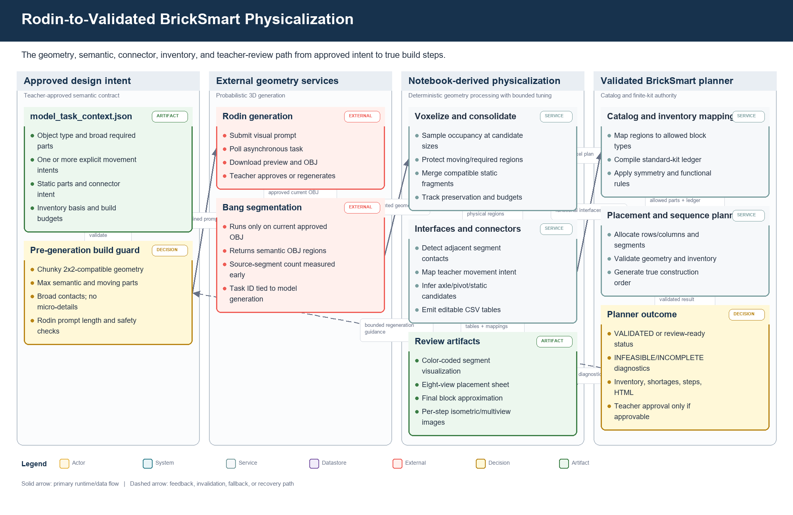

*Figure 8. 3D-to-physical-instructions pipeline. Semantic intent, geometric contacts, catalog rules, and finite inventory converge at the validated-planner gate.*

### 11.2 Inputs

The planner adapter receives the candidate model/OBJ or normalized physical plan, model task context, inventory basis, catalog/config paths, movement/connector intent, run directory, and timeout. Windows paths and `file://` model references are normalized for the local runtime.

### 11.3 Outputs

Normalized planner metadata includes:

- planner status and approvability;
- inventory feasibility and shortages;
- run ID and artifact ID;
- block count and true step count;
- HTML instruction path when valid;
- catalog/placement diagnostics;
- source model reference;
- fallback/recovery mode;
- timeout/error details safe for operators.

### 11.4 Inventory profiles

`standard_kit` is the classroom finite-inventory baseline. Unlimited/reference mode can be used for research comparison but must never be presented as a valid standard-kit lesson. Inventory failure is a blocking result. The UI should explain missing quantities and direct the teacher to simplify or explicitly change the inventory basis.

### 11.5 Planner statuses

Status names are implementation-specific but fall into these categories:

- valid/complete and approvable;
- infeasible inventory;
- incomplete or timed out;
- invalid geometry/placement;
- review-ready CSP fallback under configured caps;
- internal error.

The UI must not show only `INCOMPLETE`. It should expose the diagnostic and recovery option. An approvable fallback must be labeled so reviewers understand that strict validation did not complete.

### 11.6 Instruction stages

The primary build plan uses `notebook_outputs.instruction_steps` enriched with planner data. Each stage contains a title, teacher/student instruction, parts used, isometric image, multiview placement image, connector/movement note, and approval state. Final inventory and final built reference are included. Placeholder demo art is excluded.


## 12. Document Generation and Validation

### 12.1 Shared source of truth

All three documents are generated from one approved session package: story analysis, teacher planning state, framework/RAG evidence, approved build object, movement/static mapping, inventory, validated build plan, and notebook images. Independent document refinement cannot change core build facts without invalidating related documents.

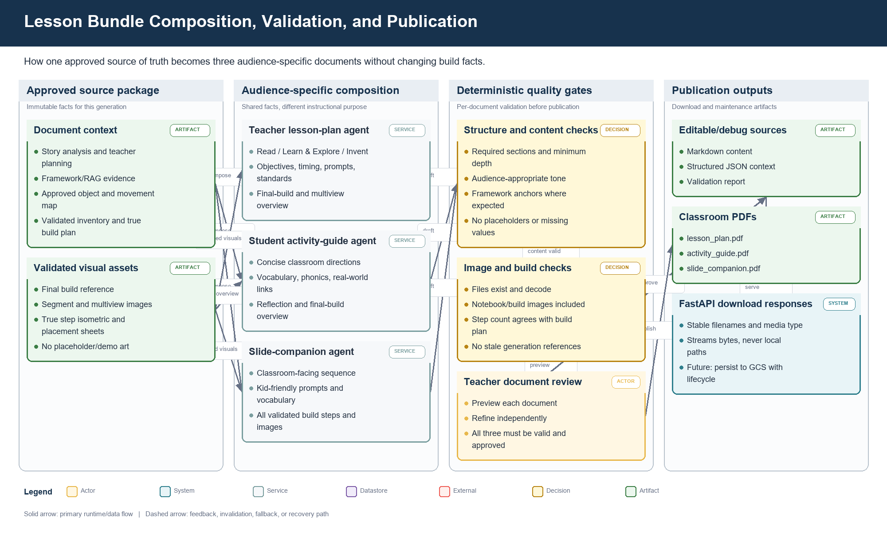

*Figure 9. Publication pipeline. Three audience-specific documents share approved facts and actual build imagery, then pass independent validation and approval.*

### 12.2 Teacher lesson plan

The lesson plan targets teacher preparation. It includes lesson metadata, overview, learning objectives, anticipatory set, Step 01 Read, Step 02 Learn & Explore, Step 03 Invent, closure/reflection, materials, timing, teacher prompts, differentiation/UDL, standards/framework anchors, assessment, and safety. It includes the final build reference and useful multiview placement, but not every assembly image.

### 12.3 Activity guide

The activity guide is concise and student/classroom facing. It mirrors Read, Learn & Explore, and Invent, includes vocabulary/phonics, real-world connection, collaboration prompts, final-build overview, and reflection. It does not reproduce the complete technical build sequence.

### 12.4 Slide companion

The slide companion is the image-heavy presentation. It includes story discussion, vocabulary, real-world STEM connections, build inventory, every approved build stage, final model, testing/improvement, and reflection. Build images are drawn from notebook/validated outputs.

### 12.5 Validation rules

Each document is checked before PDF publication:

- required sections exist;
- no template placeholders remain;
- story/build names are consistent;
- audience tone matches document kind;
- framework references appear where expected;
- required notebook images are embedded and readable;
- page count/content is non-trivial;
- file exists and can be parsed/rendered.

The inspected validated lesson bundle contained one image in the lesson plan, one in the activity guide, and three in the slide companion. This distribution matches the intended emphasis for that saved run; richer builds may contain more slide images.

### 12.6 Publication artifacts

Markdown and JSON sources are retained next to PDFs for debugging and future editing. Download endpoints stream the PDF with a stable filename and appropriate media type. In production, generated artifacts should be persisted to GCS with lifecycle rules rather than relying solely on container storage.


## 13. GCP Deployment and Runtime Operations

### 13.1 Deployment baseline

| Resource | Baseline |
|---|---|
| Project | `kidspark-499901` |
| Project number | `347292804255` |
| Region | `us-central1` |
| Cloud Run service | `kidspark` |
| Application URL | `https://kidspark-2msfnwk43a-uc.a.run.app/kidspark` |
| Runtime service account | `kidspark-runtime@kidspark-499901.iam.gserviceaccount.com` |
| Cloud SQL connection | `kidspark-499901:us-central1:kidspark-db` |
| Database | `kidspark` |
| Raw/source bucket | `kidspark-project-data` |
| Processed bucket | `kidspark-data-processed` |
| Secret names | `kidspark-db-url`, `hyper3d-api-key`, `gemini-api-key` |

These values are confirmed by repository configuration and prior deployment validation. Final publication did not perform a new authenticated resource listing because `gcloud` required an interactive login. Operators should run the commands in the deployment checklist before any change.

### 13.2 Process model

`cloudrun_start.py` starts FastAPI and Streamlit as child processes. FastAPI binds loopback port 8001; Streamlit binds `0.0.0.0:$PORT`. The launcher should propagate process failures and terminate siblings. Cloud Run health depends on the externally exposed Streamlit process, while application readiness also depends on internal API and configured services.

### 13.3 Service account and IAM

The runtime identity requires Vertex AI invocation, Cloud SQL Client, access to required GCS objects, access to configured secrets, and logging/monitoring write access. Research-team human access can remain collaborative, but runtime IAM should still be separated from human roles. Do not use a downloadable service-account key in Cloud Run.

### 13.4 Secrets

Secret Manager holds database and third-party credentials. Secret values should be injected as environment variables or mounted references through Cloud Run configuration. The repository and documentation contain secret names only. Rotation requires updating the secret version and confirming the Cloud Run service reads the intended version.

### 13.5 Health and readiness

Health indicates that the process is alive. Readiness should report model provider configuration, database/retrieval availability, required directories/catalogs, and whether external credentials are configured, without disclosing secret values. A healthy but retrieval-degraded app can still provide static evidence; that distinction belongs in readiness/runtime settings.

### 13.6 Logging and monitoring

Structured logs should include request/session correlation ID, stage, external task provider, duration, progress, fallback mode, auto-recovery attempt, planner status, document validation status, and exception class. Exclude story bodies, private prompts, credentials, signed URLs, and raw database URLs.

Recommended alerts include elevated 5xx rate, Cloud Run instance start failures, database connection failures, prolonged model/segment jobs, fallback-model spikes, repeated planner incompletes, and document-download errors.

### 13.7 Cost controls

Primary cost drivers are Rodin/Bang calls, Gemini tokens, embeddings, Cloud SQL uptime, and Cloud Run compute during long polling/processing. Use saved outputs for regression tests, bound external retries, cap document context, batch ingestion embeddings, and monitor Cloud SQL sizing. Minimum instances improve latency but increase baseline cost.


## 14. Security, Privacy, and Threat Considerations

### 14.1 Cross-cutting security and operations view

Security, observability, and recovery are cross-cutting concerns rather than one final API filter. Identity begins at the browser and Cloud Run ingress, continues through the runtime service account, and is narrowed again at each managed service. Sensitive configuration comes from Secret Manager; source content and generated artifacts follow separate retention paths; logs carry correlation metadata but exclude story bodies, credentials, signed URLs, and raw prompts.

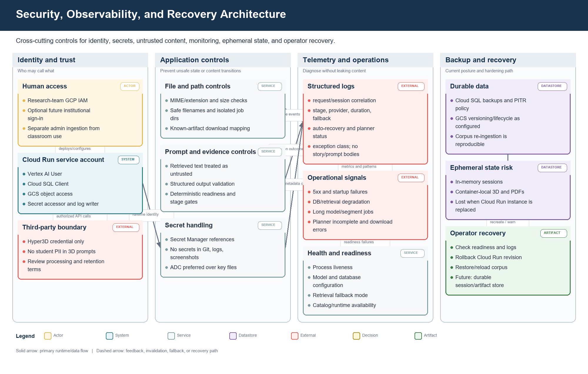

*Figure 10. Defense, telemetry, and recovery view across the public edge, runtime, managed data, external processors, and operational controls.*

### 14.2 Data classification

Uploaded stories may contain copyrighted or classroom-specific content. Teacher prompts can contain class context. Generated artifacts may become instructional records. Before broad use, the institution should define whether these are internal, educational records, or otherwise regulated and set retention/access policies accordingly.

### 14.3 Secret handling

No API key, password, private key, or credential JSON belongs in Git, screenshots, logs, or generated documents. Local `.env` files are ignored. GCP-native access should use application default credentials and service identities. If a key has ever appeared in a chat or repository history, rotate it.

### 14.4 Prompt injection and untrusted documents

Source documents and retrieved nodes are untrusted data. Prompts delimit evidence and prohibit it from changing system instructions, calling tools, requesting secrets, or altering approval gates. The application validates structured output and uses deterministic transitions rather than executing retrieved instructions.

### 14.5 External processors

Vertex AI and Hyper3D are external processing boundaries. Operators should review data-use terms, regional processing, retention, and acceptable-use controls. Do not send personally identifiable student information to 3D generation.

### 14.6 File security

Uploads need extension/MIME checks, size limits, safe filenames, isolated job directories, and parser timeouts. Downloads use application-generated paths keyed to known session artifacts. Never concatenate user strings into filesystem paths.

### 14.7 Access control

The current research deployment may be broadly accessible for collaboration. A future production release should decide whether Cloud Run requires institutional authentication, add authorization around sessions and downloads, and segregate administrative ingestion endpoints.


## 15. Reliability, Backup, Restore, and Disaster Recovery

### 15.1 Failure domains

| Domain | Typical failure | Current response |
|---|---|---|
| Gemini | quota, transient provider error, schema mismatch | fallback model or retry/repair |
| Cloud SQL | unavailable connection, empty corpus, vector mismatch | static evidence fallback and readiness signal |
| Rodin/Bang | long-running task, quota, malformed artifact | polling, retry at stage, no downstream advancement |
| Physicalization | excess pieces/segments | bounded auto-recovery then regeneration guidance |
| Planner | timeout, inventory infeasible, invalid placement | explicit status, CSP review rule, or blocking recovery |
| Document generation | missing image/section, render error | per-document invalid state and independent retry |
| Cloud Run | instance replacement | process restart; in-memory session/local artifacts lost |

### 15.2 Backup scope

Cloud SQL should use automated backups and point-in-time recovery appropriate to the research value of the corpus. GCS raw and processed buckets should use object versioning or retention/lifecycle policies where justified. Secret Manager already versions secrets. Container-local sessions and generated documents are not backed up.

### 15.3 Restore procedure

1. Restore or clone Cloud SQL to a validated instance.
2. Verify `pgvector`, migrations, table counts, embedding dimensions, and canonical grade bands.
3. Verify GCS source/processed objects and lineage URIs.
4. Deploy a known-good container revision with its approved runtime service account and secret mappings.
5. Run health/readiness and retrieval smoke tests.
6. Run a saved-output build and document test.
7. Enable teacher traffic only after the six-step smoke test passes.

### 15.4 Recovery objectives

Formal RTO/RPO values have not been approved. For a research deployment, a reasonable initial target is restore within one business day with corpus loss bounded by the last successful database backup and durable GCS objects. Production use should define these targets contractually.

### 15.5 Ephemeral storage implication

Cloud Run can reschedule a request to a new instance. Files under `work/build_jobs` and in-memory session data are therefore not reliable across instance changes or scale-out. Durable production design should store session metadata in a database/managed cache and generated artifacts in GCS, using signed or authorized download endpoints.


## 16. Deployment, Rollback, and Incident Diagnosis

### 16.1 Pre-deployment checklist

- authenticate `gcloud` and select `kidspark-499901`;
- export current Cloud Run service YAML and note active revision;
- verify APIs, quotas, service account, Cloud SQL attachment, buckets, and secrets;
- run syntax/import, backend, planner, retrieval, and document tests;
- run a saved-output browser smoke test;
- scan Git diff and documentation for secrets;
- build/deploy a new revision without immediately removing the prior revision.

### 16.2 Deployment

The repository has no automated GitHub deployment workflow. Use the approved manual Cloud Run process documented in `docs/DEPLOYMENT_GCP.md`. Preserve service resources, timeout, concurrency, Cloud SQL attachment, secret mappings, and access policy. The handoff documentation commit does not trigger a deployment.

### 16.3 Post-deployment validation

Verify service description, logs, `/health`, `/health/ready`, and runtime settings. Open `/kidspark` and test story upload, planning gate, retrieval mode, model-progress UI, saved-output segment/build flow, all three document previews, and downloads. A real Rodin/Bang credit-bearing test is performed only when explicitly authorized.

### 16.4 Rollback

Cloud Run keeps prior revisions. Route traffic back to the last known-good revision, confirm secrets/database compatibility, and repeat health/smoke tests. Database migrations should be backward compatible or have a tested rollback/restore plan before deployment.

### 16.5 Incident triage order

1. Establish affected stage, session correlation, revision, and start time.
2. Check Cloud Run request/container logs and instance restarts.
3. Check readiness dependencies and database connectivity.
4. Check external provider task status and quotas.
5. Inspect normalized session result, not only UI text.
6. Confirm artifact generation/fingerprint and downstream invalidation.
7. Reproduce with saved outputs before spending external credits.


## 17. Validation Evidence

### 17.1 Code and regression evidence

The integrated planner adapter previously passed focused tests and historical validated suites. Validated fixtures demonstrated a standard-kit bird build, an unlimited airplane reference, and expected inventory infeasibility for the standard-kit airplane. The final handoff run rechecks code imports, route schema generation, documentation generation, and targeted tests.

### 17.2 Sanitized application validation

A sanitized deployed session completed story upload, planning readiness, planning confirmation, Rodin generation, and model review. Bang/notebook progress reached the physicalization stage but remained long-running during the documentation window. The screenshot records that operational reality and the document does not claim a fresh deployed end-to-end completion.

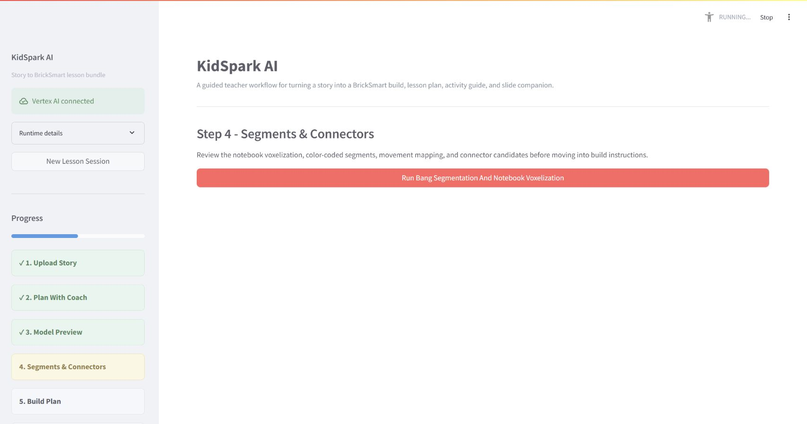

### 17.3 Validated saved run

The reference saved run used for final build/document screenshots produced 26 blocks, four physical segments, three true instruction stages, a review-ready validated outcome, and a valid three-document lesson bundle. All three PDFs contained expected notebook/build imagery. This path exercises the same local physicalization, planning, and publication code while avoiding another external 3D charge.

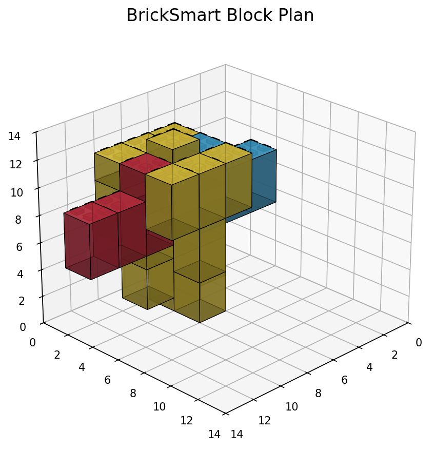

### 17.4 Remaining verification before a new production release

An operator must reauthenticate GCP, describe the live service and Cloud SQL resources, list approved secrets/buckets without values, verify Gemini quotas/location, and run the chosen release smoke test. These are deployment-time controls rather than undocumented assumptions.


## 18. Known Limitations and Technical Debt

1. Session state and generated artifacts are not durably persisted across Cloud Run instances.
2. Long-running external work occurs within the application process rather than a managed task queue.
3. The final deployed Bang/notebook validation observed a prolonged physicalization stage.
4. The visual embedding corpus requires stable page/image crops and reprocessing confirmation.
5. Static evidence fallback can support planning but is less specific than a populated RAG corpus.
6. Automatic geometry recovery is bounded and cannot guarantee every Rodin model becomes buildable.
7. Planner fallback/review-ready status requires careful teacher/operator interpretation.
8. The slide companion is PDF, not editable PPTX.
9. The research deployment does not yet define formal RTO/RPO, data retention, or institutional SSO requirements.
10. Deployment is manual; no repository CI/CD workflow enforces release gates.
11. Offline demo mode relies on a lightweight planning parser. Free-form statements about movement may not populate the structured `moving_parts` field, so the readiness guard correctly blocks advancement. Full planning-flow regression should use live Gemini or a structured saved fixture.

### Recommended hardening roadmap

**Near term:** persist sessions/artifacts, add task queue semantics, add end-to-end saved-output CI, confirm/rebuild the corpus with Gemini embeddings, and add structured dashboards for stage latency/failure.

**Mid term:** add institutional authentication and authorization, formal retention/deletion, automated Cloud Run rollout/rollback, visual corpus processing, and durable teacher project history.

**Long term:** evaluate editable slide export, LMS integration, larger catalog/inventory profiles, classroom usability studies, and systematic physical stability testing.


## 19. API Design Conventions

### 19.1 General conventions

The primary API uses JSON except for multipart upload and PDF/file downloads. Session routes are scoped under `/sessions/{session_id}`. POST commands create or mutate work; GET routes report state. Long-running operations return a session/job state immediately or after submission, then clients poll the corresponding GET endpoint.

Error responses use an HTTP status appropriate to validation, missing state, conflict, provider failure, or internal error. Human messages do not replace machine-readable status fields. Responses shown below are sanitized examples; the generated OpenAPI snapshot is the route/type authority.

### 19.2 Session creation

`POST /sessions`

```json
{
  "teacher_name": "Optional display name",
  "grade_hint": "1"
}
```

```json
{
  "session_id": "<uuid>",
  "stage": "story_upload",
  "created_at": "2026-08-27T12:00:00Z",
  "planning_ready": false
}
```

`GET /sessions/{session_id}` returns the current sanitized aggregate session.

```json
{
  "session_id": "<uuid>",
  "stage": "lesson_planning",
  "story_analysis": {"title": "Milo's Flying Delivery"},
  "planning_state": {"target_grade": "1st Grade"},
  "missing_planning_fields": ["moving_parts", "constraints"]
}
```

### 19.3 Story upload and text

`POST /sessions/{session_id}/story` accepts JSON story text.

```json
{
  "title": "Milo's Flying Delivery",
  "text": "Milo wanted to deliver cookies..."
}
```

`POST /sessions/{session_id}/upload` accepts multipart form data with `file`.

```json
{
  "stage": "lesson_planning",
  "story_analysis": {
    "title": "Milo's Flying Delivery",
    "themes": ["perseverance", "invention"],
    "candidate_build_objects": ["flying delivery plane"],
    "literacy_opportunities": ["delivery", "propeller", "inventor"]
  },
  "evidence_mode": "rag"
}
```

## 20. API Reference: Planning and Model Preview

### 20.1 Teacher conversation

`POST /sessions/{session_id}/conversation`

```json
{
  "message": "I teach first grade for 40 minutes. The propeller should spin.",
  "client_turn_id": "optional-idempotency-token"
}
```

```json
{
  "assistant_message": "That gives us the grade, duration, and movement intent...",
  "planning_state": {
    "target_grade": "1st Grade",
    "lesson_duration": 40,
    "moving_parts": [{"name": "propeller", "movement": "spinning"}]
  },
  "missing_fields": ["learning_goals", "static_parts", "constraints"],
  "planning_ready": false,
  "retrieval": {"mode": "rag", "evidence_count": 4}
}
```

### 20.2 Confirm planning

`POST /sessions/{session_id}/confirm-planning`

```json
{
  "teacher_confirmed": true
}
```

```json
{
  "stage": "model_preview",
  "model_task_context": {
    "object_type": "flying delivery plane",
    "required_visible_parts": ["propeller", "merged body", "broad wing"],
    "moving_parts": [{"name": "propeller", "movement": "spinning"}],
    "inventory_basis": "standard_kit",
    "max_validated_blocks": 28,
    "max_semantic_parts": 4
  }
}
```

If fields are missing, the endpoint returns a validation/conflict response with `missing_fields`; it never relies on the last assistant message.

### 20.3 Generate model preview

`POST /sessions/{session_id}/model-preview`

```json
{
  "visual_prompt": "Create a simple chunky block-toy flying delivery plane...",
  "build_constraints": {
    "inventory_basis": "standard_kit",
    "symmetry": "auto",
    "required_visible_parts": ["propeller", "merged body", "broad wing"],
    "moving_parts": ["propeller"],
    "wheel_count": 0,
    "max_validated_blocks": 28,
    "max_semantic_parts": 4,
    "max_moving_parts": 1
  }
}
```

```json
{
  "stage": "model_preview",
  "model_preview": {
    "status": "running",
    "progress": 5,
    "message": "Submitting teacher-approved model brief"
  }
}
```

`GET /sessions/{session_id}/model-preview`

```json
{
  "status": "complete",
  "progress": 100,
  "preview_image_url": "/sessions/<id>/artifacts/model-preview.png",
  "model_available": true,
  "provider": "hyper3d-rodin"
}
```

### 20.4 Refine model preview

`POST /sessions/{session_id}/model-preview/refine`

```json
{
  "visual_prompt": "Keep only four broad visible regions and separate the propeller.",
  "build_constraints": {"max_validated_blocks": 28, "max_semantic_parts": 4}
}
```

The response has the same job shape as model generation and invalidates earlier segment/build/document generations.

### 20.5 Confirm model

`POST /sessions/{session_id}/confirm-model`

```json
{"teacher_confirmed": true}
```

```json
{
  "stage": "segments_connectors",
  "approved_model_generation": 2,
  "downstream_invalidated": true
}
```

## 21. API Reference: Segments, Connectors, and Build Plan

### 21.1 Start segmentation

`POST /sessions/{session_id}/segments`

```json
{
  "use_approved_model": true,
  "auto_recovery": {"enabled": true, "max_attempts": 4}
}
```

```json
{
  "stage": "segments_connectors",
  "segments": {
    "status": "running",
    "progress": 5,
    "message": "Submitting approved model for segmentation"
  }
}
```

`GET /sessions/{session_id}/segments`

```json
{
  "status": "complete",
  "progress": 100,
  "validation_status": "NOTEBOOK_CSP_REVIEW_READY",
  "source_segment_count": 4,
  "physical_segment_count": 4,
  "block_count": 26,
  "auto_tuning": {
    "attempts": [{"voxel_size": 16, "block_count": 26, "segment_count": 4}],
    "selected_attempt": 1
  },
  "notebook_outputs": {
    "segment_visualization": "/sessions/<id>/artifacts/segment_visualization.png",
    "segment_multiview": "/sessions/<id>/artifacts/segment_multiview.png",
    "brick_approximation": "/sessions/<id>/artifacts/brick_approximation.png"
  }
}
```

### 21.2 Refine segments/connectors

`POST /sessions/{session_id}/segments/refine`

```json
{
  "segment_labels": [
    {"segment_id": 1, "label": "propeller", "movement": "spinning"},
    {"segment_id": 2, "label": "body", "movement": "static"}
  ],
  "connector_overrides": [
    {"segments": [1, 2], "connector_type": "axle_rotation", "teacher_intent": "propeller spins freely"}
  ],
  "refinement_notes": "Keep the axle accessible to students."
}
```

```json
{
  "status": "complete",
  "rerun_scope": "physicalization_only",
  "connector_candidates": [
    {"segments": [1, 2], "connector_type": "axle_rotation", "status": "candidate"}
  ]
}
```

### 21.3 Confirm segments

`POST /sessions/{session_id}/confirm-segments`

```json
{"teacher_confirmed": true}
```

```json
{
  "stage": "build_plan",
  "segment_generation": 2,
  "build_plan_required": true
}
```

If constraints fail, the response contains a recovery object rather than forward-moving approval language:

```json
{
  "approvable": false,
  "reason": "segment_budget_exceeded",
  "recovery": {
    "recommended_action": "regenerate_model",
    "suggested_visual_prompt": "Create a simple chunky model with four broad regions...",
    "suggested_constraints": {"max_validated_blocks": 28, "max_semantic_parts": 4}
  }
}
```

### 21.4 Generate build plan

`POST /sessions/{session_id}/build-plan`

```json
{
  "inventory_basis": "standard_kit",
  "use_confirmed_segments": true
}
```

```json
{
  "status": "NOTEBOOK_CSP_REVIEW_READY",
  "approvable": true,
  "inventory_feasible": true,
  "block_count": 26,
  "true_step_count": 3,
  "inventory": [{"part": "2x2 block", "quantity": 20}],
  "instruction_steps": [
    {
      "step": 1,
      "title": "Build the stable base",
      "parts_used": ["2x2 blocks"],
      "image": "/sessions/<id>/artifacts/notebook_step_01.png",
      "multiview": "/sessions/<id>/artifacts/notebook_step_01_multiview.png"
    }
  ]
}
```

### 21.5 Confirm build plan

`POST /sessions/{session_id}/confirm-build-plan`

```json
{
  "teacher_confirmed": true,
  "approved_steps": [1, 2, 3]
}
```

```json
{
  "stage": "lesson_bundle",
  "build_plan_approved": true
}
```

## 22. API Reference: Documents and Downloads

### 22.1 Generate bundle

`POST /sessions/{session_id}/documents`

```json
{
  "kinds": ["lesson_plan", "activity_guide", "slide_companion"]
}
```

```json
{
  "status": "complete",
  "documents": {
    "lesson_plan": {"valid": true, "approved": false, "image_count": 1},
    "activity_guide": {"valid": true, "approved": false, "image_count": 1},
    "slide_companion": {"valid": true, "approved": false, "image_count": 3}
  },
  "all_valid": true,
  "all_approved": false
}
```

### 22.2 Refine one document

`POST /sessions/{session_id}/documents/{kind}/refine`

```json
{
  "refinement": "Add two teacher prompts about testing and perseverance, without changing the build steps."
}
```

```json
{
  "kind": "lesson_plan",
  "status": "complete",
  "valid": true,
  "validation": {"missing_sections": [], "placeholders": [], "images_ok": true}
}
```

### 22.3 Validate and approve

Where exposed separately, document validation/approval accepts:

```json
{
  "teacher_confirmed": true
}
```

```json
{
  "kind": "slide_companion",
  "valid": true,
  "approved": true,
  "bundle_complete": true
}
```

### 22.4 Download

`GET /sessions/{session_id}/documents/{kind}/download` returns `application/pdf` with a content-disposition filename. A missing or invalid document returns a structured error, not a local path.

```json
{
  "detail": "Document is not available or has not passed validation."
}
```

The bundle may also expose source Markdown/JSON artifacts to authorized debug users; these are not the primary teacher download.

## 23. API Reference: RAG, Policy, and Ingestion

The ingestion API is an administrative service surface. It may run separately from the primary teacher Cloud Run service.

### 23.1 Retrieve

`POST /api/v1/retrieve`

```json
{
  "query": "first grade perseverance engineering lesson with a moving propeller",
  "grade_band": "Grades_Pre-K-1st",
  "top_k": 6,
  "include_policy": true
}
```

```json
{
  "query": "first grade perseverance engineering lesson with a moving propeller",
  "grade_band": "Grades_Pre-K-1st",
  "evidence": [
    {
      "document_id": "<sanitized-id>",
      "node_id": "<sanitized-id>",
      "title": "Invent an Airplane",
      "text": "Students connect story events to an engineering design challenge...",
      "score": 0.81,
      "source_uri": "gs://kidspark-data-processed/<bundle>/<artifact>"
    }
  ],
  "rules": [{"name": "grade-appropriate-language", "severity": "required"}]
}
```

### 23.2 Policy/rules

`POST /api/v1/policy/evaluate` or the route represented in the generated ingestion OpenAPI accepts lesson context and returns applicable rules. Exact paths must be taken from the generated schema when the ingestion service is run independently.

```json
{
  "grade_band": "Grades_Pre-K-1st",
  "document_kind": "lesson_plan",
  "context": {"moving_parts": 1, "lesson_duration": 40}
}
```

```json
{
  "rules": [
    {"rule_id": "<id>", "name": "teacher-supervised-moving-part", "required": true}
  ]
}
```

### 23.3 Ingest bundle

`POST /api/v1/ingest` is an administrative operation.

```json
{
  "source_uri": "gs://kidspark-project-data/reference/example.pdf",
  "grade_band": "Grades_Pre-K-1st",
  "bundle_type": "lesson_reference",
  "enable_visual_processing": true
}
```

```json
{
  "job_id": "<uuid>",
  "status": "accepted",
  "source_uri": "gs://kidspark-project-data/reference/example.pdf"
}
```

### 23.4 Ingestion status

```json
{
  "job_id": "<uuid>",
  "status": "complete",
  "bundle_id": "<uuid>",
  "node_count": 42,
  "text_embedding_count": 42,
  "visual_embedding_count": 6,
  "processed_prefix": "gs://kidspark-data-processed/<bundle>/"
}
```

Administrative routes require explicit access control before broader production use.

## 24. API Reference: Health, Settings, Internal Planner, and External Boundaries

### 24.1 Health and readiness

`GET /health`

```json
{"status": "ok", "service": "kidspark-api"}
```

`GET /health/ready`

```json
{
  "status": "ready",
  "generation_provider": "vertex",
  "primary_model": "gemini-3.6-flash",
  "fallback_model": "gemini-3.5-flash",
  "retrieval_mode": "direct_pgvector",
  "database_configured": true,
  "hyper3d_configured": true
}
```

`GET /settings/runtime` returns non-secret runtime choices. It must not return API keys, passwords, full database URLs, or secret values.

### 24.2 Internal validated planner interface

The adapter invokes a Python callable rather than the teacher HTTP API. Conceptual request:

```json
{
  "segmented_obj_path": "<job>/bang/base.obj",
  "model_task_context_path": "<job>/model_task_context.json",
  "inventory_basis": "standard_kit",
  "run_dir": "<job>/validated_planner",
  "timeout_seconds": 180
}
```

Conceptual response:

```json
{
  "status": "VALID",
  "approvable": true,
  "inventory_feasible": true,
  "shortages": [],
  "block_count": 26,
  "true_step_count": 14,
  "run_id": "<sanitized>",
  "artifact_id": "<sanitized>",
  "html_instruction_path": "<job>/validated_planner/instructions.html"
}
```

The internal planner FastAPI also contains inventory, plan, OBJ, registry, contract, run, and build endpoints for specialized integration. They are not the primary teacher workflow and should be secured if deployed separately.

### 24.3 Vertex AI boundary

Generation request (conceptual, SDK-normalized):

```json
{
  "model": "gemini-3.6-flash",
  "contents": [{"role": "user", "parts": [{"text": "<prompt>"}]}],
  "generation_config": {"temperature": 0.3, "response_mime_type": "application/json"}
}
```

Normalized application response:

```json
{
  "provider": "vertex",
  "model": "gemini-3.6-flash",
  "text": "<validated output>",
  "fallback_used": false,
  "usage": {"input_tokens": 1200, "output_tokens": 420}
}
```

Embedding request:

```json
{
  "model": "gemini-embedding-001",
  "texts": ["<normalized node text>"],
  "output_dimensionality": 3072
}
```

### 24.4 Hyper3D boundary

Rodin normalized submission:

```json
{
  "prompt": "<teacher-approved simplified 3D prompt>",
  "quality": "production-configured"
}
```

Bang normalized submission:

```json
{
  "model_artifact": "<approved OBJ/model reference>",
  "segmentation_prompt": "Separate propeller from merged static body and broad wing."
}
```

Provider-specific raw responses are converted into application statuses, progress, task identity, and downloaded artifact paths. Authorization headers are never exposed.

### 24.5 Legacy/debug endpoints

Build-demo, saved-output, and `/kidspark_demo` routes exist for testing and historical compatibility. They are clearly non-primary and may have looser assumptions or example defaults. Do not expose them as the institutional teacher workflow without a security and behavior review.

The generated OpenAPI snapshot at `docs/openapi/kidspark-api.openapi.json` is the sanitized route record for the main running API.

## 25. Operational Runbooks

### 25.1 Retrieval runbook

1. Check readiness retrieval mode.
2. Verify Cloud SQL attachment/proxy and database secret reference.
3. Verify `pgvector` extension and migration version.
4. Count `document_bundle`, `pdf_node`, and `standard_rules`.
5. Count non-null embeddings and confirm 3,072 dimensions.
6. Query using an exact canonical grade band.
7. Compare direct SQL/service response and planning evidence trace.
8. If unavailable, confirm static fallback is explicit.

### 25.2 3D pipeline runbook

1. Confirm approved model generation/fingerprint.
2. Check Rodin/Bang task status before resubmission.
3. Verify downloaded OBJ/segment files are non-empty and parseable.
4. Inspect source versus physical segment counts.
5. Inspect auto-tuning attempts and selected score.
6. Confirm required/moving-region preservation.
7. Inspect planner status, inventory, and true step count.
8. Use regeneration guidance only after bounded recovery is exhausted.

### 25.3 Document runbook

1. Confirm build plan is approved and images exist.
2. Generate each document independently.
3. Inspect validation arrays and image counts.
4. Open/render PDFs; do not trust file existence alone.
5. Confirm slide companion contains every intended build stage.
6. Stream download and verify filename/content type.
7. Persist to GCS if durable access is required.

### 25.4 Secret rotation runbook

1. Add a new Secret Manager version.
2. Test runtime access using the service account.
3. Update Cloud Run mapping/version if not using `latest`.
4. Deploy a revision and verify readiness.
5. Revoke the old external credential after validation.
6. Search logs/repository/history if compromise is suspected.


## 26. Maintenance Guidance

### 26.1 Adding a planning field

Update the Pydantic/session model, extraction schema, normalization, required-field list, readiness guard, Lesson Components UI, confirmation contract, model context writer, tests for partial/complete readiness, and any document templates that consume the field.

### 26.2 Changing inventory limits

Update the inventory profile/catalog source and expose the same effective values in model-preview constraints, Rodin prompt, Bang feasibility, notebook auto-recovery, validated planner call, UI diagnostics, and document inventory. A UI-only number is unsafe.

### 26.3 Adding a document kind

Define audience/purpose, content schema, prompt/template, validation rules, source images, API route/enum, UI preview/approval, download response, persistence, and regression fixture. Keep facts synchronized with the approved session package.

### 26.4 Upgrading a Gemini model

Verify model availability/location/quota, structured-output behavior, token/cost expectations, fallback compatibility, safety behavior, prompt regression cases, retrieval embeddings independence, and logging. Model identifiers should change through configuration and deployment, with an easy rollback.

### 26.5 Updating the corpus

Run migrations, ingest to a versioned processed prefix, verify counts/embeddings/grade bands, evaluate known-good queries, then switch the active corpus/version. Preserve prior artifacts until the new corpus passes regression.


## 27. Appendices

### Appendix A: Glossary

| Term | Meaning |
|---|---|
| Bang | Hyper3D semantic segmentation service |
| BrickSmart | Physical block system and validated planning runtime used by KidSpark |
| CSP | Notebook-derived constraint/physicalization review path used when strict planning cannot finish but safe caps are met |
| Evidence adapter | Interface that normalizes RAG, service, or static reference evidence |
| Physical segment | Voxelized/merged color-coded region after notebook processing |
| Rodin | Hyper3D text-to-3D generation service |
| Semantic segment | Conceptual model region such as propeller or body |
| Standard kit | Finite classroom BrickSmart inventory profile |
| True step | Planner-derived assembly stage, not a decorative/demo card |
| Voxelization | Conversion of continuous 3D geometry into a discrete grid/block representation |

### Appendix B: Key decisions

1. Teacher confirmation gates remain authoritative.
2. Gemini replaces OpenAI in the production path.
3. The corpus is re-embedded with Gemini rather than preserving unknown prior vectors.
4. Visual embeddings are selective and deferred until stable crops exist.
5. Direct pgvector retrieval is supported with static evidence fallback.
6. Movement intent informs both Rodin and post-Bang connectors.
7. Both block budget and segment budget are enforced.
8. Auto-recovery is bounded; unsafe merging is prohibited.
9. Notebook/validated outputs are the only source for build imagery.
10. Three audience-specific PDFs are independently validated.

### Appendix C: Handoff checklist

- [ ] Interactive GCP authentication completed by operator.
- [ ] Live service, revision, region, service account, SQL, buckets, and secret names confirmed.
- [ ] Gemini model availability and quotas confirmed.
- [ ] Corpus table and embedding counts verified.
- [ ] Saved-output end-to-end regression passed.
- [ ] Approved live credit-bearing 3D test completed when required.
- [ ] All three classroom PDFs rendered and reviewed.
- [ ] No secrets or generated private content in Git.
- [ ] Documentation PR reviewed and checks passed.
- [ ] Production deployment scheduled as a separate action.

### Appendix D: Related documentation

- Root `README.md`
- `docs/KIDSPARK_PROJECT_OVERVIEW.md`
- `docs/DEPLOYMENT_GCP.md`
- `docs/RAG_INTEGRATION_BLUEPRINT.md`
- `docs/openapi/kidspark-api.openapi.json`
- `docs/validated_planner/`

---

**End of technical design.**
